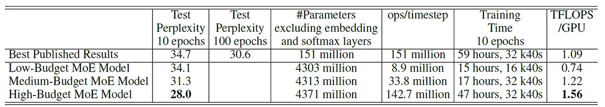
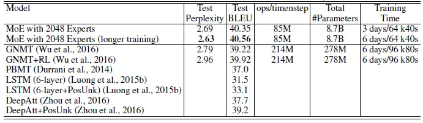
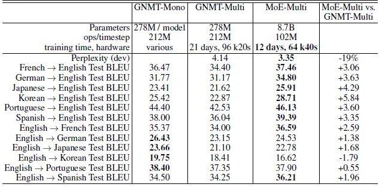

# A Deep Dive into Mixture-of-Experts (MoE) for Large-Scale Models

> This guide provides a comprehensive overview of the Mixture-of-Experts (MoE) architecture, a key technique for scaling neural networks to trillions of parameters while maintaining computational efficiency. We will delve into the foundational concepts from the paper "Outrageously Large Neural Networks," explore the core mechanics of MoE layers, including the gating network and expert design, and discuss the critical challenge of load balancing. Furthermore, we will connect these foundational ideas to modern Large Language Models (LLMs) like Mixtral and Switch Transformers, and conclude with a set of theoretical and practical interview questions to solidify your understanding.

## Knowledge Section

### 1. The Motivation: Conditional Computation

The success of deep learning has been heavily reliant on scaling both the volume of training data and the size of the models. For traditional dense neural networks, every input requires computation across the entire set of model parameters. This leads to a computational cost that grows quadratically as both the model size and the number of training examples increase, quickly becoming unsustainable even with modern hardware.

**Conditional Computation** offers a powerful alternative. Instead of activating the entire network for every sample, conditional computation techniques activate only a subset of the network. This decision is made on a per-example basis, allowing the model to have a massive number of parameters (high capacity) while keeping the actual computational cost (FLOPs) for any given input low.

The Mixture-of-Experts (MoE) model is one of the most successful implementations of conditional computation.

### 2. The Sparsely-Gated Mixture-of-Experts (MoE) Layer

The core idea of MoE is to replace a single, large feed-forward network with numerous smaller "expert" networks and a "gating network" that learns to choose which experts to consult for each input.

The paper "Outrageously Large Neural Networks: The Sparsely-Gated Mixture-of-Experts Layer" introduced a practical and scalable MoE layer, enabling models to grow to over 1000 times their original capacity with only minor losses in computational efficiency.

#### 2.1 Core Architecture

An MoE layer consists of two primary components:

1.  **Expert Networks ($E_i$):** A set of $n$ simpler neural networks (typically feed-forward networks). In the context of the paper, each expert is an independent network, but they all share the same architecture.
2.  **Gating Network ($G$):** A trainable network that determines which experts to activate for a given input. It produces a sparse n-dimensional vector of weights, where most weights are zero.

For a given input vector $x$, the output of the MoE layer, $y$, is a weighted sum of the outputs from the expert networks. The weights are provided by the gating network.

$$
y = \sum_{i=1}^{n} G(x)_i \cdot E_i(x)
$$

The key to efficiency is the sparsity of $G(x)$. If $G(x)_i = 0$, the computation for the expert $E_i(x)$ can be skipped entirely. This means that even with thousands of experts, only a small handful (e.g., the top 2 or 4) are used for any single input token.


#### 2.2 The Noisy Top-K Gating Mechanism

A naive gating network could simply use a Softmax function over a linear transformation of the input.

$$
G_{\sigma}(x) = \text{Softmax}(x \cdot W_g)
$$

However, this produces dense outputs, requiring every expert to be computed. The paper proposes a **Sparsely-Gated** mechanism that introduces both **sparsity** and **noise**:

1.  **Add Tunable Gaussian Noise:** Before selecting the top experts, noise is added to the gating network's logits. This encourages exploration and helps with load balancing, preventing the gating network from consistently picking the same few "favorite" experts.
2.  **Select Top-K Experts:** Only the top `k` values from the noisy logits are kept. The rest are set to $-\infty$ so that they become zero after the Softmax operation. This enforces sparsity.

The combined mechanism is defined as follows:

Let $H(x)$ be the noisy logits for input $x$:
$$
H(x)_i = (x \cdot W_g)_i + \text{StandardNormal}() \cdot \text{Softplus}((x \cdot W_{\text{noise}})_i)
$$
Here, $W_g$ are the standard gating weights, and $W_{\text{noise}}$ is a trainable weight matrix that scales the amount of noise added for each expert.

The final gating output $G(x)$ is then:
$$
G(x) = \text{Softmax}(\text{KeepTopK}(H(x), k))
$$
where `KeepTopK(v, k)` retains the top `k` values of a vector `v` and sets all others to $-\infty$.

Even though this hard selection introduces theoretical discontinuities, the authors found it works well in practice and is crucial for computational savings.

#### 2.3 Hierarchical MoE

When the number of experts becomes extremely large, a single gating network can become a bottleneck. A **Hierarchical MoE** can be used to manage this complexity. In this setup, a primary gating network selects a group of secondary MoEs, and each of those secondary MoEs then selects the final expert networks.


The output for a two-level Hierarchical MoE is given by:
$$
y_{H} = \sum_{i=1}^{a} \sum_{j=1}^{b} G_{\text{primary}}(x)_i \cdot G_{i}(x)_j \cdot E_{i,j}(x)
$$
where there are $a$ groups, each with $b$ experts.

### 3. The Challenge of Load Balancing

A major challenge in training MoE models is that the gating network often converges to a state of **imbalance**. It learns to favor a small subset of popular experts, while the rest receive little to no training and remain underdeveloped. This creates a self-reinforcing cycle: the popular experts get better because they are trained more, which in turn makes them more likely to be selected by the gate.

To counteract this, the paper introduces an **auxiliary loss function** to encourage a more balanced distribution of inputs across all experts. This loss is added to the main model loss during training. The goal is to ensure that all experts receive a roughly equal amount of computation/importance over a training batch.

The auxiliary loss consists of two parts:

1.  **Importance Loss ($L_{\text{importance}}$):** This loss encourages each expert to have roughly the same total "importance" or gating weight summed over a batch of training examples. The importance of an expert is the sum of its gate values across all examples in a batch $X$.
    $$
    \text{Importance}(X)_i = \sum_{x \in X} G(x)_i
    $$
    The loss is then the squared coefficient of variation (CV) of these importance values, scaled by a hyperparameter $w_{\text{importance}}$.
    $$
    L_{\text{importance}} = w_{\text{importance}} \cdot \text{CV}(\text{Importance}(X))^2
    $$
    This penalizes situations where some experts have a much higher total gating weight than others.

2.  **Load Loss ($L_{\text{load}}$):** This loss (detailed in the paper's appendix) directly considers the number of examples dispatched to each expert, ensuring a more balanced "load" in terms of data points.

By adding this auxiliary loss, the model is penalized for relying too heavily on a few experts, forcing the gating network to spread the load more evenly and ensuring all experts are effectively trained.

### 4. MoE in Modern LLMs: From LSTMs to Transformers

The original paper implemented MoE layers between stacked LSTM layers for language modeling and machine translation. However, the architecture is highly versatile. In modern LLMs, MoE layers are most commonly used to replace the feed-forward network (FFN) sub-layer within a Transformer block.

-   A standard Transformer block has a Multi-Head Self-Attention layer followed by a dense FFN.
-   An MoE Transformer block replaces this dense FFN with an MoE layer.

This allows for a dramatic increase in the parameter count of the FFN component (where a significant portion of model parameters reside) without a corresponding increase in the FLOPs required for a forward pass.

**Notable Modern MoE Architectures (as of early 2024):**

*   **Google's Switch Transformer (2021):** Pushed the MoE concept to its limits, creating models with over a trillion parameters. They simplified the routing by only sending each token to a single expert (Top-1 gating), which proved to be highly effective and computationally efficient, though it required addressing training instabilities.
*   **Mistral AI's Mixtral 8x7B (2023):** A high-performing, open-source sparse MoE model. It uses 8 experts per MoE layer and routes each token to the top 2 experts. This means that for any given token, only 2 out of the 8 experts are active. While it is marketed as a "47B" parameter model (8 experts * ~6B params + attention params), its inference cost is closer to that of a 12B dense model because only a fraction of the parameters are used per token.

### 5. Key Experimental Results from the Paper

The paper demonstrated the effectiveness of their Sparsely-Gated MoE layer on large-scale language modeling and machine translation tasks.

*   **Language Modeling:**
    *   On the 1-Billion Word Benchmark, a 4096-expert MoE model achieved a 24% reduction in perplexity compared to a computationally matched dense LSTM baseline.
    *   MoE models consistently achieved lower perplexity than dense models with a similar computational budget (TFLOPS).

    

    *   The largest models demonstrated high computational efficiency on GPUs, indicating the engineering solutions to the "shrinking batch problem" were successful.

    

    *   On a massive 100-Billion word Google News corpus, a model with 65,536 experts (68 billion parameters) achieved a 39% lower perplexity than its dense counterpart.

    

*   **Machine Translation:**
    *   By integrating MoE layers into Google's Neural Machine Translation (GNMT) model, they achieved state-of-the-art BLEU scores on WMT'14 English-to-French and English-to-German benchmarks.

    

    

    *   The MoE model also showed faster convergence, achieving a higher BLEU score in one-sixth of the training time compared to the dense baseline on an internal Google dataset.

    

    

### 6. Advantages and Disadvantages of MoE

#### Advantages
1.  **High Parameter Count, Low Computational Cost:** MoE models can have trillions of parameters but only use a fraction of them for any given input, making them computationally feasible to train and serve.
2.  **Increased Model Capacity:** The vast number of parameters allows the model to absorb more knowledge from the training data, leading to better performance on complex tasks.
3.  **Expert Specialization:** The experts can learn to specialize in different aspects of the data (e.g., different languages, topics, or syntactic structures), leading to more nuanced representations.

#### Disadvantages
1.  **Training Instability:** MoE models can be harder to train than dense models due to issues like load imbalance. The auxiliary loss is crucial but requires careful tuning.
2.  **High Memory Requirements:** Although computationally efficient at inference time, all expert parameters must be loaded into memory (VRAM), making the hardware requirements substantial.
3.  **Implementation Complexity:** The routing logic, auxiliary loss, and communication overhead (in distributed settings) make MoE models more complex to implement and optimize.
4.  **Communication Overhead:** In distributed training, the gating mechanism requires communication between devices to route tokens to the correct experts, which can become a bottleneck.

## Interview Questions

### Theoretical Questions

**1. What is a Mixture-of-Experts (MoE) layer and what fundamental problem does it solve?**

*   **Answer:** A Mixture-of-Experts (MoE) layer is a neural network component that implements conditional computation. Instead of a single, large, dense network, it uses a collection of smaller "expert" networks and a "gating network." For each input, the gating network dynamically selects a small subset of these experts to process the input.
*   The fundamental problem it solves is **scaling model capacity without proportionally scaling computational cost**. Traditional dense models require computations across all parameters for every input. MoE decouples the number of parameters from the computation per input, allowing for models with trillions of parameters while keeping the floating-point operations (FLOPs) for a forward pass manageable.

**2. Explain the two main components of an MoE layer: the experts and the gating network.**

*   **Answer:**
    *   **Experts:** These are the "workers" of the MoE layer. Each expert is typically a simple neural network, most commonly a feed-forward network (FFN). All experts have the same architecture but are initialized with and learn different weights. They are designed to specialize in different types of data or sub-tasks.
    *   **Gating Network:** This is the "router" or "manager." It's a small neural network that takes the input token's representation and outputs a probability distribution over all the experts. In a sparsely-gated MoE, this output is sparse, meaning it assigns high probability (and thus sends the input) to only a few experts (e.g., the top 2). Its job is to learn the best expert(s) to handle any given input.

**3. Why is load balancing a critical issue in MoE models? How is it typically addressed?**

*   **Answer:** Load balancing is critical because the gating network has a natural tendency to converge towards a state of imbalance. It often learns to favor a small number of "popular" experts for most inputs. This creates a destructive feedback loop: popular experts receive more training updates and become better, making them even more likely to be chosen, while other experts are starved of data and never learn useful representations. This undermines the entire principle of having a large, diverse set of specialists.
*   This issue is typically addressed by adding an **auxiliary loss function** to the main model loss. This loss penalizes imbalance. A common formulation, as seen in the "Outrageously Large Neural Networks" paper, is a loss based on the **coefficient of variation** of the total gating weights assigned to each expert over a batch. Let $G(x)_i$ be the gate value for expert $i$ and input $x$. The total importance for expert $i$ over a batch $X$ is $\text{Importance}_i = \sum_{x \in X} G(x)_i$. The auxiliary loss is $L_{\text{aux}} = w \cdot \text{CV}(\text{Importance})^2$. This loss encourages the gating network to distribute the inputs more evenly across all experts, ensuring they all receive sufficient training.

**4. Explain the "Sparsely-Gated" mechanism from the paper "Outrageously Large Neural Networks". Why are both noise and a Top-K selection used?**

*   **Answer:** The Sparsely-Gated mechanism is designed to produce a sparse gating vector efficiently. It involves two key steps before the final Softmax:
    1.  **Top-K Selection:** The gating network produces a logit for each expert. Instead of using all of them, only the experts with the top `k` logit values are selected. The logits for all other experts are set to $-\infty$. This hard selection is the primary source of sparsity, ensuring that only `k` experts are computationally engaged for any input.
    2.  **Addition of Tunable Noise:** Before the Top-K selection, tunable Gaussian noise is added to the logits. The formula is $H(x)_i = (x \cdot W_g)_i + \text{noise}$. This noise serves as a form of exploration and is crucial for load balancing. It prevents the model from getting stuck in a feedback loop where it always picks the same experts by making the selection process stochastic, especially early in training. This gives under-utilized experts a chance to be selected and trained.

**5. How does an MoE model increase model capacity without a proportional increase in computational cost (FLOPs)?**

*   **Answer:** The key is **conditional computation**. Let's compare a dense model with an MoE model.
    *   **Dense Model:** If a feed-forward layer has $d_{model}$ input dimensions and $d_{ffn}$ hidden dimensions, the FLOPs are proportional to $2 \cdot d_{model} \cdot d_{ffn}$. All parameters are used for every token.
    *   **MoE Model:** Suppose we have $N$ experts, each with a hidden dimension of $d_{ffn}$, and we select the top $k$ experts (where $k \ll N$).
        *   **Model Capacity (Parameters):** The total number of parameters in the FFN layer is roughly $N \times (2 \cdot d_{model} \cdot d_{ffn})$. This can be huge if $N$ is large.
        *   **Computational Cost (FLOPs):** For a single token, we first compute the gating logits (~$d_{model} \cdot N$). Then, we only perform the FFN computation for the selected $k$ experts. The FLOPs are therefore proportional to $k \times (2 \cdot d_{model} \cdot d_{ffn})$.
    *   **Conclusion:** The model's parameter count scales with $N$, but its computational cost scales with $k$. Since we choose $k$ to be a small constant (e.g., 2 or 4) and can make $N$ very large (e.g., 8, 64, or more), we can dramatically increase capacity with only a small, constant increase in FLOPs.

**6. Compare and contrast a Transformer model with MoE layers (like Mixtral 8x7B) to a standard dense Transformer model (like Llama 2).**

*   **Answer:**
    *   **Similarity:** Both are Transformer-based architectures. They use the same self-attention mechanism. The overall block structure is similar (attention followed by a feed-forward-style layer).
    *   **Difference (Core Architecture):** The key difference lies in the feed-forward network (FFN) layer within each Transformer block.
        *   **Dense Model (Llama 2):** Uses a standard, dense FFN. Every input token is processed by the same FFN, activating all of its parameters.
        *   **MoE Model (Mixtral 8x7B):** Replaces the dense FFN with a sparse MoE layer. In Mixtral's case, this layer contains 8 distinct FFNs (experts). For each token, a gating network selects the top 2 experts to process it.
    *   **Contrast (Parameters vs. Computation):**
        *   **Parameters:** Mixtral has a much larger total parameter count (~47B) than a dense model of similar inference cost (e.g., Llama 2 13B) because it stores 8 separate sets of expert weights.
        *   **Computation:** During inference, Mixtral's computational cost is much lower than its total parameter count suggests. Since only 2 of the 8 experts are used per token, its FLOPs are comparable to a ~12B-13B dense model, not a 47B dense model.
    *   **Effect:** This allows Mixtral to have the knowledge capacity of a much larger model while maintaining the inference speed of a smaller one, generally leading to stronger performance than dense models of a similar computational budget.

### Practical & Coding Questions

**1. Implement a basic MoE layer from scratch in PyTorch.**

*   **Answer:** Here is a Python implementation of a basic MoE layer using PyTorch. It includes the Expert network, the Gating network, and the main MoE layer that combines them.

```python
import torch
import torch.nn as nn
import torch.nn.functional as F
import numpy as np
import matplotlib.pyplot as plt

class Expert(nn.Module):
    """A simple feed-forward network expert."""
    def __init__(self, d_model, d_hidden):
        super().__init__()
        self.net = nn.Sequential(
            nn.Linear(d_model, d_hidden),
            nn.ReLU(),
            nn.Linear(d_hidden, d_model)
        )

    def forward(self, x):
        return self.net(x)

class MoELayer(nn.Module):
    """
    A Sparsely-Gated Mixture-of-Experts layer.

    Args:
        d_model (int): The input and output dimension of the model.
        num_experts (int): The total number of experts.
        top_k (int): The number of experts to route each token to.
        d_hidden (int): The hidden dimension of each expert's FFN.
    """
    def __init__(self, d_model, num_experts, top_k, d_hidden):
        super().__init__()
        self.d_model = d_model
        self.num_experts = num_experts
        self.top_k = top_k
        
        # Create a list of expert networks
        self.experts = nn.ModuleList([Expert(d_model, d_hidden) for _ in range(num_experts)])
        
        # Gating network: a linear layer to produce logits for each expert
        self.gate = nn.Linear(d_model, num_experts)

    def forward(self, x):
        """
        Forward pass for the MoE layer.
        
        Args:
            x (torch.Tensor): Input tensor of shape (batch_size, seq_len, d_model)
            
        Returns:
            torch.Tensor: Output tensor of shape (batch_size, seq_len, d_model)
            torch.Tensor: Auxiliary load balancing loss.
        """
        batch_size, seq_len, d_model = x.shape
        # Reshape input for gating and expert processing
        x = x.view(-1, d_model) # Shape: (batch_size * seq_len, d_model)
        
        # 1. Gating Decision
        # Get logits from the gating network
        gate_logits = self.gate(x) # Shape: (batch_size * seq_len, num_experts)
        
        # Find the top_k experts for each token
        # top_k_gates are the scores, top_k_indices are the expert indices
        top_k_gates, top_k_indices = torch.topk(gate_logits, self.top_k, dim=-1, sorted=False) # Shape: (..., top_k)
        
        # Apply softmax to the top_k scores to get weights
        gate_scores = F.softmax(top_k_gates, dim=-1) # Shape: (..., top_k)
        
        # 2. Load Balancing Loss Calculation
        # This is a simplified version of the importance loss from the paper
        # It encourages the gate to distribute tokens evenly among experts.
        # `F.one_hot` creates a binary mask indicating which experts were chosen for each token
        expert_mask = F.one_hot(top_k_indices, self.num_experts).sum(dim=1) # Shape: (..., num_experts)
        # Calculate the fraction of tokens dispatched to each expert
        tokens_per_expert = expert_mask.float().mean(dim=0)
        # Calculate the average gate score per expert
        gate_score_per_expert = (gate_scores.unsqueeze(-1) * F.one_hot(top_k_indices, self.num_experts)).sum(dim=1).mean(dim=0)
        # Load balancing loss: CV^2 of (tokens_per_expert * gate_score_per_expert)
        load_balancing_loss = (self.num_experts * torch.sum(tokens_per_expert * gate_score_per_expert))
        
        # 3. Dispatch tokens to experts and combine results
        final_output = torch.zeros_like(x) # Shape: (batch_size * seq_len, d_model)
        
        # Create a flattened index to map each token to its chosen expert(s)
        # `flat_top_k_indices` will tell us which expert to use for each of the (total_tokens * top_k) computations
        flat_top_k_indices = top_k_indices.flatten()
        
        # Create a routing mask to send each token only to its selected experts
        # `routing_mask` will have shape (total_tokens, num_experts, top_k) and allow us to select inputs for each expert
        # This is a more efficient way to handle routing than a for-loop over experts
        flat_x = x.repeat_interleave(self.top_k, dim=0) # Repeat each token k times
        
        # The output of each expert for its assigned tokens
        expert_outputs = torch.empty_like(flat_x)
        
        # Process tokens batch-wise for each expert
        for i, expert in enumerate(self.experts):
            # Find which tokens are routed to this expert
            idx = (flat_top_k_indices == i)
            if idx.any():
                # Compute the expert's output for its assigned tokens
                expert_outputs[idx] = expert(flat_x[idx])

        # Reshape expert_outputs and gate_scores to combine them
        expert_outputs = expert_outputs.view(-1, self.top_k, self.d_model) # Shape: (total_tokens, top_k, d_model)
        gate_scores = gate_scores.unsqueeze(-1) # Shape: (total_tokens, top_k, 1)
        
        # Weight the expert outputs by the gate scores and sum them up
        weighted_outputs = torch.sum(expert_outputs * gate_scores, dim=1) # Shape: (total_tokens, d_model)
        
        # Reshape to the original input shape
        final_output = weighted_outputs.view(batch_size, seq_len, d_model)

        return final_output, load_balancing_loss

# --- Example Usage ---
d_model = 512
d_hidden = 2048
num_experts = 8
top_k = 2
batch_size = 4
seq_len = 10

moe_layer = MoELayer(d_model, num_experts, top_k, d_hidden)
print(f"MoE Layer: {moe_layer}")

# Create dummy input
input_tensor = torch.randn(batch_size, seq_len, d_model)

# Forward pass
output, aux_loss = moe_layer(input_tensor)

print("\nInput shape:", input_tensor.shape)
print("Output shape:", output.shape)
print("Auxiliary loss:", aux_loss.item())

```

**2. Implement and Visualize the Effect of the `temperature` parameter in a Gating Network.**

*   **Answer:** The `temperature` in a Softmax function controls the "sharpness" of the resulting probability distribution. A low temperature makes the distribution spiky (closer to a hard max), while a high temperature makes it smoother (closer to a uniform distribution). This is relevant for gating, as it controls the trade-off between confidently selecting one expert versus distributing the load more softly.

Here is Python code to visualize this effect.

```python
import torch
import torch.nn.functional as F
import numpy as np
import matplotlib.pyplot as plt

def softmax_with_temperature(logits, temperature):
    """Computes softmax with a temperature parameter."""
    if temperature <= 0:
        raise ValueError("Temperature must be positive.")
    return F.softmax(logits / temperature, dim=-1)

# --- Visualization ---

# Create some example logits for a gating network over 8 experts
# Let's say one expert is clearly preferred, and others are close contenders
gate_logits = torch.tensor([4.0, 1.5, 3.5, 1.0, 0.5, 3.8, 1.2, 0.8])

# Define a range of temperatures to test
temperatures = [0.1, 0.5, 1.0, 2.0, 5.0, 10.0]

# Number of experts
num_experts = len(gate_logits)
expert_indices = np.arange(num_experts)

# Create plot
plt.style.use('seaborn-v0_8-whitegrid')
fig, ax = plt.subplots(figsize=(12, 7))

for temp in temperatures:
    probabilities = softmax_with_temperature(gate_logits, temp)
    ax.plot(expert_indices, probabilities.numpy(), marker='o', linestyle='--', label=f'Temp = {temp}')

ax.set_title('Effect of Temperature on Softmax Gating Probabilities', fontsize=16)
ax.set_xlabel('Expert Index', fontsize=12)
ax.set_ylabel('Probability', fontsize=12)
ax.set_xticks(expert_indices)
ax.set_xticklabels([f'Expert {i+1}' for i in expert_indices])
ax.legend()
plt.show()

```
**Explanation of the Visualization:**
*   **Low Temperature (e.g., 0.1):** The output distribution is very "peaky" or "sharp." The probability mass is highly concentrated on the expert with the highest logit (Expert 1, with logit 4.0). The model is very confident in its choice, effectively performing a hard selection (arg max).
*   **Standard Temperature (1.0):** This is the standard Softmax. It produces a probability distribution that reflects the relative differences in the logits.
*   **High Temperature (e.g., 10.0):** The output distribution becomes very "soft" or "smooth," approaching a uniform distribution. The differences between logits are dampened, and the model assigns almost equal probability to all experts. This encourages exploration but reduces specialization.