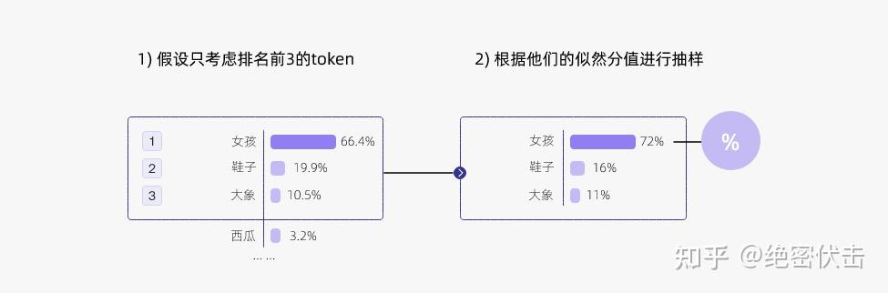

# Decoding Strategies in Large Language Models: A Comprehensive Guide

> This guide provides a deep dive into the essential decoding strategies used in Large Language Models (LLMs) like GPT. It covers the theoretical foundations and practical implementations of Greedy Search, Beam Search, Temperature Scaling, Top-k Sampling, and Top-p (Nucleus) Sampling. The document is structured to serve as an interview preparation resource, complete with conceptual explanations, mathematical formulations, and practical coding exercises in Python and PyTorch.

## Knowledge Section

### 1. The Foundation: From Logits to Probabilities

Before diving into decoding strategies, it's crucial to understand how a language model makes predictions. After processing an input sequence, the final layer of a transformer-based LLM outputs a vector of raw, unnormalized scores for every possible token in its vocabulary. This vector is called the **logits**.

Let the vocabulary size be $V$. For a given context, the model produces a logit vector $z \in \mathbb{R}^V$. Each element $z_i$ corresponds to the score for the $i$-th token in the vocabulary.

To convert these scores into a probability distribution, we use the **Softmax function**:

$$
P(token_i | \text{context}) = \text{Softmax}(z)_i = \frac{e^{z_i}}{\sum_{j=1}^{V} e^{z_j}}
$$

This function exponentiates each logit (making it positive) and then normalizes the values so that they sum to 1, forming a valid probability distribution. The decoding strategy's job is to select a token based on this distribution.

For example, given the context "My favorite thing is," the model might produce the following logits and corresponding probabilities:


*Figure 1: An example of a probability distribution over the vocabulary for the next token after the context "My favorite...".*

The core challenge is deciding how to pick the next token from this distribution. A naive choice might not always be the best.

### 2. Deterministic Decoding Strategies

These methods produce the same output every time for a given input.

#### 2.1. Greedy Decoding

Greedy decoding is the simplest and most straightforward strategy. At each timestep, it selects the token with the highest probability.

-   **Algorithm**: Select $token_t = \arg\max_{v \in V} P(v | \text{context}, token_{1..t-1})$.
-   **Pros**:
    -   **Fast and Simple**: Computationally inexpensive as it only requires finding the maximum value.
    -   **Coherent for short sequences**: Often produces grammatically correct and relevant text for a few steps.
-   **Cons**:
    -   **Repetitive and Dull**: Prone to getting stuck in loops (e.g., "I am I am I am..."). It lacks the ability to explore alternative, more interesting phrases.
    -   **Short-sighted**: It makes the locally optimal choice at each step, but this may not lead to a globally optimal sequence. A high-probability word now might lead to a dead-end path later.

#### 2.2. Beam Search

Beam Search is an improvement over Greedy Decoding. Instead of keeping only the single best choice at each step, it maintains a "beam" of `k` most probable sequences (called hypotheses).

-   **Algorithm**:
    1.  At step $t$, for each of the `k` hypotheses from step $t-1$, generate the next possible sequences and their probabilities. This results in $k \times V$ potential sequences.
    2.  Calculate the cumulative log-probability of each of these new sequences.
    3.  Select the top `k` sequences with the highest cumulative scores to be the new set of hypotheses for step $t$.
    4.  Repeat until an end-of-sequence token is generated or the maximum length is reached.
-   **Pros**:
    -   **Higher Quality Output**: Generally produces more fluent and coherent text than greedy search by exploring a wider search space.
-   **Cons**:
    -   **Computationally Expensive**: Requires significantly more memory and computation than greedy search.
    -   **Favors "Safe" and Common Text**: Can still be repetitive and may miss more creative or diverse outputs that lie outside the beam.
    -   **Parameter Tuning**: The beam width `k` needs to be tuned. A larger `k` offers better quality at a higher computational cost.

### 3. Stochastic Decoding Strategies

These methods introduce randomness, allowing for more diverse and creative outputs. The following sampling strategies are often used in combination.

#### 3.1. Temperature Sampling

Temperature sampling adjusts the shape of the probability distribution, controlling the level of randomness. It is inspired by statistical thermodynamics, where temperature influences the energy states of particles.

The temperature $T$ is a hyperparameter that scales the logits before they are passed to the Softmax function.

$$
P(token_i | \text{context}) = \frac{e^{z_i / T}}{\sum_{j=1}^{V} e^{z_j / T}}
$$

-   **Effect of Temperature `T`**:
    -   **$T \to 0$**: The distribution becomes extremely sharp (low entropy). The highest-probability token gets nearly all the probability mass. This makes the sampling equivalent to **greedy decoding**.
    -   **$T = 1$**: This is the standard Softmax function, using the original probabilities from the model.
    -   **$T > 1$**: The distribution becomes flatter (higher entropy). The probabilities of less likely tokens are increased, making the output more random and diverse.
    -   **$T \to \infty$**: The distribution approaches a **uniform distribution**, where every token has an equal chance of being selected.


*Figure 2: As temperature decreases, the model becomes more confident in its top choice. As it increases, the distribution flattens, increasing randomness.*

**Key Takeaway**: Temperature does not change which token is the most likely, but it changes the *confidence* of the model in its choices. Lowering the temperature makes the model more deterministic and conservative; raising it makes the model more "creative" but also more prone to errors.


*Figure 3: A conceptual representation of how temperature affects the final sampled output.*

#### 3.2. Top-k Sampling

Top-k sampling addresses a key issue with pure random sampling from a temperature-adjusted distribution: you might still pick a nonsensical word from the long tail of low-probability tokens. Top-k restricts the sampling pool to the `k` most likely tokens.

-   **Algorithm**:
    1.  At a given step, identify the `k` tokens with the highest probabilities.
    2.  Mask out all other tokens (effectively setting their probability to 0).
    3.  Redistribute the probability mass among the top `k` tokens.
    4.  Sample from this new, smaller distribution.


*Figure 4: With k=2, the sampling space is limited to the two most probable tokens.*


*Figure 5: Greedy decoding is simply Top-k sampling with k=1.*

-   **Pros**:
    -   Prevents sampling of highly improbable or bizarre tokens.
    -   Provides a good balance between diversity and coherence.
-   **Cons**:
    -   **Not Adaptive**: The size of the sampling pool `k` is fixed. In some contexts, the probability might be concentrated in just a few tokens (e.g., after "The Eiffel Tower is in"), while in others, it might be spread across many plausible tokens (e.g., after "I want to..."). A fixed `k` cannot adapt to this, potentially cutting off good candidates or including bad ones.

#### 3.3. Top-p (Nucleus) Sampling

Top-p sampling, also known as Nucleus Sampling, was proposed to solve the non-adaptive problem of Top-k. Instead of picking a fixed number of tokens `k`, it selects a variable number of tokens whose cumulative probability exceeds a threshold `p`.

-   **Algorithm**:
    1.  Sort the vocabulary tokens by their probabilities in descending order.
    2.  Find the smallest set of tokens (the "nucleus") such that their cumulative probability is greater than or equal to `p`.
    3.  Mask out all tokens not in this nucleus.
    4.  Redistribute the probability mass among the nucleus tokens.
    5.  Sample from this adaptive set.


*Figure 6: With p=0.9, the sampling nucleus includes "girl" (0.664) and "shoe" (0.199), as their cumulative probability (0.863) is the first to exceed 0.9. "elephant" is excluded.*

-   **Pros**:
    -   **Adaptive**: The size of the sampling pool changes dynamically based on the model's confidence. If the model is certain, the nucleus will be small. If the model is uncertain, the nucleus will be larger, allowing for more diversity.
    -   Generally considered superior to Top-k for generating high-quality, diverse text.
-   **Cons**:
    -   Requires careful tuning of the `p` value. A value too close to 1 is similar to full sampling, while a value too low can be overly restrictive. Common values are between 0.9 and 0.95.

#### 3.4. The Combined Strategy

In practice, these strategies are often combined to get the best of all worlds. A typical decoding pipeline is:

1.  **Filter with Top-k**: First, limit the candidate pool to the `k` most likely tokens. This is a quick and efficient first pass to remove the long tail of irrelevant tokens. (e.g., `top_k = 50`).
2.  **Filter with Top-p**: From the remaining `k` tokens, apply nucleus sampling to form an even smaller, adaptive set of candidates. (e.g., `top_p = 0.95`).
3.  **Scale with Temperature**: Apply temperature scaling to the logits of the final candidate tokens to sharpen or flatten the distribution, controlling the final level of randomness. (e.g., `temperature = 0.8`).
4.  **Sample**: Sample one token from the final, adjusted probability distribution.

The order matters: **Top-k and Top-p are applied first to filter the candidates, and then Temperature is applied to the remaining candidates to adjust the sampling probabilities.**

#### 3.5. Repetition Penalty

A common issue in text generation is unwanted repetition. The **repetition penalty** is a simple and effective technique to discourage the model from repeating tokens.

-   **Algorithm**: Before sampling, the logits of tokens that have recently appeared in the context window are manually reduced. This is typically done by dividing their logits by a penalty factor greater than 1 (e.g., `repetition_penalty = 1.2`).
-   **Effect**: This makes it less likely for the model to choose a token it has just generated, promoting more varied and interesting output.

---

## Interview Questions

### Theoretical Questions

**Q1: What is the fundamental difference between Top-k and Top-p (Nucleus) sampling? Which one is generally preferred and why?**

**Answer:**
The fundamental difference lies in how they define the set of candidate tokens for sampling.

*   **Top-k Sampling** selects a **fixed number (`k`)** of the most probable tokens. The size of the candidate set is always `k`, regardless of the underlying probability distribution.
*   **Top-p (Nucleus) Sampling** selects a **variable number** of tokens. It forms the smallest possible set of tokens whose cumulative probability exceeds a predefined threshold `p`.

**Why Top-p is generally preferred:**
Top-p is more adaptive. Consider two scenarios:
1.  **High Confidence Context**: After "The capital of France is", the model is very certain the next token is "Paris". The probability for "Paris" might be 0.99. In this case, Top-p with `p=0.95` would create a candidate set of just one token: {"Paris"}. Top-k with `k=10` would unnecessarily include 9 other unlikely tokens.
2.  **Low Confidence Context**: After "I think the best way to learn is", the model might be uncertain, with probabilities spread across many plausible words like "by", "through", "to", "with", etc. In this case, Top-p will create a larger candidate set that includes all these reasonable options. Top-k might arbitrarily cut off some of these good candidates if `k` is too small.

Because of this adaptiveness to the model's uncertainty at each step, Top-p generally produces higher-quality and more sensible text than the rigid Top-k approach.

**Q2: How does the temperature parameter `T` affect the entropy of the output probability distribution? Prove your answer.**

**Answer:**
The temperature `T` has an inverse relationship with the "peakedness" of the distribution and a direct relationship with its entropy.
*   As $T \to 0$, the distribution becomes more peaked (less uniform), and its **entropy decreases**.
*   As $T \to \infty$, the distribution becomes more uniform, and its **entropy increases**.

**Proof/Derivation:**
Let the logits be $z = (z_1, z_2, ..., z_V)$. The probability distribution with temperature $T$ is $p_i(T) = \frac{e^{z_i/T}}{\sum_j e^{z_j/T}}$. The entropy of this distribution is $H(p(T)) = -\sum_{i=1}^{V} p_i(T) \log p_i(T)$.

Let's examine the limits:
1.  **Case 1: $T \to 0^+$**
    Let $z_{max} = \max_i(z_i)$. We can rewrite the probability as:
    $$ p_i(T) = \frac{e^{(z_i - z_{max})/T}}{\sum_j e^{(z_j - z_{max})/T}} $$
    As $T \to 0^+$, the term $(z_i - z_{max})/T$ goes to $-\infty$ for any $z_i < z_{max}$, and it is $0$ for $z_i = z_{max}$.
    Therefore, $e^{(z_i - z_{max})/T} \to 0$ if $z_i < z_{max}$ and $e^{(z_i - z_{max})/T} \to 1$ if $z_i = z_{max}$.
    This means the probability distribution becomes a one-hot vector where $p_{max} = 1$ and all other probabilities are 0. The entropy of a one-hot distribution is $H = - (1 \log 1 + (V-1) \cdot 0 \log 0) = 0$. This is the minimum possible entropy.

2.  **Case 2: $T \to \infty$**
    As $T \to \infty$, the term $z_i/T \to 0$ for all $i$. Therefore, $e^{z_i/T} \to e^0 = 1$.
    The probability becomes:
    $$ p_i(T) \to \frac{1}{\sum_{j=1}^{V} 1} = \frac{1}{V} $$
    This is a uniform distribution. The entropy of a uniform distribution is $H = -\sum_{i=1}^{V} \frac{1}{V} \log \frac{1}{V} = -V \left(\frac{1}{V} \log \frac{1}{V}\right) = -\log \frac{1}{V} = \log V$. This is the maximum possible entropy for a distribution over $V$ categories.

Thus, increasing temperature increases the entropy of the output distribution.

**Q3: Explain why Greedy Decoding is particularly prone to generating repetitive text.**

**Answer:**
Greedy decoding is prone to repetition due to a feedback loop it creates. At each step, it chooses the single most probable token. If a common phrase or word like "I think" starts a sentence, the model might predict the next most likely token is "that". Then, given "I think that", the model might again predict a very common token. This can lead to high-probability but uninspired and generic phrases.

The core issue is that once the model generates a common token, the new context (including that token) often makes another common token the most likely next choice. This creates a cycle where the model follows a "path of least resistance" through the probability space, never deviating to explore slightly less probable but more interesting alternatives. This often manifests as repeating phrases or simple sentence structures.

**Q4: Can Top-p sampling with `p < 1.0` ever result in a candidate set of just one token? If so, describe the condition.**

**Answer:**
Yes, absolutely. This happens when the model is highly confident about its prediction. If the probability of the single most likely token is greater than or equal to the threshold `p`, the nucleus will consist of only that token.

For example, if the model outputs a distribution where the top token "Paris" has a probability of 0.98, and we use Top-p sampling with `p=0.95`, the algorithm proceeds as follows:
1. Sort tokens by probability: ("Paris": 0.98, "France": 0.01, ...).
2. Calculate cumulative probability: The first token "Paris" already has a cumulative probability of 0.98.
3. Check against `p`: Since $0.98 \ge 0.95$, the nucleus is formed by just this one token.
4. The candidate set for sampling becomes `{"Paris"}`. The subsequent sampling will deterministically pick "Paris".

**Q5: What are the main limitations of Beam Search?**

**Answer:**
While an improvement over greedy search, Beam Search has several key limitations:
1.  **Sub-optimal Global Solution**: It is not guaranteed to find the globally optimal sequence (the sequence with the absolute highest probability). It is a heuristic search algorithm and can prune away a path that seems weak locally but would have led to a better overall sequence.
2.  **Favors High-Frequency, "Safe" Text**: Beam search often produces text that is grammatically correct and coherent but can be generic, dull, and repetitive. It tends to favor common phrases because they maintain high cumulative probability, avoiding the riskier, more creative paths.
3.  **Computational Cost**: It is much more computationally expensive than greedy search, scaling with the beam width `k`. This can be a bottleneck in real-time applications.
4.  **Fixed-Length Bias**: Standard beam search can be biased towards shorter sequences, as each additional token typically multiplies the cumulative probability by a number less than 1, decreasing the overall score. This often requires length normalization penalties to counteract.

**Q6: How does a repetition penalty work at the logit level?**

**Answer:**
A repetition penalty works by directly manipulating the logit vector before the softmax function is applied. The process is as follows:
1.  **Identify Recent Tokens**: Before generating the next token, look back at the recently generated sequence of tokens (within a certain context window).
2.  **Penalize Logits**: For each token in the vocabulary that has appeared in the recent history, its corresponding logit is penalized. The penalty is usually applied by dividing the logit by a penalty factor `> 1.0`. For example, if the logit for the token "the" is `3.5` and the repetition penalty is `1.2`, the new logit becomes `3.5 / 1.2 ≈ 2.92`.
3.  **Apply Softmax**: The softmax function is then applied to this modified logit vector.

By reducing the logits of repeated tokens, their resulting probabilities are suppressed, making them less likely to be sampled again. This encourages the model to generate more diverse tokens.

### Practical & Coding Questions

**Q1: Implement a function in PyTorch that applies Top-k, Top-p, and Temperature sampling in the correct order to a batch of logits.**

**Answer:**
Here is a complete, runnable PyTorch function that demonstrates the combined decoding logic. The order of operations is crucial: first filter by Top-k, then filter by Top-p, then scale by Temperature, and finally sample.

```python
import torch
import torch.nn.functional as F

def combined_sampler(
    logits: torch.Tensor,
    top_k: int = 0,
    top_p: float = 1.0,
    temperature: float = 1.0,
) -> torch.Tensor:
    """
    Applies Top-k, Top-p (Nucleus), and Temperature sampling to a batch of logits.

    Args:
        logits (torch.Tensor): The raw logits from the model. Shape: (batch_size, vocab_size).
        top_k (int): If > 0, keeps only the top k tokens.
        top_p (float): If < 1.0, keeps the smallest set of tokens with cumulative probability >= top_p.
        temperature (float): The temperature for scaling logits. Must be > 0.

    Returns:
        torch.Tensor: The indices of the sampled tokens. Shape: (batch_size,).
    """
    # Ensure logits are on the correct device and float type for processing
    logits = logits.to(torch.float32)

    # 1. Apply Temperature Scaling
    # We apply temperature first as it affects the distribution for both top-k and top-p
    if temperature <= 0:
        raise ValueError("Temperature must be a positive float.")
    logits = logits / temperature

    # 2. Apply Top-k Filtering
    if top_k > 0:
        # Get the top k values and their indices
        top_k_values, top_k_indices = torch.topk(logits, top_k, dim=-1)
        # Create a mask filled with -inf
        mask = torch.full_like(logits, float('-inf'))
        # Place the top k values back into the mask
        mask.scatter_(-1, top_k_indices, top_k_values)
        logits = mask

    # 3. Apply Top-p (Nucleus) Filtering
    if top_p < 1.0:
        # Convert logits to probabilities
        probs = F.softmax(logits, dim=-1)
        # Sort probabilities in descending order
        sorted_probs, sorted_indices = torch.sort(probs, dim=-1, descending=True)
        # Calculate cumulative probabilities
        cumulative_probs = torch.cumsum(sorted_probs, dim=-1)
        
        # Create a mask for tokens to remove
        # Find tokens where cumulative probability exceeds top_p
        # We also keep the first token that crosses the threshold
        sorted_indices_to_remove = cumulative_probs > top_p
        # Shift the mask to the right to keep the first token that exceeds p
        sorted_indices_to_remove[..., 1:] = sorted_indices_to_remove[..., :-1].clone()
        sorted_indices_to_remove[..., 0] = 0 # Always keep the most probable token
        
        # Create a mask for the original logits tensor
        indices_to_remove = sorted_indices_to_remove.scatter(
            -1, sorted_indices, sorted_indices_to_remove
        )
        # Apply the mask by setting the logits of tokens to remove to -inf
        logits[indices_to_remove] = float('-inf')

    # 4. Sample from the final modified logits
    # The multinomial function expects probabilities, so we apply softmax
    final_probs = F.softmax(logits, dim=-1)
    sampled_tokens = torch.multinomial(final_probs, num_samples=1)
    
    return sampled_tokens.squeeze(-1)

# --- Example Usage ---
if __name__ == '__main__':
    batch_size = 2
    vocab_size = 100
    
    # Create some dummy logits
    dummy_logits = torch.randn(batch_size, vocab_size)
    
    # Scenario 1: High temperature, high diversity
    print("--- Scenario 1: High Temperature, High Diversity ---")
    sampled_high_temp = combined_sampler(dummy_logits.clone(), temperature=1.5, top_k=50, top_p=0.9)
    print(f"Sampled tokens (high temp): {sampled_high_temp.tolist()}")

    # Scenario 2: Low temperature, more deterministic
    print("\n--- Scenario 2: Low Temperature, More Deterministic ---")
    sampled_low_temp = combined_sampler(dummy_logits.clone(), temperature=0.1, top_k=50, top_p=0.9)
    print(f"Sampled tokens (low temp): {sampled_low_temp.tolist()}")
    print(f"Argmax (greedy) tokens:   {torch.argmax(dummy_logits, dim=-1).tolist()}")

    # Scenario 3: Very restrictive Top-p
    print("\n--- Scenario 3: Restrictive Top-p ---")
    sampled_top_p = combined_sampler(dummy_logits.clone(), temperature=1.0, top_p=0.1)
    print(f"Sampled tokens (p=0.1): {sampled_top_p.tolist()}")
```

**Q2: Write a Python script using `matplotlib` to visualize how different temperature values affect a softmax probability distribution.**

**Answer:**
This script will create a sample logit vector and then plot the resulting probability distributions for several different temperature values, clearly illustrating the sharpening and flattening effect.

```python
import torch
import torch.nn.functional as F
import matplotlib.pyplot as plt
import numpy as np

def visualize_temperature_effect():
    """
    Generates a plot to visualize the effect of temperature scaling on a
    softmax probability distribution.
    """
    # 1. Create a sample logit vector
    # Let's make it have a clear peak
    vocab_size = 50
    logits = torch.linspace(-2, 2, vocab_size) + torch.randn(vocab_size) * 0.5
    # Sort for a cleaner plot
    logits, _ = torch.sort(logits, descending=True)

    # 2. Define temperature values to test
    temperatures = [0.1, 0.5, 1.0, 2.0, 10.0]

    # 3. Setup the plot
    plt.style.use('seaborn-v0_8-whitegrid')
    fig, ax = plt.subplots(figsize=(12, 7))

    # 4. Calculate and plot probabilities for each temperature
    for T in temperatures:
        scaled_logits = logits / T
        probabilities = F.softmax(scaled_logits, dim=0).numpy()
        ax.plot(probabilities, label=f'Temperature = {T}', lw=2)

    # 5. Customize the plot
    ax.set_title('Effect of Temperature on Softmax Probability Distribution', fontsize=16)
    ax.set_xlabel('Token Index (Sorted by Logit)', fontsize=12)
    ax.set_ylabel('Probability', fontsize=12)
    ax.legend(title='Temperature (T)', fontsize=10)
    ax.grid(True, which='both', linestyle='--', linewidth=0.5)
    
    # Add annotation
    text_y_pos = np.max(F.softmax(logits / 0.1, dim=0).numpy()) * 0.5
    ax.text(5, text_y_pos, 'T -> 0\n(Greedy-like)', ha='center', va='center', color='blue', fontsize=10)
    
    text_y_pos_2 = np.max(F.softmax(logits / 10.0, dim=0).numpy()) * 1.5
    ax.text(25, text_y_pos_2, 'T -> inf\n(Uniform-like)', ha='center', va='center', color='red', fontsize=10)
    
    plt.tight_layout()
    plt.show()

# --- Run the visualization ---
if __name__ == '__main__':
    visualize_temperature_effect()
```

### Python Implementation of Core Concepts

The provided user input included code snippets. Here are the fully annotated and explained versions, consistent with the style of the guide.

#### Top-k Sampler (Conceptual Implementation)

```python
import torch

class TopKSampler:
    """A conceptual sampler that filters logits to the top-k before another sampler is used."""
    def __init__(self, k: int, sampler_func):
        """
        Args:
            k (int): The number of top tokens to consider.
            sampler_func (callable): Another sampling function (e.g., based on temperature)
                                    to call on the filtered logits.
        """
        self.k = k
        self.sampler = sampler_func

    def __call__(self, logits: torch.Tensor) -> torch.Tensor:
        """
        Filters logits to top-k and then samples.

        Args:
            logits (torch.Tensor): The raw logits. Shape: (batch_size, vocab_size).

        Returns:
            torch.Tensor: The indices of the sampled tokens.
        """
        # Create a tensor of -inf with the same shape as logits
        filtered_logits = torch.full_like(logits, float('-inf'))
        
        # Find the top k values and their indices along the last dimension
        values, indices = torch.topk(logits, self.k, dim=-1)
        
        # Place the top k values into the `filtered_logits` tensor at the correct indices
        # The .scatter_ method modifies the tensor in-place.
        filtered_logits.scatter_(-1, indices, values)
        
        # Now, pass the filtered logits to the downstream sampler
        return self.sampler(filtered_logits)
```

#### Nucleus (Top-p) Sampler (Conceptual Implementation)

```python
import torch
import torch.nn.functional as F

class NucleusSampler:
    """A conceptual sampler that filters logits using the top-p (nucleus) method."""
    def __init__(self, p: float, sampler_func):
        """
        Args:
            p (float): The cumulative probability threshold for nucleus sampling.
            sampler_func (callable): The sampling function to use on the filtered logits.
        """
        if not 0.0 < p <= 1.0:
            raise ValueError("p must be in (0, 1]")
        self.p = p
        self.sampler = sampler_func

    def __call__(self, logits: torch.Tensor) -> torch.Tensor:
        """
        Filters logits to the nucleus set and then samples.
        """
        # First, sort the probabilities in descending order
        probabilities = F.softmax(logits, dim=-1)
        sorted_probs, sorted_indices = torch.sort(probabilities, dim=-1, descending=True)

        # Compute the cumulative sum of probabilities
        cumulative_probs = torch.cumsum(sorted_probs, dim=-1)

        # Find the indices of tokens to remove. These are tokens that are not in the nucleus.
        # The nucleus is the smallest set of tokens whose cumulative probability is >= p.
        # So we remove tokens *after* this set is formed.
        sorted_indices_to_remove = cumulative_probs > self.p
        # We must keep at least one token, so we shift to ensure the first token that
        # crosses the boundary is included.
        sorted_indices_to_remove[..., 1:] = sorted_indices_to_remove[..., :-1].clone()
        sorted_indices_to_remove[..., 0] = 0

        # Scatter the removal mask back to the original ordering
        indices_to_remove = torch.zeros_like(logits, dtype=torch.bool).scatter_(
            -1, sorted_indices, sorted_indices_to_remove
        )

        # Set the logits of the tokens to be removed to -inf
        filtered_logits = logits.masked_fill(indices_to_remove, float('-inf'))

        # Pass the filtered logits to the downstream sampler
        return self.sampler(filtered_logits)
```

#### Temperature Sampler (Core Logic)

```python
import torch
from torch.distributions import Categorical

class TemperatureSampler:
    """A simple sampler that applies temperature and uses multinomial sampling."""
    def __init__(self, temperature: float = 1.0):
        if temperature <= 0:
            raise ValueError("Temperature must be positive.")
        self.temperature = temperature

    def __call__(self, logits: torch.Tensor) -> torch.Tensor:
        """
        Samples from the logits after applying temperature scaling.
        """
        # Scale logits by temperature
        scaled_logits = logits / self.temperature
        
        # Create a categorical distribution from the scaled logits
        # The `Categorical` distribution automatically applies softmax internally
        distribution = Categorical(logits=scaled_logits)
        
        # Sample from the distribution
        return distribution.sample()
```