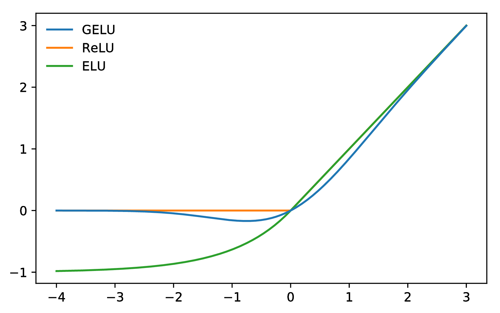
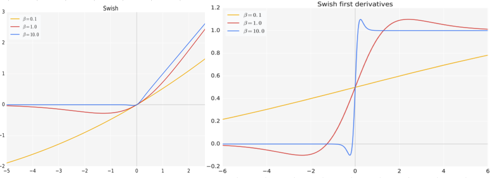

# A Deep Dive into Activation Functions and Gated Architectures for NLP Interviews

> This guide provides a comprehensive overview of activation functions and advanced feed-forward network (FFN) architectures crucial for modern Natural Language Processing (NLP) and Large Language Models (LLMs). We begin with the fundamentals of activation functions like ReLU, then explore more advanced options such as GeLU and Swish. The core of this guide delves into Gated Linear Units (GLU) and their powerful variants like SwiGLU and GeGLU, which are central to the performance of state-of-the-art models like LLaMA and PaLM. The guide concludes with a set of theoretical and practical interview questions, complete with detailed answers and Python/PyTorch code implementations.

## Knowledge Section

### The Role of Activation Functions in Neural Networks

At its core, a neural network is a series of linear transformations (e.g., `y = Wx + b`) stacked on top of each other. If we only stack linear layers, the entire network would be equivalent to a single, larger linear transformation. This would severely limit its expressive power, making it incapable of learning complex patterns in data (like language, images, etc.).

Activation functions are the key to unlocking this power. They are non-linear functions applied after each linear transformation. By introducing non-linearity, they allow neural networks to approximate arbitrarily complex functions, a property known as the Universal Approximation Theorem.

**Desirable Properties of an Activation Function:**
*   **Non-linear:** This is the most crucial property.
*   **Differentiable:** The function must be differentiable to allow for gradient-based optimization (i.e., backpropagation).
*   **Computationally Efficient:** Since it's applied thousands or millions of times during training, it must be fast to compute.
*   **Avoids Gradient Saturation:** Functions like Sigmoid and Tanh have flat regions (saturate) for large positive or negative inputs, causing their gradients to become close to zero. This is the **vanishing gradient problem**, which stalls learning in deep networks.
*   **Zero-centered Output (or close to it):** Outputs centered around zero can help speed up convergence during training.

---

### The Feed-Forward Network (FFN) in Transformers

The Feed-Forward Network (FFN) is a critical component within each block of a Transformer model, appearing after the self-attention sub-layer. Its primary role is to introduce additional non-linearity and increase the model's representational capacity.

Empirical studies have shown that this non-linear transformation significantly impacts the final model performance. The FFN consists of two linear (fully-connected) layers with a non-linear activation function in between.

The structure is often described as an "expansion-compression" layer. The first linear layer expands the dimension of the input from `d_model` (the model's hidden size) to a larger intermediate dimension `d_ff` (often `4 * d_model`). The second linear layer then compresses it back down to `d_model`.

The calculation for an input vector **x** is given by:
$$
\text{FFN}(\mathbf{x}) = \text{Activation}(\mathbf{x}\mathbf{W}_1 + \mathbf{b}_1)\mathbf{W}_2 + \mathbf{b}_2
$$
Where:
*   $\mathbf{x} \in \mathbb{R}^{d_{\text{model}}}$ is the input vector from the preceding layer (e.g., self-attention).
*   $\mathbf{W}_1 \in \mathbb{R}^{d_{\text{model}} \times d_{\text{ff}}}$ and $\mathbf{b}_1 \in \mathbb{R}^{d_{\text{ff}}}$ are the weights and biases of the first (expansion) linear layer.
*   $\mathbf{W}_2 \in \mathbb{R}^{d_{\text{ff}} \times d_{\text{model}}}$ and $\mathbf{b}_2 \in \mathbb{R}^{d_{\text{model}}}$ are the weights and biases of the second (compression) linear layer.
*   The original "Attention Is All You Need" paper used the ReLU activation function.

The rationale for expanding the dimensionality is to project the learned features into a higher-dimensional space where it may be easier to separate them or learn more complex relationships before projecting them back.

---

### A Tour of Key Activation Functions

#### ReLU (Rectified Linear Unit)

ReLU is arguably the most popular activation function in deep learning, especially in Computer Vision. It is simple, fast, and effective.

**Formula:**
$$
\text{ReLU}(x) = \max(0, x)
$$
**Pros:**
*   **Computational Efficiency:** It involves a simple thresholding operation, making it very fast.
*   **Mitigates Vanishing Gradients:** For positive inputs, the gradient is a constant 1, preventing it from vanishing during backpropagation.

**Cons:**
*   **The Dying ReLU Problem:** If a neuron's input is consistently negative, it will output 0. The gradient for negative inputs is also 0. Consequently, the weights connected to this neuron will never be updated, and the neuron effectively "dies," ceasing to contribute to the model's learning. This can happen due to a large negative bias or a large learning rate.
*   **Not Zero-Centered:** The outputs are always non-negative, which can slow down the convergence of gradient descent.

#### GeLU (Gaussian Error Linear Unit)

GeLU has become the standard activation in many Transformer-based models like BERT, GPT-2, and T5. It introduces a probabilistic, stochastic element to activation.

**Intuitive Idea:** GeLU weights inputs by their magnitude, but unlike ReLU which uses a hard zero-one gate, GeLU uses a smoother gate based on the standard Gaussian cumulative distribution function (CDF), $\Phi(x)$. The activation is essentially the input $x$ multiplied by the probability that a standard normal variable is less than $x$.

**Formula:**
$$
\text{GeLU}(x) = x \cdot \Phi(x) = x \cdot \frac{1}{2} \left[1 + \text{erf}\left(\frac{x}{\sqrt{2}}\right)\right]
$$
where `erf` is the error function. For practical implementation, a fast approximation is often used, as it avoids computing the error function directly:
$$
\text{GeLU}(x) \approx 0.5x \left(1 + \tanh\left[\sqrt{\frac{2}{\pi}} \left(x + 0.044715x^3\right)\right]\right)
$$
This approximation is what you'll find in many library implementations.



**Comparison with ReLU:**
*   **Shape:** GeLU is a smooth, S-shaped curve that is non-monotonic (it dips slightly for negative values), unlike ReLU's sharp corner at zero.
*   **Neuron Death:** GeLU can alleviate the dying ReLU problem because it's non-zero for negative inputs, allowing gradients to flow and weights to be updated.
*   **Computational Cost:** GeLU is more computationally expensive than ReLU due to the `tanh` and power calculations.

#### Swish

Swish is another advanced activation function that often performs as well as or better than ReLU and GeLU. It was discovered using automated architecture search techniques.

**Formula:**
$$
\text{Swish}_{\beta}(x) = x \cdot \sigma(\beta x) = \frac{x}{1 + e^{-\beta x}}
$$
Where:
*   $\sigma$ is the sigmoid function.
*   $\beta$ is a constant or a learnable parameter. If $\beta=1$, it is often just called Swish.



**Properties:**
*   **Self-Gating:** Like GeLU, Swish uses a gating mechanism where the gate ($\sigma(\beta x)$) is a function of the input itself.
*   **Smoothness:** It is a smooth function, which helps with optimization.
*   **Non-Monotonicity:** Like GeLU, it has a slight dip for negative values, which can improve expressiveness.
*   **Relationship to ReLU:** As $\beta \to \infty$, the sigmoid function becomes a 0-1 step function, and Swish approaches the ReLU function. As $\beta \to 0$, Swish approaches the linear function $y = x/2$. This property allows it to interpolate between linear and ReLU-like behavior.

---

### Gated Linear Units (GLU) and Advanced FFN Architectures

While GeLU and Swish are powerful drop-in replacements for ReLU, a more profound architectural change in modern LLMs has been the replacement of the standard FFN block with one based on **Gated Linear Units (GLU)**.

#### The Core Idea: Gated Linear Units (GLU)

Originally proposed by Dauphin et al. (2017) for convolutional sequence models, the GLU provides a mechanism to control the flow of information through the network. The core idea is to split a layer's input into two parts, `A` and `B`. Part `B` is passed through a sigmoid function to create a "gate" (with values between 0 and 1). This gate is then multiplied element-wise with part `A`, controlling what information passes through.

**Original Formulation:** For an input `X`, it is projected and split into `A` and `B`.
$$
\text{GLU}(A, B) = A \otimes \sigma(B)
$$
where $\otimes$ denotes element-wise multiplication.

#### Modern GLU Variants in Transformer FFNs

In recent LLMs (e.g., PaLM, LLaMA, Mixtral), the FFN block has been re-engineered to incorporate this gating idea, but with different activation functions in the gate. This has led to significant performance improvements.

The general structure of these gated FFNs is:
$$
\text{FFN}_{\text{Gated}}(\mathbf{x}) = \left(\text{Activation}(\mathbf{x}\mathbf{W}_{\text{gate}}) \otimes (\mathbf{x}\mathbf{W}_{\text{up}})\right) \mathbf{W}_{\text{down}}
$$

Let's break down the most popular variants:

**1. SwiGLU (Used in PaLM, LLaMA, Mixtral):**
This variant uses the Swish activation in the gate path. It is widely considered one of the most effective FFN architectures today.

$$
\text{SwiGLU}(\mathbf{x}) = \left( \text{Swish}(\mathbf{x}\mathbf{W}_{\text{gate}}) \otimes (\mathbf{x}\mathbf{W}_{\text{up}}) \right) \mathbf{W}_{\text{down}}
$$

**2. GeGLU (Used in PaLM):**
This variant uses the GeLU activation in the gate path.

$$
\text{GeGLU}(\mathbf{x}) = \left( \text{GeLU}(\mathbf{x}\mathbf{W}_{\text{gate}}) \otimes (\mathbf{x}\mathbf{W}_{\text{up}}) \right) \mathbf{W}_{\text{down}}
$$

**Why do these work so well?**
The gating mechanism provides a much more dynamic and context-dependent way to control the information flow. Instead of a static non-linearity like ReLU, the gate `Activation(xW_gate)` can decide, based on the input `x`, which elements from the other path `xW_up` are important and should be passed on. This multiplicative interaction is more expressive than the additive nature of the standard FFN.

**Note on Parameter Count:** These GLU-based FFNs appear to use three matrices (`W_gate`, `W_up`, `W_down`) instead of two. However, to maintain a comparable parameter count to the standard FFN, the intermediate dimension is often adjusted. For example, the LLaMA paper uses an intermediate dimension of $\frac{2}{3} \times (4 \times d_{\text{model}})$, which results in a similar number of parameters while delivering superior performance.

## Interview Questions

### Theoretical Questions

#### Question 1: What is the purpose of an activation function? Why can't we just stack linear layers?

**Answer:**
The purpose of an activation function is to introduce **non-linearity** into a neural network.

A neural network layer is fundamentally a linear transformation of its input, calculated as $\mathbf{y} = \mathbf{W}\mathbf{x} + \mathbf{b}$. If we were to stack multiple such layers without any function in between, the entire network would still only be able to represent a linear function.

Let's prove this with two layers:
1.  **Layer 1:** $\mathbf{y}_1 = \mathbf{W}_1\mathbf{x} + \mathbf{b}_1$
2.  **Layer 2:** $\mathbf{y}_2 = \mathbf{W}_2\mathbf{y}_1 + \mathbf{b}_2$

Substituting the first equation into the second:
$$
\mathbf{y}_2 = \mathbf{W}_2(\mathbf{W}_1\mathbf{x} + \mathbf{b}_1) + \mathbf{b}_2
$$
$$
\mathbf{y}_2 = (\mathbf{W}_2\mathbf{W}_1)\mathbf{x} + (\mathbf{W}_2\mathbf{b}_1 + \mathbf{b}_2)
$$
If we define $\mathbf{W}_{\text{eff}} = \mathbf{W}_2\mathbf{W}_1$ and $\mathbf{b}_{\text{eff}} = \mathbf{W}_2\mathbf{b}_1 + \mathbf{b}_2$, the equation simplifies to:
$$
\mathbf{y}_2 = \mathbf{W}_{\text{eff}}\mathbf{x} + \mathbf{b}_{\text{eff}}
$$
This is the same form as a single linear layer. No matter how many linear layers we stack, the entire network is mathematically equivalent to just one linear layer. Such a model can only learn linear relationships, making it no more powerful than simple linear regression or logistic regression.

By applying a non-linear activation function $g(\cdot)$ after each linear layer (i.e., $\mathbf{y}_1 = g(\mathbf{W}_1\mathbf{x} + \mathbf{b}_1)$), we break this linearity. This allows the network to learn and approximate any arbitrarily complex continuous function, a capability known as the Universal Approximation Theorem, making it powerful enough for tasks like image recognition, language translation, and more.

#### Question 2: Explain the "Dying ReLU" problem. How does it occur, and what are its consequences? Suggest ways to mitigate it.

**Answer:**
The "Dying ReLU" problem is a common issue where neurons in a network can become permanently inactive, outputting only zero for any input.

**How it occurs:**
The ReLU activation function is defined as $\text{ReLU}(x) = \max(0, x)$. Its derivative is:
$$
\frac{d}{dx}\text{ReLU}(x) =
\begin{cases}
1 & \text{if } x > 0 \\
0 & \text{if } x \le 0
\end{cases}
$$
During backpropagation, the gradient of the loss with respect to a weight $w_{ij}$ is proportional to the gradient of the activation. If a neuron's input (the weighted sum, $z = \sum w_i x_i + b$) is consistently negative, its output will be 0, and more importantly, the gradient flowing back through it will also be 0.
This means the weights and bias of that neuron will not receive any updates. If a neuron gets into this state due to a large negative bias or an unfortunate weight update from a large learning rate, it may never recover. It becomes "stuck" at zero.

**Consequences:**
The primary consequence is a loss of representational power in the model. If a significant fraction of neurons "die," the model's capacity is effectively reduced, hindering its ability to learn complex patterns.

**Mitigation Strategies:**
1.  **Use Leaky ReLU or its variants:** Leaky ReLU introduces a small, non-zero slope for negative inputs, e.g., $f(x) = \max(0.01x, x)$. This ensures there is always a small gradient, preventing the neuron from dying completely. Parametric ReLU (PReLU) makes this slope a learnable parameter.
2.  **Use other activation functions:** Functions like GeLU or Swish do not have a hard zero-gradient region for negative inputs, naturally avoiding this problem.
3.  **Proper Weight Initialization:** Using methods like He initialization, which is designed for ReLU-based networks, can help prevent the weighted sums from becoming too large or too small initially, reducing the chance of neurons getting stuck.
4.  **Lower Learning Rates:** Using a smaller learning rate can prevent aggressive weight updates that might push a neuron into the "dead" region. Techniques like learning rate scheduling or using adaptive optimizers (Adam, RMSprop) also help manage update sizes.

#### Question 3: What is SwiGLU, and why has it become popular in recent Large Language Models? How does its architecture differ from the original Transformer FFN?

**Answer:**
SwiGLU is a modern, high-performance variant of the Feed-Forward Network (FFN) block used in Transformers. It leverages a Gated Linear Unit (GLU) with the Swish activation function.

**Architecture:**
The architecture of a SwiGLU FFN block is fundamentally different from the standard FFN.

*   **Standard FFN:**
    1.  Input $\mathbf{x}$ is projected to a higher dimension: $\mathbf{h} = \text{ReLU}(\mathbf{x}\mathbf{W}_1 + \mathbf{b}_1)$
    2.  The result is projected back to the original dimension: $\mathbf{y} = \mathbf{h}\mathbf{W}_2 + \mathbf{b}_2$

*   **SwiGLU FFN:**
    1.  Input $\mathbf{x}$ is projected twice, in parallel, creating two intermediate vectors: one for the "gate" and one for the "content."
        *   Gate Path: $\mathbf{g} = \text{Swish}(\mathbf{x}\mathbf{W}_{\text{gate}})$
        *   Content Path: $\mathbf{c} = \mathbf{x}\mathbf{W}_{\text{up}}$
    2.  The gate modulates the content via element-wise multiplication: $\mathbf{h} = \mathbf{g} \otimes \mathbf{c}$
    3.  The result is projected back down with a final linear layer: $\mathbf{y} = \mathbf{h}\mathbf{W}_{\text{down}}$

**Why is it popular in recent LLMs (like LLaMA, PaLM, Mixtral)?**
1.  **Improved Performance:** Empirical results, notably from the PaLM paper ("Scaling Language Models: Methods, Analysis & Insights"), showed that replacing the standard ReLU or GeLU FFN with a SwiGLU variant consistently improves model quality (e.g., lower perplexity) for a similar parameter budget.
2.  **Dynamic Information Flow:** The gating mechanism is more expressive than a static activation function. The gate ($\mathbf{g}$) is data-dependent; it can learn to selectively suppress or amplify elements of the content vector ($\mathbf{c}$) based on the specific input token and its context. This allows for finer-grained control over the information being processed at each layer.
3.  **Efficient Parameter Usage:** Even though it seems to require more parameters, by adjusting the intermediate hidden dimension, SwiGLU can achieve better performance than a standard FFN with the same or even fewer total parameters. The LLaMA paper found that using an intermediate dimension of $\frac{2}{3}(4d_{\text{model}})$ for SwiGLU worked best, matching the parameter count of a standard FFN with an intermediate dimension of $4d_{\text{model}}$.

### Practical & Coding Questions

#### Question 1: Implement ReLU, GeLU, and Swish from scratch in Python/NumPy and visualize them.

**Answer:**

```python
import numpy as np
import matplotlib.pyplot as plt

# 1. Implementation of Activation Functions

def relu(x):
    """Rectified Linear Unit (ReLU)"""
    return np.maximum(0, x)

def gelu(x):
    """
    Gaussian Error Linear Unit (GeLU)
    Using the fast approximation from the paper.
    """
    return 0.5 * x * (1 + np.tanh(np.sqrt(2 / np.pi) * (x + 0.044715 * np.power(x, 3))))

def sigmoid(x):
    """Sigmoid function"""
    return 1 / (1 + np.exp(-x))

def swish(x, beta=1.0):
    """Swish activation function"""
    return x * sigmoid(beta * x)

# 2. Visualization

# Generate a range of input values
x = np.linspace(-5, 5, 200)

# Calculate the outputs for each activation function
y_relu = relu(x)
y_gelu = gelu(x)
y_swish = swish(x)

# Plot the functions and their derivatives
plt.style.use('seaborn-v0_8-whitegrid')
fig, ax = plt.subplots(figsize=(12, 7))

ax.plot(x, y_relu, label='ReLU', color='red', linestyle='--')
ax.plot(x, y_gelu, label='GeLU', color='blue', linewidth=2)
ax.plot(x, y_swish, label='Swish (β=1)', color='green', linewidth=2)

# Formatting the plot
ax.set_title('Comparison of Activation Functions', fontsize=16)
ax.set_xlabel('Input (x)', fontsize=12)
ax.set_ylabel('Output (f(x))', fontsize=12)
ax.legend(fontsize=12)
ax.axhline(0, color='black', linewidth=0.5)
ax.axvline(0, color='black', linewidth=0.5)
ax.set_ylim(-1, 4)
ax.set_xlim(-5, 5)

plt.show()
```

#### Question 2: Implement the standard FFN block from the original Transformer paper in PyTorch.

**Answer:**

```python
import torch
import torch.nn as nn

class StandardFFN(nn.Module):
    """
    A standard Feed-Forward Network block as described in "Attention Is All You Need".
    This consists of two linear layers with a ReLU activation in between.
    
    Architecture: Linear -> ReLU -> Dropout -> Linear -> Dropout
    """
    def __init__(self, d_model: int, d_ff: int, dropout: float = 0.1):
        """
        Args:
            d_model (int): The dimension of the input and output vectors (model's hidden size).
            d_ff (int): The dimension of the inner-layer (feed-forward dimension).
                        Usually 4 * d_model.
            dropout (float): Dropout probability.
        """
        super().__init__()
        self.linear_1 = nn.Linear(d_model, d_ff)
        self.relu = nn.ReLU()
        self.dropout = nn.Dropout(dropout)
        self.linear_2 = nn.Linear(d_ff, d_model)

    def forward(self, x: torch.Tensor) -> torch.Tensor:
        """
        Forward pass for the FFN block.
        
        Args:
            x (torch.Tensor): Input tensor of shape (batch_size, seq_len, d_model)
            
        Returns:
            torch.Tensor: Output tensor of shape (batch_size, seq_len, d_model)
        """
        # (batch_size, seq_len, d_model) -> (batch_size, seq_len, d_ff)
        x = self.linear_1(x)
        x = self.relu(x)
        x = self.dropout(x)
        
        # (batch_size, seq_len, d_ff) -> (batch_size, seq_len, d_model)
        x = self.linear_2(x)
        
        return x

# --- Example Usage ---
d_model = 512  # Model dimension
d_ff = 2048    # Feed-forward dimension (4 * d_model)
batch_size = 4
seq_len = 10

# Create a dummy input tensor
input_tensor = torch.randn(batch_size, seq_len, d_model)

# Instantiate the FFN
ffn_block = StandardFFN(d_model=d_model, d_ff=d_ff)
print(f"Standard FFN Block:\n{ffn_block}\n")

# Pass the input through the FFN
output_tensor = ffn_block(input_tensor)

# Print shapes to verify
print(f"Input shape:  {input_tensor.shape}")
print(f"Output shape: {output_tensor.shape}")

# Verify parameter count
total_params = sum(p.numel() for p in ffn_block.parameters())
# W1: 512*2048, b1: 2048, W2: 2048*512, b2: 512 -> 2 * (512*2048) + 2048 + 512
expected_params = (d_model * d_ff + d_ff) + (d_ff * d_model + d_model)
print(f"\nTotal parameters: {total_params:,}")
print(f"Expected parameters: {expected_params:,}")
assert total_params == expected_params
```

#### Question 3: Implement a SwiGLU-based FFN block in PyTorch and explain how its parameter count compares to the standard FFN.

**Answer:**

```python
import torch
import torch.nn as nn
import torch.nn.functional as F

class SwiGLU_FFN(nn.Module):
    """
    A Feed-Forward Network block using the SwiGLU activation,
    as popularized by models like PaLM and LLaMA.

    Architecture: Parallel Linear Projections -> Swish(Gate) * Content -> Linear
    """
    def __init__(self, d_model: int, d_ff: int, dropout: float = 0.1):
        """
        Args:
            d_model (int): The dimension of the input and output vectors.
            d_ff (int): The intermediate hidden dimension. In LLaMA, this is
                        set to (2/3) * (4 * d_model) to match parameter counts.
            dropout (float): Dropout probability.
        """
        super().__init__()
        
        # The hidden dimension must be a multiple of 256 for efficiency, a common practice
        # hidden_dim = int(2 * d_ff / 3)
        # multiple_of = 256
        # self.hidden_dim = multiple_of * ((hidden_dim + multiple_of - 1) // multiple_of)
        
        # For simplicity, we'll just use the provided d_ff directly
        self.hidden_dim = d_ff

        # The gate projection W_gate
        self.w_gate = nn.Linear(d_model, self.hidden_dim, bias=False)
        # The content up-projection W_up
        self.w_up = nn.Linear(d_model, self.hidden_dim, bias=False)
        # The down-projection W_down
        self.w_down = nn.Linear(self.hidden_dim, d_model, bias=False)
        
        self.dropout = nn.Dropout(dropout)

    def forward(self, x: torch.Tensor) -> torch.Tensor:
        """
        Forward pass for the SwiGLU FFN block.
        
        Args:
            x (torch.Tensor): Input tensor of shape (batch_size, seq_len, d_model)
            
        Returns:
            torch.Tensor: Output tensor of shape (batch_size, seq_len, d_model)
        """
        # Project to create gate and content vectors
        gate = self.w_gate(x)  # (batch, seq_len, hidden_dim)
        up = self.w_up(x)      # (batch, seq_len, hidden_dim)

        # Apply Swish activation to the gate and multiply
        # F.silu is PyTorch's implementation of Swish(x) = x * sigmoid(x)
        gated_output = F.silu(gate) * up
        
        # Project back down to the model dimension
        output = self.w_down(gated_output)
        output = self.dropout(output)
        
        return output

# --- Example Usage & Parameter Comparison ---
d_model = 512
batch_size = 4
seq_len = 10

# 1. Standard FFN for baseline
std_d_ff = 4 * d_model  # 2048
standard_ffn = StandardFFN(d_model=d_model, d_ff=std_d_ff)
std_params = sum(p.numel() for p in standard_ffn.parameters())
print(f"--- Standard FFN ---")
print(f"d_model={d_model}, d_ff={std_d_ff}")
print(f"Total Parameters: {std_params:,}")

# 2. SwiGLU FFN with adjusted hidden dimension for comparable param count
# As per LLaMA paper, hidden_dim = (2/3) * (4 * d_model)
swiglu_d_ff = int((2/3) * (4 * d_model)) # approx 1365
# In practice, this is rounded to a multiple of, say, 256. For this example, we use the raw value.
swiglu_ffn = SwiGLU_FFN(d_model=d_model, d_ff=swiglu_d_ff)
swiglu_params = sum(p.numel() for p in swiglu_ffn.parameters())
print(f"\n--- SwiGLU FFN (Comparable) ---")
print(f"d_model={d_model}, d_ff={swiglu_d_ff}")
print(f"Total Parameters: {swiglu_params:,}")

# --- Parameter Count Explanation ---
print("\n--- Parameter Count Analysis ---")
# Standard FFN: Two matrices (d_model * d_ff) and two bias vectors
# Params ≈ 2 * (d_model * std_d_ff)
print(f"Standard FFN Params ≈ 2 * ({d_model} * {std_d_ff}) = {2 * d_model * std_d_ff:,}")
# SwiGLU FFN: Three matrices (no bias is common practice)
# w_gate, w_up are (d_model * swiglu_d_ff)
# w_down is (swiglu_d_ff * d_model)
# Params ≈ 2 * (d_model * swiglu_d_ff) + (swiglu_d_ff * d_model) = 3 * d_model * swiglu_d_ff
print(f"SwiGLU FFN Params ≈ 3 * ({d_model} * {swiglu_d_ff}) = {3 * d_model * swiglu_d_ff:,}")

print("\nAs you can see, by choosing `d_ff` for SwiGLU to be 2/3 of the standard FFN's `d_ff`,")
print("the total parameter counts are very similar, yet SwiGLU typically yields better performance.")

# Verify forward pass
input_tensor = torch.randn(batch_size, seq_len, d_model)
output_tensor_swiglu = swiglu_ffn(input_tensor)
print(f"\nSwiGLU Input Shape:  {input_tensor.shape}")
print(f"SwiGLU Output Shape: {output_tensor_swiglu.shape}")
```