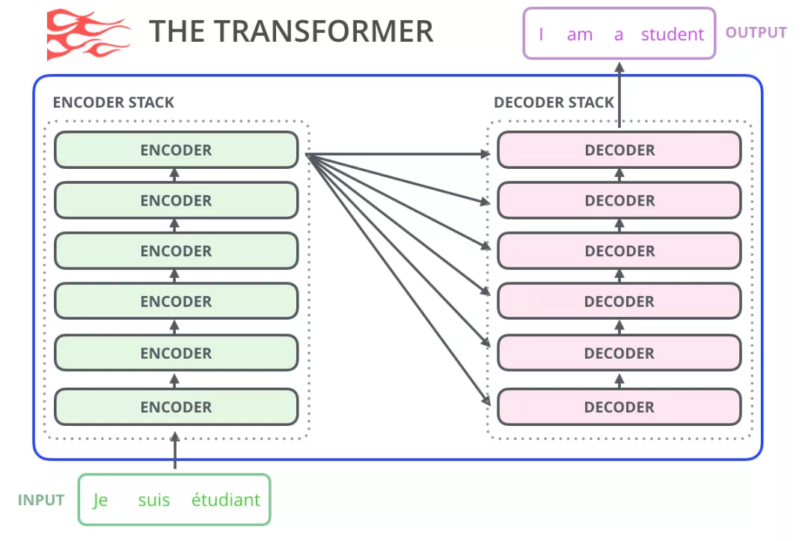

# A Deep Dive into the Transformer Architecture for Interviews

> This guide provides a comprehensive breakdown of the Transformer architecture, a cornerstone of modern Natural Language Processing (NLP) and Large Language Models (LLMs). We will dissect its core components, including the Encoder and Decoder stacks, the revolutionary self-attention mechanism, multi-head attention, and positional encodings. The document delves into the mathematical justifications for design choices, such as the attention scaling factor, and contrasts the Transformer's operational principles during training and inference. It concludes with a curated set of theoretical and practical interview questions, complete with detailed answers and Python/PyTorch implementations, to prepare you for rigorous technical interviews.

## Knowledge Section

### The Transformer Architecture: An Overview

The Transformer model, introduced in the seminal paper "Attention Is All You Need" (Vaswani et al., 2017), marked a paradigm shift in sequence transduction tasks. It was the first model to rely entirely on self-attention mechanisms, dispensing with the recurrent and convolutional layers that were standard in previous state-of-the-art architectures like RNNs and LSTMs. This design choice unlocked massive parallelism and superior handling of long-range dependencies.

The overall architecture follows an encoder-decoder structure, which is particularly well-suited for tasks like machine translation, summarization, and question-answering.


A simplified view highlights the main data flow between the stacks:



### The Encoder Stack

The goal of the Encoder is to process the entire input sequence and generate a rich, context-aware representation for each token. The original Transformer consists of a stack of N=6 identical Encoder Blocks.

Each **Encoder Block** has two primary sub-layers:
1.  **Multi-Head Self-Attention Layer:** This layer allows each token in the input sequence to attend to all other tokens in the sequence (including itself). This process computes a weighted representation of the token based on its relevance to others, capturing complex contextual relationships.
2.  **Position-wise Feed-Forward Network (FFN):** This is a fully connected feed-forward network applied independently to each position's representation. It consists of two linear transformations with a ReLU activation in between.
    $$ \text{FFN}(x) = \max(0, xW_1 + b_1)W_2 + b_2 $$
    The dimensionality expands in the middle layer. Typically, if the input dimension $d_{\text{model}} = 512$, the inner-layer dimension $d_{\text{ff}} = 2048$. This expansion allows the model to learn more complex transformations.

Crucially, a residual connection followed by a Layer Normalization step wraps each of these two sub-layers. This is the **"Add & Norm"** component.

### The Decoder Stack

The Decoder's role is to generate the output sequence one token at a time, using the Encoder's output representations. It also consists of a stack of N=6 identical Decoder Blocks.

Each **Decoder Block** has three sub-layers:
1.  **Masked Multi-Head Self-Attention Layer:** This layer is similar to the self-attention in the Encoder, but with a crucial modification: the **look-ahead mask**. This mask is applied to prevent any position from attending to subsequent positions. This ensures that the prediction for the current token `i` can only depend on the known outputs at positions less than `i`, preserving the autoregressive property required for generation.
2.  **Encoder-Decoder Cross-Attention Layer:** This is where the Decoder interacts with the Encoder's output. It allows every token in the Decoder to attend to all the tokens in the Encoder's output sequence. The **Queries (Q)** come from the previous Decoder sub-layer, while the **Keys (K)** and **Values (V)** come from the final output of the Encoder stack. This mechanism enables the Decoder to focus on the most relevant parts of the input sequence while generating each output token.
3.  **Position-wise Feed-Forward Network (FFN):** This is identical in structure and function to the FFN in the Encoder.

Like the Encoder, each of these three sub-layers is wrapped in an "Add & Norm" component.

### The "Add & Norm" Component

This small but vital component appears after every sub-layer in both the Encoder and Decoder. It consists of two parts:
*   **Add (Residual Connection):** The input to a sub-layer is added to the output of that sub-layer. This is a standard technique from deep learning (e.g., ResNets) to combat the vanishing gradient problem. It creates a "shortcut" for the gradient, allowing information to flow more easily through deep networks and enabling the training of much deeper models. The operation is: `output = sublayer(x) + x`.
*   **Norm (Layer Normalization):** This normalizes the activations across the features for a given layer instance, independent of other instances in the batch. It helps stabilize the learning process by keeping the activations within a consistent range, preventing them from becoming too large or too small and thus speeding up convergence. It is preferred over Batch Normalization for NLP tasks because the statistics (mean and variance) are computed per-instance and per-layer, making it independent of sequence length and batch size, which can vary significantly in text data.

### Positional Encoding: Injecting Sequence Order

Since the self-attention mechanism is inherently position-agnostic (it treats the input as an unordered set of tokens), the model needs a way to understand the order of the sequence. This is achieved by adding **Positional Encodings** to the input embeddings. The Transformer uses sine and cosine functions of different frequencies:

$$
PE_{(pos, 2i)} = \sin\left(\frac{pos}{10000^{2i/d_{\text{model}}}}\right)
$$
$$
PE_{(pos, 2i+1)} = \cos\left(\frac{pos}{10000^{2i/d_{\text{model}}}}\right)
$$

where `pos` is the position of the token in the sequence, `i` is the dimension index within the embedding vector, and $d_{\text{model}}$ is the embedding dimension.

This choice has several advantages:
*   **Uniqueness:** Each position gets a unique encoding vector.
*   **Relative Positioning:** The encoding for a position `pos + k` can be represented as a linear function of the encoding for `pos`, allowing the model to easily learn relative positions.
*   **Extrapolation:** The sinusoidal nature allows the model to handle sequences longer than those seen during training.

### Data Flow: Training vs. Inference

The way the Decoder handles its input differs significantly between training and inference.

**1. Training Phase (Teacher Forcing):**
During training, we have access to the entire ground-truth output sequence. To maximize parallelism and training efficiency, the entire ground-truth output sequence is fed to the Decoder at once. However, to simulate sequential generation, the **look-ahead mask** is used in the first self-attention layer. This mask ensures that when computing the attention for token at position `i`, it can only see tokens from positions `0` to `i`.

*   **Example:** If the ground-truth target is `"<SOS> How are you? <EOS>"`, the entire sequence is input to the decoder. The mask ensures that when processing "are", it can attend to "<SOS>" and "How", but not to "you?".

In practice, this is implemented by feeding the target sequence shifted one position to the right as the Decoder input.
*   **Decoder Input:** `<SOS> How are you?`
*   **Target Output:** `How are you? <EOS>`

**2. Inference (Prediction) Phase (Autoregressive Generation):**
During inference, we don't have the ground-truth sequence. Generation must be done one step at a time in an autoregressive manner.
1.  **Time Step 1:** The input is a special start-of-sequence token, e.g., `<SOS>`. The model predicts the first token (e.g., "What").
2.  **Time Step 2:** The input is now the concatenation of the start token and the previously predicted token: `<SOS> What`. The model predicts the second token (e.g., "is").
3.  **Time Step 3:** The input becomes `<SOS> What is`. The model predicts the third token (e.g., "the").
4.  This process repeats, with the model's own output being fed back as input for the next step, until a special end-of-sequence token (`<EOS>`) is generated or a maximum length is reached.

This sequential process means that Decoder prediction is not parallelizable and is much slower than the parallelized training process.

### The Attention Mechanism: The Heart of the Transformer

#### (1) Scaled Dot-Product Attention

The core of the Transformer is its attention mechanism. It is described as mapping a query and a set of key-value pairs to an output. The output is computed as a weighted sum of the values, where the weight assigned to each value is computed by a compatibility function of the query with the corresponding key.

The specific implementation in the Transformer is **Scaled Dot-Product Attention**.

$$
\text{Attention}(Q, K, V) = \text{softmax}\left(\frac{QK^T}{\sqrt{d_k}}\right)V
$$

Here, $Q$ (Query), $K$ (Key), and $V$ (Value) are matrices packed with the query, key, and value vectors for each token in the sequence. $d_k$ is the dimension of the key vectors.

In **self-attention**, which is used in the Encoder and the first sub-layer of the Decoder, Q, K, and V all come from the same source: the output of the previous layer. This allows a sequence to relate to itself.


#### (2) The (Q, K, V) Triplet Intuition

Using three separate matrices (Q, K, V) derived from the input embeddings provides greater modeling flexibility and expressive power than using fewer.
*   **Query (Q):** Represents the current token's "question" or what information it is looking for.
*   **Key (K):** Represents the other tokens' "labels" or what information they can offer. The compatibility of a Query and a Key (via dot product) determines the attention score.
*   **Value (V):** Represents the actual content or substance of the other tokens. Once attention scores are calculated, they are used to form a weighted sum of the Values.

This separation allows the model to look for information (Q-K matching) based on one representation, while retrieving information (V) based on another.

#### (3) Why Scale? The Math Behind $\frac{1}{\sqrt{d_k}}$

The scaling factor is crucial for stable training.

**Theoretical Justification:**
Assume the components of the query vector $q$ and key vector $k$ are independent random variables with mean 0 and variance 1. Their dot product is $q \cdot k = \sum_{i=1}^{d_k} q_i k_i$.

*   **Mean:** The expected value of the dot product is $E[q \cdot k] = \sum_{i=1}^{d_k} E[q_i k_i] = \sum_{i=1}^{d_k} E[q_i]E[k_i] = \sum_{i=1}^{d_k} 0 \cdot 0 = 0$.
*   **Variance:** The variance of the dot product is $D(q \cdot k) = \sum_{i=1}^{d_k} D(q_i k_i)$.
    Since $D(XY) = E(X^2 Y^2) - [E(XY)]^2 = E(X^2)E(Y^2) - (E(X)E(Y))^2 = D(X)D(Y) + D(X)E(Y)^2 + D(Y)E(X)^2$, and with $E(X)=E(Y)=0, D(X)=D(Y)=1$, we get $D(q_i k_i) = 1$.
    Therefore, $D(q \cdot k) = \sum_{i=1}^{d_k} 1 = d_k$.

The variance of the dot product is $d_k$. This means that for larger values of $d_k$, the dot products grow large in magnitude.

**Practical Consequence: The Softmax Gradient Problem**
The softmax function is sensitive to large input values. When its inputs are large, it tends to produce a very sharp distribution, where one output is close to 1 and all others are close to 0. This phenomenon is called **saturation**.

In saturated regions, the gradient of the softmax function becomes extremely small (approaches 0), leading to the **vanishing gradient problem**. This makes learning difficult as weight updates become negligible.

By scaling the dot products by $\frac{1}{\sqrt{d_k}}$, we scale the variance back to 1:
$$ D\left(\frac{q\cdot k}{\sqrt{d_k}}\right) = \frac{1}{(\sqrt{d_k})^2} D(q \cdot k) = \frac{d_k}{d_k} = 1 $$
This keeps the inputs to the softmax function in a healthier range, preventing saturation and ensuring stable gradients for effective training.

The plot below demonstrates how the output of softmax for the largest element in a vector $[a, a, 2a]$ quickly saturates to 1 as the magnitude `a` increases.

```python
import numpy as np
from math import exp
from matplotlib import pyplot as plt

# Define the softmax output for the 3rd element in a vector [a, a, 2a]
f = lambda a: exp(2*a) / (exp(a) + exp(a) + exp(2*a))

# Generate values for 'a'
a_values = np.linspace(0, 15, 100)
# Calculate the corresponding softmax output
y_values = [f(a_i) for a_i in a_values]

# Plotting
plt.figure(figsize=(10, 6))
plt.plot(a_values, y_values, label='softmax(2a)')
plt.title('Softmax Saturation with Increasing Input Magnitude')
plt.xlabel('Input Magnitude (a)')
plt.ylabel('Softmax Output for Largest Element')
plt.grid(True)
plt.legend()
plt.show()

```


### Multi-Head Attention (MHA)

Instead of performing a single attention function, Multi-Head Attention was found to be more beneficial. It works by projecting the queries, keys, and values `h` times (the number of heads) with different, learned linear projections. Attention is then performed in parallel on each of these projected versions. The outputs from each head are then concatenated and linearly projected back to the original dimension.

$$
\text{MultiHead}(Q, K, V) = \text{Concat}(\text{head}_1, \dots, \text{head}_h)W^O
$$
where
$$
\text{head}_i = \text{Attention}(QW_i^Q, KW_i^K, VW_i^V)
$$

**Why use MHA?**
1.  **Ensemble Effect:** It's similar to having multiple convolutional filters in a CNN. Each head can learn to focus on different types of relationships or features in different representation subspaces. One head might capture syntactic dependencies, while another captures semantic ones.
2.  **Richer Representations:** By combining the outputs, the model can synthesize a richer representation that incorporates diverse aspects of the information. It allows the model to jointly attend to information from different representation subspaces at different positions.

### Transformer vs. Predecessors (RNN/LSTM, Seq2Seq)

**Compared to RNN/LSTM:**
*   **Parallelism:** The biggest advantage is that Transformers can process all tokens in a sequence simultaneously, unlike RNNs which must process them sequentially. This makes Transformers vastly more efficient on modern hardware (GPUs/TPUs).
*   **Path Length:** In an RNN, the "distance" between the first and last token is $O(n)$, where $n$ is the sequence length. Information can be lost over this long path. In a Transformer, the path length between any two tokens is $O(1)$, as they can be directly connected via the self-attention mechanism. This makes it far superior at capturing long-range dependencies.

**Compared to classic Seq2Seq with Attention:**
*   **Information Bottleneck:** Traditional seq2seq models compress the entire input sequence into a single fixed-size context vector. This is a major information bottleneck.
*   **Transformer's Solution:** The Transformer's Encoder produces a set of representations (one for each input token). The Decoder's cross-attention mechanism can then look at this entire set at every step, allowing it to focus on the most relevant parts of the input for each token it generates, eliminating the bottleneck.

## Interview Questions

### Theoretical Questions

**1. What is the core innovation of the Transformer architecture compared to RNNs?**
**Answer:** The core innovation is the complete replacement of recurrence with the **self-attention mechanism**. While RNNs process sequences token-by-token, maintaining a hidden state that carries past information, Transformers process the entire sequence at once. The self-attention mechanism allows any token to directly attend to any other token in the sequence, regardless of their distance. This has two major consequences:
*   **Massive Parallelism:** Since there are no sequential dependencies in the computation within a layer, all tokens can be processed in parallel, making training significantly faster on modern hardware.
*   **Superior Long-Range Dependency Handling:** The path length between any two tokens is constant ($O(1)$), allowing the model to capture long-range dependencies far more effectively than RNNs, where information has to travel through a long chain of recurrent steps ($O(n)$) and is prone to being lost.

---

**2. Explain the roles of Query (Q), Key (K), and Value (V) in the attention mechanism.**
**Answer:** The Q, K, V abstraction is inspired by information retrieval systems.
*   **Query (Q):** Represents the current token that is seeking information. It's like a search query asking, "What parts of the sequence are relevant to me?"
*   **Key (K):** Represents all tokens in the sequence (including the current one) that offer information. Each token has a Key that acts as a "label" or "descriptor." The query is compared against all keys to find matches.
*   **Value (V):** Represents the actual content or embedding of each token. After the Query matches with the Keys to produce attention scores (weights), these scores are used to create a weighted sum of the Values. This final sum is the output of the attention mechanism—a new representation of the query token that is enriched with context from the most relevant parts of the sequence.

---

**3. Why is the dot-product in self-attention scaled by $\sqrt{d_k}$? Derive the variance of the dot product to support your answer.**
**Answer:** The scaling is performed to prevent the softmax function from entering its saturation region, which would lead to vanishing gradients and hinder training.

**Derivation:**
1.  **Assumptions:** Let the query vector $q$ and key vector $k$ be $d_k$-dimensional vectors. Assume their components ($q_i, k_i$) are independent and identically distributed (i.i.d.) random variables with a mean of 0 and a variance of 1.
    *   $E[q_i] = E[k_i] = 0$
    *   $D[q_i] = D[k_i] = E[q_i^2] - (E[q_i])^2 = E[q_i^2] - 0 = 1 \implies E[q_i^2]=1$. Similarly, $E[k_i^2]=1$.

2.  **Dot Product:** The dot product is $q \cdot k = \sum_{i=1}^{d_k} q_i k_i$.

3.  **Mean of the Dot Product:** Due to the linearity of expectation:
    $$ E[q \cdot k] = E\left[\sum_{i=1}^{d_k} q_i k_i\right] = \sum_{i=1}^{d_k} E[q_i k_i] $$
    Because $q_i$ and $k_i$ are independent, $E[q_i k_i] = E[q_i] E[k_i] = 0 \cdot 0 = 0$.
    $$ E[q \cdot k] = \sum_{i=1}^{d_k} 0 = 0 $$

4.  **Variance of the Dot Product:** Since the terms $q_i k_i$ are independent for each $i$, the variance of the sum is the sum of the variances:
    $$ D[q \cdot k] = D\left[\sum_{i=1}^{d_k} q_i k_i\right] = \sum_{i=1}^{d_k} D[q_i k_i] $$
    Let's find the variance of a single term $q_i k_i$:
    $$ D[q_i k_i] = E[(q_i k_i)^2] - (E[q_i k_i])^2 $$
    We already know $E[q_i k_i] = 0$. Because $q_i$ and $k_i$ are independent, so are $q_i^2$ and $k_i^2$.
    $$ E[(q_i k_i)^2] = E[q_i^2 k_i^2] = E[q_i^2] E[k_i^2] = 1 \cdot 1 = 1 $$
    Therefore, $D[q_i k_i] = 1 - 0^2 = 1$.
    Plugging this back into the sum:
    $$ D[q \cdot k] = \sum_{i=1}^{d_k} 1 = d_k $$

**Conclusion:** The variance of the dot product is $d_k$. As the dimension $d_k$ grows, the dot products get larger, pushing the softmax function into regions where gradients are near zero. By dividing the dot product by $\sqrt{d_k}$, we normalize the variance back to 1, ensuring stable gradients.

---

**4. Explain the difference between the three types of attention in a Transformer: encoder self-attention, masked decoder self-attention, and encoder-decoder cross-attention.**
**Answer:**
1.  **Encoder Self-Attention:**
    *   **Location:** In each encoder block.
    *   **Purpose:** To generate context-aware representations for each token in the input sequence.
    *   **Mechanism:** Q, K, and V all come from the output of the previous encoder layer. Every token can attend to every other token in the input sequence, allowing it to gather information from the entire input.

2.  **Masked Decoder Self-Attention:**
    *   **Location:** The first sub-layer of each decoder block.
    *   **Purpose:** To build a representation for the output sequence being generated, while respecting the autoregressive property (i.e., not looking into the future).
    *   **Mechanism:** Q, K, and V all come from the output of the previous decoder layer. A "look-ahead mask" is applied to the attention scores before the softmax. This mask sets the scores for all subsequent positions to $-\infty$, ensuring that the prediction for position `i` can only depend on tokens at positions `0` to `i`.

3.  **Encoder-Decoder Cross-Attention:**
    *   **Location:** The second sub-layer of each decoder block.
    *   **Purpose:** This is the key link between the encoder and decoder. It allows the decoder to focus on the most relevant parts of the *input sequence* while generating each token of the *output sequence*.
    *   **Mechanism:** The Queries (Q) come from the output of the preceding masked self-attention layer in the decoder. The Keys (K) and Values (V) come from the final output of the *entire encoder stack*. This structure lets each decoder token "query" the encoded input representations to decide where to focus.

---

**5. How does the Transformer handle the order of the sequence, given it has no recurrent components?**
**Answer:** The Transformer handles sequence order by explicitly injecting positional information into the model via **Positional Encodings**. Since the self-attention mechanism itself is position-agnostic, without these encodings, it would treat the input as an unordered bag of words.

The process is as follows:
1.  A unique positional encoding vector is generated for each position in the sequence (from 0 to max length).
2.  This positional encoding vector has the same dimension ($d_{\text{model}}$) as the token embeddings.
3.  The positional encoding vector is simply added to the corresponding token embedding.
4.  The resulting combined embedding, which now contains both semantic and positional information, is fed into the first layer of the encoder/decoder.

The original paper used sine and cosine functions of different frequencies for this:
$$ PE_{(pos, 2i)} = \sin\left(\frac{pos}{10000^{2i/d_{\text{model}}}}\right) $$
$$ PE_{(pos, 2i+1)} = \cos\left(\frac{pos}{10000^{2i/d_{\text{model}}}}\right) $$
This formulation allows the model to learn relative positional relationships, as the encoding for `pos + k` can be expressed as a linear transformation of the encoding for `pos`.

---

**6. What is the purpose of the "Add & Norm" layers? Why is Layer Normalization typically used instead of Batch Normalization in Transformers?**
**Answer:**
The "Add & Norm" component serves two critical functions:
*   **Add (Residual Connection):** The `Add` part implements a residual (or skip) connection. The input to a sub-layer is added directly to its output. This is vital for training very deep networks (like a stack of 6 or 12 Transformer blocks) because it provides a "shortcut" for the gradient to flow through the network. This mitigates the vanishing gradient problem, allowing for more stable and effective training of deeper architectures.
*   **Norm (Layer Normalization):** The `Norm` part normalizes the activations from the previous step. This stabilizes the training process by keeping the distribution of activations consistent throughout the network, which helps speed up convergence and can act as a form of regularization.

**Layer Norm vs. Batch Norm:**
*   **Batch Normalization** normalizes activations across the *batch dimension*. For each feature, it computes a mean and standard deviation based on all the examples in the current mini-batch.
*   **Layer Normalization** normalizes activations across the *feature dimension*. For each example in the batch, it computes a mean and standard deviation based on all the features of that single example.

In NLP and Transformer models, **Layer Normalization is preferred** for a few key reasons:
1.  **Variable Sequence Lengths:** NLP tasks often involve sequences of varying lengths. Padding shorter sequences can cause the statistics in Batch Norm to be skewed by the padding tokens. Layer Norm is independent of other sequences in the batch and is not affected by this.
2.  **Small Batch Sizes:** Transformers, especially large ones, are memory-intensive, often forcing the use of small batch sizes. The statistics calculated by Batch Norm can be noisy and unstable with small batches, whereas Layer Norm's statistics are calculated per-example and are therefore independent of the batch size.

---

**7. Explain the concept of Multi-Head Attention. What are its benefits over single-head attention?**
**Answer:**
Multi-Head Attention (MHA) is a mechanism where instead of performing a single attention calculation, the model runs multiple attention mechanisms—the "heads"—in parallel and then combines their results.

The process is:
1.  **Projection:** The input Query, Key, and Value matrices are each linearly projected `h` times using different, learned weight matrices ($W_i^Q, W_i^K, W_i^V$). This creates `h` sets of Q, K, and V for each head.
2.  **Parallel Attention:** Scaled Dot-Product Attention is applied independently to each of these `h` sets, producing `h` separate output matrices.
3.  **Concatenation & Projection:** The `h` output matrices are concatenated and then passed through a final linear projection ($W^O$) to produce the final output, which has the original dimension.

**Benefits of MHA:**
1.  **Diverse Subspace Learning:** MHA allows the model to jointly attend to information from different representation subspaces at different positions. Each head can learn to focus on a different aspect of the sequence. For example, one head might learn to track syntactic relationships, another might track semantic relationships, and another might track coreference.
2.  **Increased Expressive Power:** A single attention head might be forced to average all these different types of relationships into a single representation. By having multiple heads, the model can capture a richer, more nuanced set of dependencies, leading to a more powerful model. It's analogous to how CNNs use multiple filters to detect different types of features (edges, textures, shapes).

---

**8. Describe the data flow during the training of a Transformer decoder. What is "teacher forcing"?**
**Answer:**
During training, the Transformer decoder is trained to predict the next token in a target sequence, given the encoder's output and the preceding ground-truth tokens. The data flow is designed for maximum parallelism.

1.  **Input:** The decoder receives two main inputs:
    *   The complete output from the encoder stack (the K and V matrices for the cross-attention layer).
    *   The entire target sequence, shifted one position to the right and prepended with a start-of-sequence token (`<SOS>`). For example, if the target is `How are you? <EOS>`, the decoder input is `<SOS> How are you?`.

2.  **Masked Self-Attention:** The decoder input passes through the masked self-attention layer. The look-ahead mask ensures that for each position `i`, the model can only attend to tokens from `0` to `i`, preventing it from "cheating" by seeing future tokens.

3.  **Cross-Attention:** The output of the masked self-attention then goes to the cross-attention layer, where it acts as the Query to attend to the Keys and Values from the encoder's output.

4.  **FFN and Output:** The result passes through the FFN, and finally, a linear layer followed by a softmax produces a probability distribution over the entire vocabulary for each position in the output sequence.

**Teacher Forcing** is the strategy of using the **actual ground-truth tokens** from the target sequence as input to the decoder at each step during training, rather than using the model's own (potentially incorrect) predictions from the previous step. This is what allows the entire sequence to be processed in parallel. It stabilizes training by ensuring the model always receives correct context, preventing errors from accumulating, which could happen if it had to rely on its own imperfect predictions.

---

**9. Contrast the parallelism capabilities of the Transformer's Encoder and Decoder during both training and inference.**
**Answer:**
*   **Encoder (Training & Inference):** The Encoder is **fully parallelizable** in both training and inference. Since it processes the entire input sequence at once and has no masking that prevents tokens from seeing each other, the computations for all tokens (self-attention, FFN) can be performed simultaneously as large matrix operations.

*   **Decoder (Training):** The Decoder is **highly parallelizable** during training. This is enabled by two key factors: teacher forcing and the look-ahead mask. Because the entire ground-truth sequence is fed in at once (teacher forcing), the model doesn't need to wait for a previous token to be generated. The look-ahead mask enforces the autoregressive property logically, while the computation for all positions can still happen in parallel via matrix operations.

*   **Decoder (Inference):** The Decoder is **not parallelizable** during inference. The generation process is inherently **sequential and autoregressive**. To generate token `t`, the model must have already generated all tokens from `1` to `t-1`, as they become the input for the current step. This creates a sequential dependency that cannot be parallelized, making inference a much slower, step-by-step process.

---

**10. The Feed-Forward Network in each block is position-wise. What does this mean and why is it structured this way?**
**Answer:**
"Position-wise" means that the **exact same** Feed-Forward Network (with the same weight matrices, $W_1, b_1, W_2, b_2$) is applied independently to the representation of **each token (position)** in the sequence.

If the output from the attention layer is a matrix of size `(sequence_length, d_model)`, the position-wise FFN processes each of the `sequence_length` row vectors identically and independently. While the same FFN is used for all positions within a single layer, different layers of the Transformer have different FFNs.

**Why is it structured this way?**
1.  **Consistency and Parameter Sharing:** It introduces a consistent transformation across all parts of the sequence, while still allowing each position's representation to be transformed based on its unique values. This parameter sharing makes the model more efficient.
2.  **Non-linearity and Depth:** The primary role of the FFN is to introduce non-linearity and additional computational depth after the attention layer. The attention layer is primarily linear in its transformations (dot products and weighted sums), except for the softmax. The FFN, with its ReLU activation, provides a rich, non-linear transformation of each token's representation, allowing the model to learn more complex functions.
3.  **Projecting into a New Space:** It can be seen as projecting the attention-infused representations into a new space where they might be more easily processed by the next layer's attention mechanism. The expansion-compression structure (`d_model` -> `d_ff` -> `d_model`) facilitates this.

---
**11. Derive the gradient of the Softmax function and explain how large input values can lead to the vanishing gradient problem.**

**Answer:**
Let the input to the softmax be a vector $X = [x_1, x_2, \dots, x_n]$, and the output be $Y = \text{softmax}(X) = [y_1, y_2, \dots, y_n]$. The formula for each output component is:
$$ y_i = \frac{e^{x_i}}{\sum_{j=1}^{n} e^{x_j}} $$
To find the gradient, we need to compute the partial derivative $\frac{\partial y_i}{\partial x_j}$ for all pairs of $i,j$. We consider two cases.

**Case 1: $i = j$** (The derivative of an output with respect to its corresponding input)
Using the quotient rule $\left(\frac{u}{v}\right)' = \frac{u'v - uv'}{v^2}$:
$$
\begin{aligned}
\frac{\partial y_i}{\partial x_i} &= \frac{\partial}{\partial x_i}\left(\frac{e^{x_i}}{\sum_{k=1}^n e^{x_k}}\right) \\
&= \frac{(e^{x_i})'(\sum_k e^{x_k}) - e^{x_i}(\sum_k e^{x_k})'}{(\sum_k e^{x_k})^2} \\
&= \frac{e^{x_i}(\sum_k e^{x_k}) - e^{x_i}(e^{x_i})}{(\sum_k e^{x_k})^2} \\
&= \frac{e^{x_i}}{\sum_k e^{x_k}} \cdot \frac{\sum_k e^{x_k}}{(\sum_k e^{x_k})} - \frac{e^{x_i}}{\sum_k e^{x_k}} \cdot \frac{e^{x_i}}{\sum_k e^{x_k}} \\
&= y_i - y_i^2 = y_i(1 - y_i)
\end{aligned}
$$

**Case 2: $i \neq j$** (The derivative of an output with respect to a different input)
Again, using the quotient rule. The numerator $e^{x_i}$ does not depend on $x_j$, so its derivative is 0.
$$
\begin{aligned}
\frac{\partial y_i}{\partial x_j} &= \frac{\partial}{\partial x_j}\left(\frac{e^{x_i}}{\sum_{k=1}^n e^{x_k}}\right) \\
&= \frac{0 \cdot (\sum_k e^{x_k}) - e^{x_i}(e^{x_j})}{(\sum_k e^{x_k})^2} \\
&= - \frac{e^{x_i} e^{x_j}}{(\sum_k e^{x_k})^2} \\
&= - \left(\frac{e^{x_i}}{\sum_k e^{x_k}}\right) \left(\frac{e^{x_j}}{\sum_k e^{x_k}}\right) = -y_i y_j
\end{aligned}
$$

**Explanation of Vanishing Gradients:**
When the input values $x_k$ become very large, the softmax function becomes "saturated." Specifically, if one input $x_k$ is much larger than the others, its corresponding output $y_k$ will approach 1, and all other outputs $y_j$ (where $j \neq k$) will approach 0.

Let's examine the gradients in this saturated state where $y_k \approx 1$ and $y_j \approx 0$ for $j \neq k$:
*   For $i=j=k$: $\frac{\partial y_k}{\partial x_k} = y_k(1-y_k) \approx 1(1-1) = 0$.
*   For $i=j \neq k$: $\frac{\partial y_j}{\partial x_j} = y_j(1-y_j) \approx 0(1-0) = 0$.
*   For $i \neq j$: $\frac{\partial y_i}{\partial x_j} = -y_i y_j \approx 0$.

In all cases, the gradients approach 0. During backpropagation, these near-zero gradients are multiplied through the chain rule, causing the gradients for all preceding layers to also become near-zero. This is the **vanishing gradient problem**. The model's parameters receive virtually no update, and learning stalls. This is precisely why scaling the dot products in the attention mechanism is so important.


### Practical & Coding Questions

**1. Implement Scaled Dot-Product Attention from scratch in PyTorch.**

```python
import torch
import torch.nn as nn
import torch.nn.functional as F
import math

def scaled_dot_product_attention(q, k, v, mask=None):
    """
    Computes Scaled Dot-Product Attention.

    Args:
        q (torch.Tensor): Queries. Shape: (batch_size, num_heads, seq_len_q, depth)
        k (torch.Tensor): Keys. Shape: (batch_size, num_heads, seq_len_k, depth)
        v (torch.Tensor): Values. Shape: (batch_size, num_heads, seq_len_v, depth)
                          Note: seq_len_k must equal seq_len_v
        mask (torch.Tensor, optional): Mask to be applied. Shape can be
                                       (batch_size, 1, 1, seq_len_k) for padding mask or
                                       (1, 1, seq_len_q, seq_len_k) for look-ahead mask.
                                       Defaults to None.

    Returns:
        tuple: A tuple containing:
            - output (torch.Tensor): The attention-weighted output. Shape: (batch_size, num_heads, seq_len_q, depth)
            - attention_weights (torch.Tensor): The attention weights. Shape: (batch_size, num_heads, seq_len_q, seq_len_k)
    """
    # Get the depth of the key vectors
    d_k = k.size(-1)

    # 1. Calculate the dot products of queries and keys.
    # (batch, num_heads, seq_len_q, depth) @ (batch, num_heads, depth, seq_len_k)
    # -> (batch, num_heads, seq_len_q, seq_len_k)
    matmul_qk = torch.matmul(q, k.transpose(-2, -1))

    # 2. Scale the dot products by the square root of the depth.
    scaled_attention_logits = matmul_qk / math.sqrt(d_k)

    # 3. Apply the mask (if provided).
    # The mask is typically used to prevent attending to padding tokens or future tokens.
    # Masked values are set to a very small number (-1e9) so they become zero after softmax.
    if mask is not None:
        scaled_attention_logits += (mask * -1e9)

    # 4. Apply softmax to get the attention weights.
    # The softmax is applied on the last dimension (seq_len_k) to get weights for each query.
    attention_weights = F.softmax(scaled_attention_logits, dim=-1)

    # 5. Multiply the attention weights by the values.
    # (batch, num_heads, seq_len_q, seq_len_k) @ (batch, num_heads, seq_len_v, depth)
    # -> (batch, num_heads, seq_len_q, depth)
    output = torch.matmul(attention_weights, v)

    return output, attention_weights

# Example Usage
batch_size, num_heads, seq_len, d_model = 4, 8, 10, 512
depth = d_model // num_heads

q = torch.randn(batch_size, num_heads, seq_len, depth)
k = torch.randn(batch_size, num_heads, seq_len, depth)
v = torch.randn(batch_size, num_heads, seq_len, depth)

output, weights = scaled_dot_product_attention(q, k, v)
print("Output shape:", output.shape)
print("Attention weights shape:", weights.shape)
```

**2. Implement a single Multi-Head Attention block in PyTorch.**

```python
import torch
import torch.nn as nn
import math
import torch.nn.functional as F

# Assuming scaled_dot_product_attention function from Q1 is available

class MultiHeadAttention(nn.Module):
    def __init__(self, d_model, num_heads):
        """
        Initializes the MultiHeadAttention layer.

        Args:
            d_model (int): The dimensionality of the input and output embeddings.
            num_heads (int): The number of attention heads.
        """
        super(MultiHeadAttention, self).__init__()
        assert d_model % num_heads == 0, "d_model must be divisible by num_heads"

        self.d_model = d_model
        self.num_heads = num_heads
        self.depth = d_model // num_heads

        # Linear layers for Query, Key, Value, and the final output
        self.wq = nn.Linear(d_model, d_model)
        self.wk = nn.Linear(d_model, d_model)
        self.wv = nn.Linear(d_model, d_model)
        self.dense = nn.Linear(d_model, d_model)

    def split_heads(self, x, batch_size):
        """
        Splits the last dimension into (num_heads, depth).
        Transposes the result to be (batch_size, num_heads, seq_len, depth)

        Args:
            x (torch.Tensor): Input tensor. Shape: (batch_size, seq_len, d_model)
            batch_size (int): The size of the batch.

        Returns:
            torch.Tensor: Reshaped tensor. Shape: (batch_size, num_heads, seq_len, depth)
        """
        x = x.view(batch_size, -1, self.num_heads, self.depth)
        return x.transpose(1, 2)

    def forward(self, q, k, v, mask=None):
        """
        Forward pass for MultiHeadAttention.

        Args:
            q (torch.Tensor): Query tensor. Shape: (batch_size, seq_len_q, d_model)
            k (torch.Tensor): Key tensor. Shape: (batch_size, seq_len_k, d_model)
            v (torch.Tensor): Value tensor. Shape: (batch_size, seq_len_v, d_model)
            mask (torch.Tensor, optional): Mask to be applied. Defaults to None.

        Returns:
            tuple: A tuple containing:
                - output (torch.Tensor): Final output. Shape: (batch_size, seq_len_q, d_model)
                - attention_weights (torch.Tensor): Attention weights. Shape: (batch_size, num_heads, seq_len_q, seq_len_k)
        """
        batch_size = q.size(0)

        # 1. Pass inputs through linear layers
        q = self.wq(q)  # (batch_size, seq_len_q, d_model)
        k = self.wk(k)  # (batch_size, seq_len_k, d_model)
        v = self.wv(v)  # (batch_size, seq_len_v, d_model)

        # 2. Split into multiple heads
        q = self.split_heads(q, batch_size)  # (batch_size, num_heads, seq_len_q, depth)
        k = self.split_heads(k, batch_size)  # (batch_size, num_heads, seq_len_k, depth)
        v = self.split_heads(v, batch_size)  # (batch_size, num_heads, seq_len_v, depth)

        # 3. Apply scaled dot-product attention
        # scaled_attention shape: (batch_size, num_heads, seq_len_q, depth)
        # attention_weights shape: (batch_size, num_heads, seq_len_q, seq_len_k)
        scaled_attention, attention_weights = scaled_dot_product_attention(q, k, v, mask)

        # 4. Concatenate heads
        # First, transpose back to (batch_size, seq_len_q, num_heads, depth)
        scaled_attention = scaled_attention.transpose(1, 2)
        # Then, reshape to (batch_size, seq_len_q, d_model)
        concat_attention = scaled_attention.contiguous().view(batch_size, -1, self.d_model)

        # 5. Pass through final linear layer
        output = self.dense(concat_attention)  # (batch_size, seq_len_q, d_model)

        return output, attention_weights

# Example Usage
batch_size, seq_len, d_model, num_heads = 4, 10, 512, 8
mha = MultiHeadAttention(d_model, num_heads)
q = torch.randn(batch_size, seq_len, d_model) # In self-attention, k and v are the same as q

output, weights = mha(q, q, q, mask=None)
print("MHA Output shape:", output.shape)
print("MHA Attention weights shape:", weights.shape)
```

**3. Code the Positional Encoding layer in PyTorch.**

```python
import torch
import torch.nn as nn
import math

class PositionalEncoding(nn.Module):
    def __init__(self, d_model, max_len=5000):
        """
        Initializes the PositionalEncoding layer.

        Args:
            d_model (int): The dimensionality of the embeddings.
            max_len (int): The maximum possible length of a sequence.
        """
        super(PositionalEncoding, self).__init__()

        # Create a positional encoding matrix of shape (max_len, d_model)
        pe = torch.zeros(max_len, d_model)

        # Create a position tensor of shape (max_len, 1)
        position = torch.arange(0, max_len, dtype=torch.float).unsqueeze(1)

        # Create the division term for the sine/cosine functions
        # This is 1 / (10000^(2i/d_model))
        # It's calculated in log space for numerical stability
        div_term = torch.exp(torch.arange(0, d_model, 2).float() * (-math.log(10000.0) / d_model))

        # Apply sine to even indices in the d_model dimension
        pe[:, 0::2] = torch.sin(position * div_term)

        # Apply cosine to odd indices in the d_model dimension
        pe[:, 1::2] = torch.cos(position * div_term)

        # Add a batch dimension so it can be easily added to the input embeddings
        # Shape becomes (1, max_len, d_model)
        pe = pe.unsqueeze(0)

        # Register 'pe' as a buffer. A buffer is part of the model's state,
        # but it is not considered a model parameter to be trained.
        self.register_buffer('pe', pe)

    def forward(self, x):
        """
        Adds positional encoding to the input tensor.

        Args:
            x (torch.Tensor): Input tensor. Shape: (batch_size, seq_len, d_model)

        Returns:
            torch.Tensor: Output tensor with positional encoding. Shape: (batch_size, seq_len, d_model)
        """
        # Add the positional encoding to the input embeddings.
        # self.pe is sliced to match the sequence length of the input x.
        x = x + self.pe[:, :x.size(1), :]
        return x

# Example Usage
d_model, seq_len, batch_size = 512, 20, 4
pos_encoder = PositionalEncoding(d_model)
x = torch.randn(batch_size, seq_len, d_model) # Dummy embeddings
x_pos = pos_encoder(x)
print("Input shape:", x.shape)
print("Output shape with positional encoding:", x_pos.shape)
```

**4. Write a PyTorch function to generate a subsequent token mask (look-ahead mask) for the Decoder.**

```python
import torch

def create_look_ahead_mask(size):
    """
    Creates a look-ahead mask for self-attention in the decoder.
    The mask is a square matrix where positions that are allowed to be
    attended to have a value of 0, and positions that are masked
    (i.e., future positions) have a value of 1.

    Args:
        size (int): The length of the target sequence.

    Returns:
        torch.Tensor: The look-ahead mask. Shape: (1, 1, size, size)
    """
    # torch.triu returns the upper triangular part of a 2D matrix.
    # The diagonal=1 argument means it excludes the main diagonal.
    # This creates a matrix with 1s in the upper triangle and 0s elsewhere.
    mask = torch.triu(torch.ones(size, size), diagonal=1)

    # The mask should be a boolean tensor where True means "mask this position".
    # However, for use in attention, it's common to return 0 for allowed
    # and 1 for masked (or float equivalents).
    # Shape becomes (size, size)
    
    # We add dimensions for batch_size and num_heads for broadcasting
    # Shape becomes (1, 1, size, size)
    return mask.unsqueeze(0).unsqueeze(0) == 1

# Example Usage
seq_length = 5
mask = create_look_ahead_mask(seq_length)

print("Look-ahead mask tensor (True means masked):")
print(mask)
# When used in attention, this mask will be multiplied by -1e9 and added
# to the attention logits.
# (mask * -1e9) will result in:
# tensor([[[[0., -1.e+09, -1.e+09, -1.e+09, -1.e+09],
#           [0.,     0., -1.e+09, -1.e+09, -1.e+09],
#           [0.,     0.,     0., -1.e+09, -1.e+09],
#           [0.,     0.,     0.,     0., -1.e+09],
#           [0.,     0.,     0.,     0.,     0.]]]])
```