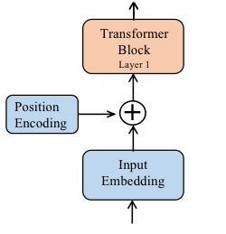
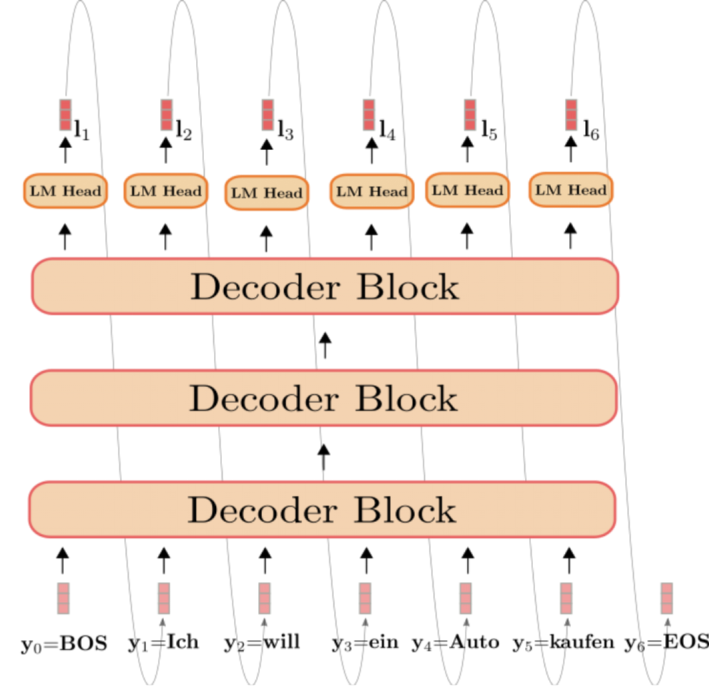
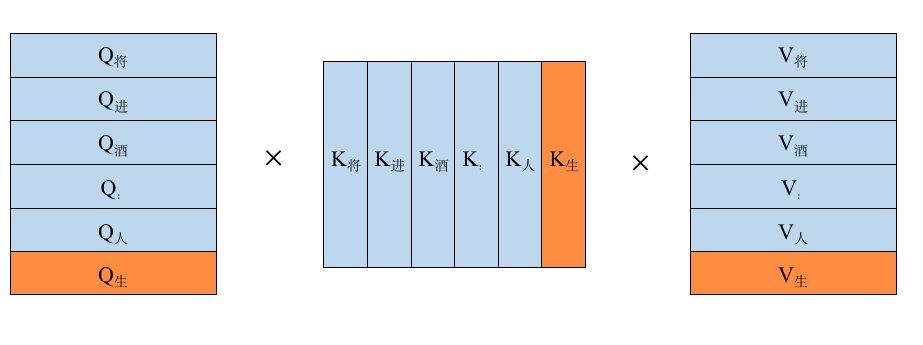
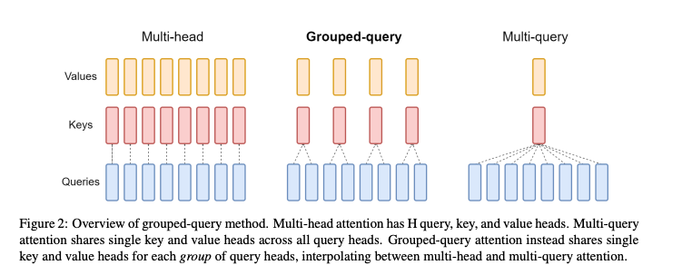

# A Deep Dive into the Llama 2 Architecture for Technical Interviews

> This guide provides a comprehensive breakdown of the Llama 2 architecture, transforming the original notes into an in-depth interview preparation resource. We will explore the entire data processing pipeline, from tokenization to generation, and take a deep dive into Llama 2's key architectural innovations, including RMSNorm, Rotary Positional Embeddings (RoPE), Grouped-Query Attention (GQA) with KV Caching, and the SwiGLU feed-forward network. The content is structured to build a strong conceptual foundation and is supplemented with theoretical and practical interview questions to test your understanding.

## Knowledge

### 1. The Large Language Model (LLM) Processing Pipeline

Before diving into the specifics of Llama 2, it's crucial to understand the standard processing pipeline for a modern autoregressive Large Language Model.

#### 1.1. Input Data
The process begins with a raw text string, which serves as the prompt or context for the model.

```text
"To be, or not to be, that is the question:"
```

#### 1.2. Tokenization
The raw text is converted into a sequence of numerical tokens. This involves two steps:
1.  **Segmentation**: The text is broken down into smaller units (tokens), which can be words, subwords, or characters. Llama 2 uses a **SentencePiece** tokenizer, which implements an algorithm like Byte-Pair Encoding (BPE). BPE is effective at handling unknown words and balancing vocabulary size with sequence length.
2.  **Indexing**: Each token is mapped to a unique integer ID from a predefined vocabulary. Special tokens like `BOS` (Beginning of Sentence) and `EOS` (End of Sentence) are often added.

```text
Text: "To be, or not to be"
Tokenized Sequence: ['BOS', ' To', ' be', ',', ' or', ' not', ' to', ' be', 'EOS']
Indexed Sequence: [1, 312, 345, 13, 421, 532, 298, 345, 2]
```

#### 1.3. Embedding
The sequence of integer IDs is transformed into a sequence of dense vectors, known as embeddings. Each integer ID is mapped to a high-dimensional vector. This embedding layer is a lookup table of weights that are learned during model training.

*   `ID: 312` -> `[0.12, -0.45, ..., 0.89]` (a dense vector of dimension `d_model`)
*   `ID: 345` -> `[0.98, 0.11, ..., -0.23]` (another vector of dimension `d_model`)

The result is a matrix of shape `(sequence_length, d_model)`, where `d_model` is the hidden dimension of the model (e.g., 4096 for Llama 2 7B).

#### 1.4. Positional Encoding
Standard Transformer architectures are permutation-invariant, meaning they don't inherently understand the order of tokens. Positional encodings are added to the token embeddings to provide this crucial information. Unlike the original Transformer which used static sinusoidal encodings, Llama 2 employs **Rotary Positional Embedding (RoPE)**, which is applied within the attention mechanism itself. This will be discussed in detail later.

#### 1.5. The Transformer Decoder
LLMs designed for text generation tasks, like Llama 2 and GPT, use a **"Decoder-Only"** Transformer architecture. This means the model consists of a stack of decoder blocks. Each block contains two main sub-layers:
1.  A **Masked Self-Attention** mechanism.
2.  A **Feed-Forward Network (FFN)**.

Residual connections and normalization layers are used around each of these sub-layers. The "masking" in the self-attention layer is critical for autoregressive generation, as it prevents a token at position `i` from attending to any tokens at positions `j > i`.

#### 1.6. Autoregressive Generation
Generation happens one token at a time in a loop. The model takes the current sequence of tokens as input and predicts a probability distribution over the entire vocabulary for the *next* token.

```python
# A conceptual autoregressive generation loop
model = Llama2()
def generate(prompt_tokens, num_tokens_to_generate):
    generated_tokens = []
    # Use prompt_tokens as the initial input
    current_tokens = prompt_tokens 
    for _ in range(num_tokens_to_generate):
        # The model predicts logits for the next token
        logits = model(current_tokens)
        # We only care about the logits for the very last position
        next_token_logits = logits[:, -1, :] 
        # Convert logits to probabilities and sample the next token
        next_token = sample(next_token_logits) 
        # Append the new token to our sequence for the next iteration
        current_tokens.append(next_token)
        generated_tokens.append(next_token)
    return generated_tokens
```

#### 1.7. Output Processing & Sampling
The final layer of the Transformer outputs a vector of logits for each position. For the next token, we focus on the logits of the last position. To select a token from this distribution, several sampling strategies can be used:

*   **Greedy Sampling**: Simply pick the token with the highest probability (`argmax`). This is deterministic but can lead to repetitive and boring text.
*   **Temperature Scaling**: The logits are divided by a temperature value ($T$) before applying the softmax function.
    *   $T > 1$: Makes the distribution flatter, increasing randomness and creativity.
    *   $0 < T < 1$: Makes the distribution sharper, favoring higher probability tokens.
    *   $T = 1$: Standard softmax.
*   **Top-p (Nucleus) Sampling**: Instead of considering all tokens, we select from the smallest set of tokens whose cumulative probability is greater than a threshold `p`. This provides a dynamic vocabulary size for sampling, adapting to the model's confidence.

The provided code implements top-p sampling:
```python
def sample_top_p(probs, p):
    # Sort probabilities in descending order
    probs_sort, probs_idx = torch.sort(probs, dim=-1, descending=True)
    # Calculate the cumulative sum of probabilities
    probs_sum = torch.cumsum(probs_sort, dim=-1)
    # Create a mask to remove tokens once the cumulative probability exceeds p
    # The subtraction ensures we keep the first token that crosses the threshold p
    mask = (probs_sum - probs_sort) > p
    probs_sort[mask] = 0.0
    # Renormalize the probabilities of the kept tokens
    probs_sort.div_(probs_sort.sum(dim=-1, keepdim=True))
    # Sample from the resulting distribution
    next_token = torch.multinomial(probs_sort, num_samples=1)
    # Retrieve the original index of the sampled token
    next_token = torch.gather(probs_idx, -1, next_token)
    return next_token
```

### 2. Core Architectural Innovations in Llama 2

Llama 2 builds upon the standard Transformer decoder but incorporates several key modifications for improved performance, stability, and efficiency. A single Llama 2 Transformer block consists of:
1.  **Pre-Normalization** using **RMSNorm**.
2.  **Self-Attention** using **GQA** and **RoPE**.
3.  A **Residual Connection**.
4.  Another **Pre-Normalization** using **RMSNorm**.
5.  A **Feed-Forward Network** using **SwiGLU**.
6.  Another **Residual Connection**.

Let's explore each of these innovations.

#### 2.1. Pre-Normalization with RMSNorm

Instead of the standard `LayerNorm`, Llama 2 uses Root Mean Square Normalization (RMSNorm). This is a simplification that has been shown to be effective and computationally cheaper.

**LayerNorm:**
The standard LayerNorm first centers the input `x` by subtracting the mean $E[x]$ and then normalizes it by the standard deviation. It includes learnable affine transformation parameters, gain ($\gamma$) and bias ($\beta$).
$$
\text{LayerNorm}(x) = \frac{x - E[x]}{\sqrt{\operatorname{Var}[x] + \epsilon}} \cdot \gamma + \beta
$$
where $E[x] = \frac{1}{d} \sum_{i=1}^{d} x_i$ and $\operatorname{Var}[x] = \frac{1}{d} \sum_{i=1}^{d} (x_i - E[x])^2$.

**RMSNorm:**
RMSNorm simplifies this by removing the mean-centering step (the re-centering property) and the bias term ($\beta$). It only normalizes the vector by its root mean square, and then re-scales it with a gain parameter ($\gamma$).
$$
\text{RMSNorm}(x) = \frac{x}{\sqrt{\frac{1}{d} \sum_{i=1}^{d} x_i^2 + \epsilon}} \cdot \gamma = \frac{x}{\text{RMS}(x)} \cdot \gamma
$$
**Why this matters?** By removing the mean calculation, RMSNorm reduces computation, making it faster than LayerNorm, especially for large hidden dimensions. This is a significant advantage in massive models like Llama 2.

```python
import torch
import torch.nn as nn

class RMSNorm(nn.Module):
    def __init__(self, dim: int, eps: float = 1e-6):
        """
        Initialize the RMSNorm module.
        Args:
            dim (int): The dimension of the input tensor.
            eps (float): A small value to prevent division by zero.
        """
        super().__init__()
        self.eps = eps
        # The learnable gain parameter (gamma)
        self.weight = nn.Parameter(torch.ones(dim))

    def _norm(self, x: torch.Tensor):
        """
        Apply the RMSNorm normalization.
        The formula is x * 1/sqrt(mean(x^2) + eps)
        """
        # torch.rsqrt is a fast implementation of 1/sqrt(x)
        return x * torch.rsqrt(x.pow(2).mean(-1, keepdim=True) + self.eps)

    def forward(self, x: torch.Tensor):
        # Convert to float32 for stability during normalization
        output = self._norm(x.float()).type_as(x)
        return output * self.weight
```

#### 2.2. Rotary Positional Embedding (RoPE)

Llama 2 does not add positional encodings at the input embedding layer. Instead, it applies **Rotary Positional Embeddings (RoPE)** to the query (`q`) and key (`k`) vectors *within* each attention layer. RoPE is a novel technique that encodes absolute position information in a way that naturally allows the self-attention mechanism to attend to relative positions.

**The core idea:** RoPE treats token embeddings as complex numbers and rotates them based on their absolute position.

1.  **Absolute Positional Encoding (Standard Transformer):** The original Transformer adds a sinusoidal position vector $p_i$ to the input embedding $x_i$ before they are projected into queries and keys. The dot product between a query at position $m$ and a key at position $n$ is a complex function of their embeddings and positions.

    

2.  **Rotary Positional Encoding (RoPE):** RoPE's goal is to find transformations $f(\boldsymbol{q}, m)$ and $f(\boldsymbol{k}, n)$ such that the inner product depends only on the relative position, $m-n$.
    $$
    \langle f(\boldsymbol{q}, m), f(\boldsymbol{k}, n) \rangle = g(\boldsymbol{q}, \boldsymbol{k}, m-n)
    $$
    The solution is achieved by viewing the vectors in the complex plane. For a 2D vector $\boldsymbol{q} = (q_0, q_1)$, this is equivalent to multiplying it by a complex number $e^{im\theta}$, which rotates the vector by an angle of $m\theta$.
    $$
    f(\boldsymbol{q}, m) = \boldsymbol{q} e^{im\theta}
    $$
    This is implemented by pairing up dimensions of the query and key vectors and applying a rotation matrix:
    $$
    f(\boldsymbol{q}, m) = \begin{pmatrix} \cos m\theta & -\sin m\theta \\ \sin m\theta & \cos m\theta \end{pmatrix} \begin{pmatrix} q_0 \\ q_1 \end{pmatrix}
    $$
    When we take the dot product of a rotated query and a rotated key, the absolute positions $m$ and $n$ cancel out, leaving only the relative position $m-n$:
    $$
    \langle \boldsymbol{q}e^{im\theta}, \boldsymbol{k}e^{in\theta} \rangle = \text{Re}[(\boldsymbol{q}e^{im\theta}) (\boldsymbol{k}e^{in\theta})^*] = \text{Re}[\boldsymbol{q}\boldsymbol{k}^*e^{i(m-n)\theta}]
    $$
    This is extended to high-dimensional vectors by applying this 2D rotation to every pair of dimensions, each with a different frequency $\theta_i$.

    

**In Llama 2 Code:**
This rotation is implemented efficiently using complex number multiplication. The query/key vectors are reshaped and viewed as complex numbers, multiplied by the precomputed rotational frequencies, and then converted back to their real representation.

```python
def precompute_freqs_cis(dim: int, end: int, theta: float = 10000.0):
    # Calculate the rotational frequencies (theta_i values)
    # freqs will be of shape (dim / 2)
    freqs = 1.0 / (theta ** (torch.arange(0, dim, 2)[: (dim // 2)].float() / dim))
    # t is the sequence of positions [0, 1, ..., end-1]
    t = torch.arange(end, device=freqs.device)
    # Create a matrix of position-frequency products (m * theta_i)
    # Shape: (end, dim / 2)
    freqs = torch.outer(t, freqs).float()
    # Convert to complex numbers of form cos(m*theta) + i*sin(m*theta)
    # This is e^(i*m*theta)
    freqs_cis = torch.polar(torch.ones_like(freqs), freqs)
    return freqs_cis

def apply_rotary_emb(
    xq: torch.Tensor,
    xk: torch.Tensor,
    freqs_cis: torch.Tensor,
) -> Tuple[torch.Tensor, torch.Tensor]:
    # Reshape xq and xk to treat pairs of dimensions as complex numbers
    # Shape: [bsz, seqlen, n_heads, head_dim/2]
    xq_ = torch.view_as_complex(xq.float().reshape(*xq.shape[:-1], -1, 2))
    xk_ = torch.view_as_complex(xk.float().reshape(*xk.shape[:-1], -1, 2))
    
    # Broadcast freqs_cis to match the shape of xq_ and xk_
    freqs_cis = freqs_cis.unsqueeze(0).unsqueeze(2) # Shape: [1, seqlen, 1, head_dim/2]
    
    # Apply the rotation by element-wise complex multiplication
    # (q_r + i*q_i) * (cos + i*sin) = (q_r*cos - q_i*sin) + i*(q_r*sin + q_i*cos)
    xq_out = torch.view_as_real(xq_ * freqs_cis).flatten(3)
    xk_out = torch.view_as_real(xk_ * freqs_cis).flatten(3)
    
    return xq_out.type_as(xq), xk_out.type_as(xk)
```

#### 2.3. Efficient Attention with GQA and KV Cache

##### (1) KV Cache for Inference Acceleration
In autoregressive decoding, the model generates one token at a time, appending it to the input sequence. Without optimization, this would be incredibly inefficient, as the attention calculation for all previous tokens would be recomputed at every single step.



For example, to predict the token "意" after "将进酒：人生得", the model would compute the full attention matrix for the entire sequence.



The **KV Cache** solves this by storing the Key (`K`) and Value (`V`) vectors for all previous tokens in the sequence. At each new step, the model only needs to:
1.  Compute the `Q`, `K`, and `V` vectors for the *new token only*.
2.  Append the new `K` and `V` vectors to the cached `K` and `V` tensors.
3.  Perform the attention calculation using the new `Q` vector and the full, cached `K` and `V` tensors.

This transforms the computational complexity of attention from $O(n^2)$ to $O(n)$ at each generation step (where `n` is the sequence length), dramatically speeding up inference. The `Q` vectors are not cached because each new query needs to attend to *all* past keys.

##### (2) The Memory Wall and Grouped-Query Attention (GQA)
While KV Cache accelerates computation, it introduces a new bottleneck: memory. The cache itself can become very large, especially for long contexts and large batch sizes. For the Llama 2 7B model, the KV cache for a single sequence of length 1024 can be over 500MB. Moving this data from slow GPU DRAM to fast on-chip SRAM for computation at every step creates a **"Memory Wall"**, where the processor is idle waiting for data.

To mitigate this, Llama 2 uses **Grouped-Query Attention (GQA)**, a compromise between standard Multi-Head Attention (MHA) and Multi-Query Attention (MQA).



*   **Multi-Head Attention (MHA)**: Standard approach. Has `N` heads for queries, keys, and values (`N_q`, `N_k`, `N_v` are all equal). High quality, but large KV cache.
*   **Multi-Query Attention (MQA)**: A more extreme optimization where all query heads share a single key and value head. This drastically reduces the KV cache size (`N_k = N_v = 1`) but can lead to a significant drop in model quality.
*   **Grouped-Query Attention (GQA)**: A balanced approach. Query heads are divided into groups, and each *group* shares a single key and value head. For example, with 8 query heads and 2 groups, there would be 2 key/value heads. This reduces the KV cache size significantly compared to MHA while retaining much better quality than MQA.

Llama 2 uses GQA in its larger models (e.g., 70B) to balance performance and quality. The code handles this by having different numbers of heads for Q (`n_local_heads`) and KV (`n_local_kv_heads`) and then "repeating" the KV heads to match the number of Q heads for the attention computation.

```python
# In the Attention module's forward pass...

# keys and values have shape (bs, seqlen, n_local_kv_heads, head_dim)
# We need to expand them to match the number of query heads.
self.n_rep = self.n_local_heads // self.n_local_kv_heads
keys = repeat_kv(keys, self.n_rep)  # Now has shape (bs, seqlen, n_local_heads, head_dim)
values = repeat_kv(values, self.n_rep) # Same for values

# Now the attention computation can proceed as if it were MHA
scores = torch.matmul(xq, keys.transpose(2, 3)) / math.sqrt(self.head_dim)
# ...
```

#### 2.4. SwiGLU Feed-Forward Network
The feed-forward network (FFN) in a standard Transformer typically consists of two linear layers with a ReLU activation in between. Llama 2 uses a more advanced structure based on Gated Linear Units (GLU), specifically the **SwiGLU** variant.

The formula is:
$$
\text{FFN}_{\text{SwiGLU}}(x) = W_2 (\text{SiLU}(W_1 x) \odot W_3 x)
$$
where $\odot$ is element-wise multiplication and SiLU (Sigmoid Linear Unit) is defined as:
$$
\text{SiLU}(x) = x \cdot \sigma(x) = \frac{x}{1+e^{-x}}
$$
This structure uses three weight matrices ($W_1$, $W_2$, $W_3$) instead of two. The input $x$ is projected up by both $W_1$ and $W_3$. The output of $W_1$ is passed through a SiLU activation, which acts as a "gate" that modulates the output of the $W_3$ projection. This gating mechanism allows the network to control the flow of information more dynamically and has been shown to improve performance over a standard ReLU FFN.

```python
import torch.nn.functional as F

class FeedForward(nn.Module):
    def __init__(self, dim: int, hidden_dim: int, ...):
        super().__init__()
        # In Llama 2, hidden_dim is calculated based on model args
        # Example: hidden_dim = 4 * dim
        # hidden_dim = int(2 * hidden_dim / 3)
        # hidden_dim = multiple_of * ((hidden_dim + multiple_of - 1) // multiple_of)
        
        self.w1 = nn.Linear(dim, hidden_dim, bias=False) # Gating projection
        self.w2 = nn.Linear(hidden_dim, dim, bias=False) # Output projection
        self.w3 = nn.Linear(dim, hidden_dim, bias=False) # Value projection

    def forward(self, x):
        # Apply SwiGLU activation
        # F.silu is the PyTorch implementation of the SiLU function
        return self.w2(F.silu(self.w1(x)) * self.w3(x))
```

---

## Interview Questions

### Theoretical Questions

**Question 1: What is RMSNorm, and how does it differ from LayerNorm? Why is this difference significant for large models like Llama 2?**

**Answer:**
RMSNorm (Root Mean Square Normalization) is a simplification of LayerNorm used for stabilizing layer inputs during deep neural network training.

*   **LayerNorm Formula:**
    $$ \text{LayerNorm}(x) = \frac{x - E[x]}{\sqrt{\operatorname{Var}[x] + \epsilon}} \cdot \gamma + \beta $$
    It involves two main statistics: the mean ($E[x]$) for centering and the variance ($\operatorname{Var}[x]$) for scaling. It also has two learnable affine parameters: a gain ($\gamma$) and a bias ($\beta$).

*   **RMSNorm Formula:**
    $$ \text{RMSNorm}(x) = \frac{x}{\sqrt{\frac{1}{d}\sum_{i=1}^{d} x_i^2 + \epsilon}} \cdot \gamma $$
    It removes both the mean-centering step and the bias parameter ($\beta$). It only normalizes the input by its root mean square and re-scales it with the gain parameter ($\gamma$).

*   **Key Differences & Significance:**
    1.  **Computational Efficiency:** RMSNorm is computationally cheaper. The calculation of the mean over the feature dimension is omitted. For a hidden dimension `d`, LayerNorm requires two passes over the data (one for mean, one for variance), while RMSNorm requires only one pass (for the mean of squares). This speed-up can be significant (20-40% faster on GPUs) when applied repeatedly in a large model with thousands of layers and large hidden dimensions.
    2.  **Equivalent to LayerNorm under certain conditions:** The authors of RMSNorm argue that if the mean of the inputs is zero, RMSNorm is equivalent to LayerNorm (if we also set $\beta=0$). The re-centering property of LayerNorm is its main difference from RMSNorm. In practice, for large models, this simplification does not harm performance and provides a valuable efficiency gain.
    3.  **Parameter Reduction:** By removing the bias term `β`, RMSNorm slightly reduces the total number of model parameters, though this effect is marginal.

**Question 2: Explain the core concept behind Rotary Positional Embeddings (RoPE). How does it encode relative positional information using an absolute encoding scheme?**

**Answer:**
The core concept of RoPE is to encode absolute positional information into query and key vectors in a way that the self-attention score becomes sensitive to their relative positions. It achieves this by rotating the query and key vectors based on their absolute positions.

*   **How it Works:**
    1.  **Complex Number Analogy:** Imagine each pair of features in a query vector $\boldsymbol{q}$ as a single complex number. RoPE rotates this complex number by an angle that is proportional to its absolute position, $m$. The rotation is done by multiplying by $e^{im\theta}$, where $\theta$ is a fixed frequency. So, the transformed query is $\boldsymbol{q}' = \boldsymbol{q} e^{im\theta}$. Similarly, a key vector $\boldsymbol{k}$ at position $n$ is transformed to $\boldsymbol{k}' = \boldsymbol{k} e^{in\theta}$.
    2.  **Relative Position in Dot Product:** When we compute the dot product (real part of the complex product) between the rotated query and key, the absolute positions cancel out, leaving only the relative distance $m-n$.
        $$ \langle \boldsymbol{q}', \boldsymbol{k}' \rangle = \text{Re}[(\boldsymbol{q}e^{im\theta})(\boldsymbol{k}e^{in\theta})^*] = \text{Re}[(\boldsymbol{q}\boldsymbol{k}^*) (e^{i(m-n)\theta})] $$
        This shows that the attention score is now explicitly a function of the original vectors ($\boldsymbol{q}, \boldsymbol{k}$) and their relative position ($m-n$).
    3.  **Implementation:** In practice, this is implemented not with complex numbers directly, but by applying a 2D rotation matrix to every pair of dimensions in the query and key vectors. Different pairs use different rotation frequencies ($\theta_i$) to capture positional information at various scales.

*   **Summary:** RoPE uses an absolute encoding (rotation by position `m`) to achieve a relative effect. Unlike additive positional encodings, which mix positional and content information, RoPE's rotational approach preserves the vector norms and makes the attention mechanism inherently aware of relative distances.

**Question 3: Compare and contrast Multi-Head Attention (MHA), Multi-Query Attention (MQA), and Grouped-Query Attention (GQA). What are the trade-offs of each approach?**

**Answer:**
MHA, MQA, and GQA are variants of the attention mechanism that differ in how they handle the Key (K) and Value (V) projections across multiple attention heads.

*   **Multi-Head Attention (MHA):**
    *   **Structure:** Has `H` independent heads. Each head has its own Query, Key, and Value projection weights.
    *   **Pros:** Highest model quality and representational power as each head can learn to focus on different aspects of the input.
    *   **Cons:** Highest memory bandwidth requirements during inference due to the large KV Cache. The size of the cache is proportional to `H * sequence_length * d_head`.

*   **Multi-Query Attention (MQA):**
    *   **Structure:** Has `H` Query heads, but all heads share a single Key and a single Value projection.
    *   **Pros:** Drastically reduces the KV Cache size (by a factor of `H`), which significantly lessens the memory bandwidth bottleneck and speeds up inference.
    *   **Cons:** Can lead to a noticeable degradation in model quality and training instability because the shared K/V projection becomes a bottleneck for information flow.

*   **Grouped-Query Attention (GQA):**
    *   **Structure:** A compromise between MHA and MQA. The `H` Query heads are divided into `G` groups, where `1 < G < H`. Each group of Q heads shares a single K and V projection.
    *   **Pros:** Offers a trade-off between MQA's speed and MHA's quality. It substantially reduces the KV Cache size compared to MHA (by a factor of `G`) while performing much closer to MHA in terms of quality than MQA.
    *   **Cons:** Slightly more complex to implement than MQA and not as memory-efficient, but generally considered the best practical trade-off for large models.

| Feature         | Multi-Head (MHA) | Grouped-Query (GQA)     | Multi-Query (MQA) |
| :-------------- | :--------------- | :---------------------- | :---------------- |
| **# Query Heads** | H                | H                       | H                 |
| **# Key/Value Heads** | H                | G (where 1 < G < H)     | 1                 |
| **KV Cache Size** | Large            | Medium                  | Small             |
| **Model Quality** | Highest          | High (close to MHA)     | Lower             |
| **Inference Speed** | Slowest          | Fast (close to MQA)     | Fastest           |

Llama 2 uses GQA for its larger models to achieve near-MHA quality with inference speeds closer to MQA.

### Practical & Coding Questions

**1. Implement RMSNorm from scratch in PyTorch.**

```python
import torch
import torch.nn as nn

class RMSNorm(nn.Module):
    def __init__(self, dim: int, eps: float = 1e-6):
        """
        Initialize the RMSNorm module.

        Args:
            dim (int): The feature dimension of the input tensor.
            eps (float): A small value added to the denominator for numerical stability.
        """
        super().__init__()
        self.eps = eps
        # The learnable scaling parameter (gamma), initialized to ones.
        self.weight = nn.Parameter(torch.ones(dim))

    def _norm(self, x: torch.Tensor) -> torch.Tensor:
        """
        Apply the core RMS normalization logic.
        """
        # Calculate the mean of the squares of the input tensor along the last dimension.
        # keepdim=True ensures the output shape is broadcastable with the input.
        mean_of_squares = x.pow(2).mean(-1, keepdim=True)
        
        # Calculate the reciprocal of the square root (rsqrt) for efficiency.
        rsqrt = torch.rsqrt(mean_of_squares + self.eps)
        
        return x * rsqrt

    def forward(self, x: torch.Tensor) -> torch.Tensor:
        """
        Forward pass for RMSNorm.

        Args:
            x (torch.Tensor): The input tensor of shape (batch_size, seq_len, dim).

        Returns:
            torch.Tensor: The normalized tensor.
        """
        # It's good practice to compute normalization in float32 for precision.
        original_dtype = x.dtype
        normalized_x = self._norm(x.float()).to(original_dtype)
        
        # Apply the learnable weight parameter.
        return normalized_x * self.weight

# --- Example Usage ---
if __name__ == '__main__':
    batch_size = 4
    seq_len = 10
    dim = 128

    # Create a random input tensor
    input_tensor = torch.randn(batch_size, seq_len, dim)

    # Initialize the RMSNorm layer
    rms_norm = RMSNorm(dim=dim)

    # Apply the normalization
    output_tensor = rms_norm(input_tensor)

    # Check the output shape
    print(f"Input shape: {input_tensor.shape}")
    print(f"Output shape: {output_tensor.shape}")

    # Verify that the RMS of the output (before scaling) is close to 1
    # We can access the internal _norm method for this verification
    unscaled_output = rms_norm._norm(input_tensor)
    rms_of_output = torch.sqrt(unscaled_output.pow(2).mean(-1))
    print(f"\nRMS of the first vector in the batch (should be close to 1.0):\n{rms_of_output[0]}")
```

**2. Implement the core logic of RoPE in PyTorch.**

```python
import torch
from typing import Tuple

def precompute_rotary_frequencies(dim: int, seq_len: int, theta: float = 10000.0) -> torch.Tensor:
    """
    Precomputes the rotary frequencies (e^{i*m*theta}) for RoPE.

    Args:
        dim (int): The dimension of the head (must be even).
        seq_len (int): The maximum sequence length.
        theta (float): The base period for the frequencies.

    Returns:
        torch.Tensor: A complex tensor of shape (seq_len, dim / 2) containing the frequencies.
    """
    assert dim % 2 == 0, "Dimension must be even for RoPE."
    
    # Calculate the inverse frequencies (theta_i values)
    # Shape: (dim / 2)
    inv_freq = 1.0 / (theta ** (torch.arange(0, dim, 2).float() / dim))
    
    # Create the position sequence `m`
    # Shape: (seq_len)
    positions = torch.arange(seq_len, dtype=torch.float)
    
    # Calculate the angle `m * theta_i` using an outer product
    # Shape: (seq_len, dim / 2)
    freqs = torch.outer(positions, inv_freq)
    
    # Convert to complex numbers: cos(angles) + i*sin(angles)
    # This is equivalent to e^(i*angles)
    freqs_cis = torch.polar(torch.ones_like(freqs), freqs)
    
    return freqs_cis

def apply_rotary_embeddings(
    q: torch.Tensor,
    k: torch.Tensor,
    freqs_cis: torch.Tensor
) -> Tuple[torch.Tensor, torch.Tensor]:
    """
    Applies rotary positional embeddings to query and key tensors.

    Args:
        q (torch.Tensor): Query tensor of shape (batch, seq_len, n_heads, head_dim).
        k (torch.Tensor): Key tensor of shape (batch, seq_len, n_heads, head_dim).
        freqs_cis (torch.Tensor): Precomputed rotary frequencies.

    Returns:
        Tuple[torch.Tensor, torch.Tensor]: The rotated query and key tensors.
    """
    # Reshape q and k to view the last dimension as pairs of values
    # Shape becomes (batch, seq_len, n_heads, head_dim/2, 2)
    q_reshaped = q.float().reshape(*q.shape[:-1], -1, 2)
    k_reshaped = k.float().reshape(*k.shape[:-1], -1, 2)
    
    # Convert the real-valued pairs to complex numbers
    # Shape becomes (batch, seq_len, n_heads, head_dim/2)
    q_complex = torch.view_as_complex(q_reshaped)
    k_complex = torch.view_as_complex(k_reshaped)
    
    # Ensure freqs_cis is broadcastable with q_complex and k_complex
    # Target shape: (1, seq_len, 1, head_dim/2)
    freqs_cis = freqs_cis.unsqueeze(0).unsqueeze(2)
    
    # Apply rotation via complex multiplication
    q_rotated = q_complex * freqs_cis
    k_rotated = k_complex * freqs_cis
    
    # Convert back to real representation and flatten the last two dimensions
    q_out = torch.view_as_real(q_rotated).flatten(3)
    k_out = torch.view_as_real(k_rotated).flatten(3)
    
    return q_out.type_as(q), k_out.type_as(k)

# --- Example Usage ---
if __name__ == '__main__':
    batch_size = 2
    seq_len = 64
    n_heads = 8
    head_dim = 32 # Must be even

    # Create dummy query and key tensors
    q = torch.randn(batch_size, seq_len, n_heads, head_dim)
    k = torch.randn(batch_size, seq_len, n_heads, head_dim)

    # 1. Precompute frequencies
    freqs_cis = precompute_rotary_frequencies(dim=head_dim, seq_len=seq_len)
    
    # 2. Apply rotary embeddings
    q_rotated, k_rotated = apply_rotary_embeddings(q, k, freqs_cis)

    print(f"Original Q shape: {q.shape}")
    print(f"Rotated Q shape: {q_rotated.shape}")
    print(f"Original K shape: {k.shape}")
    print(f"Rotated K shape: {k_rotated.shape}")

    # Verification: Norm of vectors should be preserved after rotation
    q_norm = torch.linalg.norm(q, dim=-1)
    q_rotated_norm = torch.linalg.norm(q_rotated, dim=-1)
    print(f"\nNorms are preserved: {torch.allclose(q_norm, q_rotated_norm)}")

```

**3. Visualize the effect of temperature scaling on a softmax output.**

```python
import torch
import torch.nn.functional as F
import matplotlib.pyplot as plt
import numpy as np

def visualize_temperature_scaling(logits, temperatures):
    """
    Visualizes the effect of different temperatures on a softmax distribution.

    Args:
        logits (torch.Tensor): A 1D tensor of raw logits.
        temperatures (list): A list of temperature values to test.
    """
    # Create a figure to plot on
    plt.style.use('seaborn-v0_8-whitegrid')
    fig, ax = plt.subplots(figsize=(12, 7))
    
    x = np.arange(len(logits))
    width = 0.8 / len(temperatures) # Bar width depends on number of temps
    
    for i, T in enumerate(temperatures):
        # Apply temperature scaling
        scaled_logits = logits / T
        # Compute probabilities
        probabilities = F.softmax(scaled_logits, dim=0)
        
        # Plotting the bars
        offset = width * i
        rects = ax.bar(x + offset - (width * (len(temperatures)-1))/2, probabilities, width, label=f'Temp = {T}')
        ax.bar_label(rects, fmt='%.2f', padding=3, fontsize=9)

    ax.set_ylabel('Probability')
    ax.set_xlabel('Token Index')
    ax.set_title('Effect of Temperature Scaling on Softmax Probabilities')
    ax.set_xticks(x)
    ax.set_xticklabels([f'Token {i}' for i in range(len(logits))])
    ax.legend()
    ax.set_ylim(0, 1.05)
    
    fig.tight_layout()
    plt.show()

# --- Example Usage ---
if __name__ == '__main__':
    # Define a sample logit vector. Let's make one token clearly dominant.
    sample_logits = torch.tensor([1.0, 4.0, 0.5, 2.5, -1.0, 3.5])
    
    # Define the temperatures to visualize
    test_temperatures = [0.1, 0.7, 1.0, 2.0]
    
    visualize_temperature_scaling(sample_logits, test_temperatures)

    print("Observations from the plot:")
    print("T=0.1 (Low Temp): The distribution is very sharp (spiky). The model is almost certain, turning into a near-argmax.")
    print("T=0.7: The distribution is sharper than standard, increasing confidence in high-prob tokens.")
    print("T=1.0 (Standard): The baseline probability distribution.")
    print("T=2.0 (High Temp): The distribution is much flatter (more uniform). The model is less certain, increasing randomness and the chance of picking lower-probability tokens.")
```

---

## References

1.  [A Paper on Rotary Positional Embedding (RoPE) in LLaMA](https://zhuanlan.zhihu.com/p/642884818)
2.  [Transformer Upgrade Path: Rotary Positional Embedding](https://spaces.ac.cn/archives/8265)
3.  [Understanding KV Cache for LLM Inference Optimization](https://zhuanlan.zhihu.com/p/630832593)
4.  [Analyzing Transformer Model Parameters, Computation, and KV Cache](https://zhuanlan.zhihu.com/p/624740065)
5.  [Why are MQA and GQA so popular now?](https://mp.weixin.qq.com/s/_4OxoRLxhOcjGf0Q4Tvp2Q)
6.  Touvron, H., et al. (2023). *Llama 2: Open Foundation and Fine-Tuned Chat Models*. [arXiv:2307.09288](https://arxiv.org/abs/2307.09288).
7.  Zhang, B., & Sennrich, R. (2019). *Root Mean Square Layer Normalization*. [arXiv:1910.07467](https://arxiv.org/pdf/1910.07467.pdf).
8.  Su, J., et al. (2021). *RoFormer: Enhanced Transformer with Rotary Position Embedding*. [arXiv:2104.09864](https://arxiv.org/pdf/2104.09864.pdf).
9.  Ainslie, J., et al. (2023). *GQA: Training Generalized Multi-Query Transformer Models from Multi-Head Checkpoints*. [arXiv:2305.13245](https://arxiv.org/pdf/2305.13245.pdf).