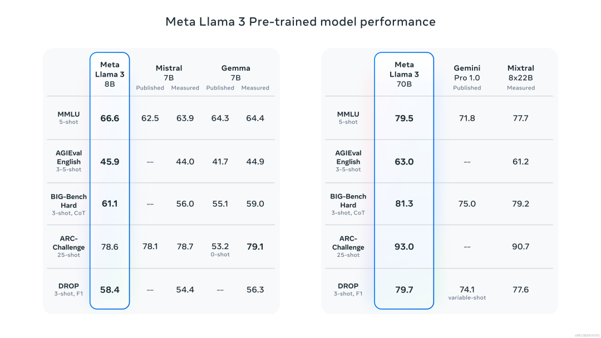
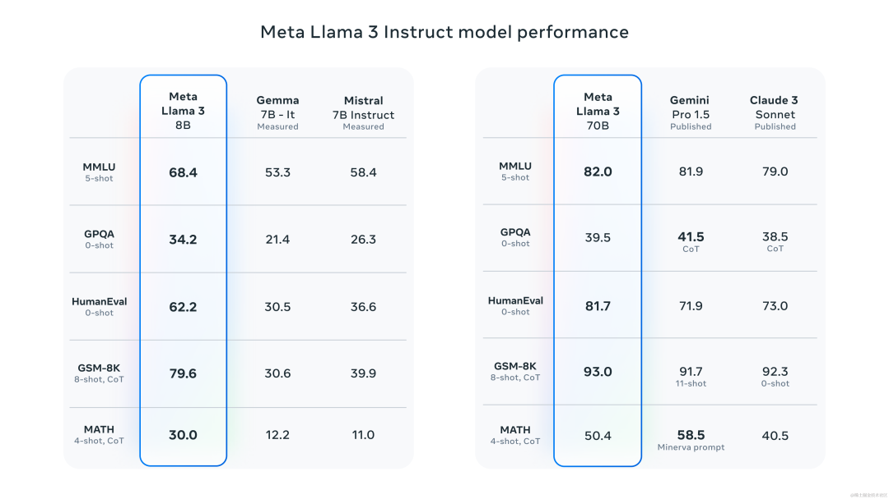
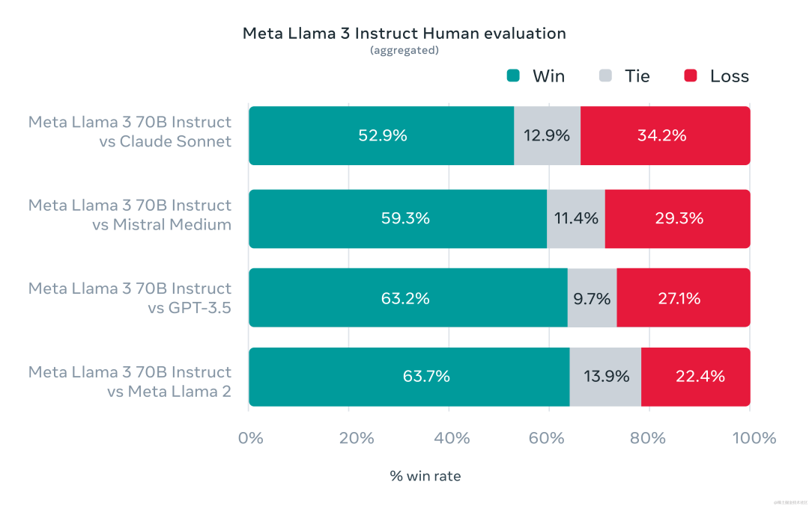
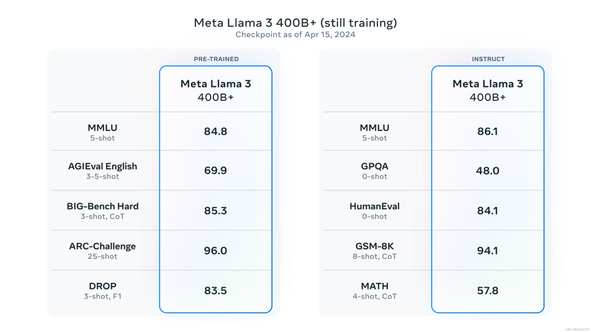
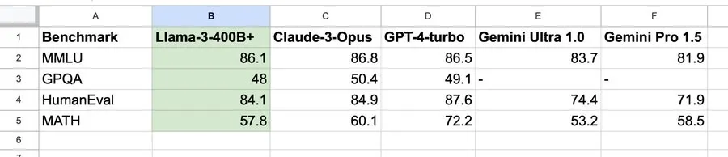

# A Deep Dive into LLaMA 3: Architecture, Training, and Interview Preparation

> This guide provides a comprehensive overview of Meta's LLaMA 3, one of the most powerful open-source Large Language Models available as of its release in April 2024. We will deconstruct its architecture, including key innovations like Grouped-Query Attention (GQA) and a new 128K token tokenizer. We'll explore the massive 15 trillion token dataset and the sophisticated data engineering pipeline behind it, the novel training methodologies that challenge existing scaling laws, and the hybrid approach to instruction fine-tuning involving SFT, PPO, and DPO. The document concludes with a curated set of theoretical and practical interview questions designed to test a deep understanding of the concepts underlying LLaMA 3 and modern LLMs.

## Knowledge Section

### 1. Introduction to LLaMA 3

Meta AI released LLaMA 3 in April 2024 as a major advancement in open-source Large Language Models (LLMs). The initial release included two parameter sizes: **8B** and **70B**, both pre-trained on an unprecedented **15 trillion tokens** of publicly available data. These models were designed to support a wide range of applications and demonstrated state-of-the-art performance across numerous industry benchmarks, outperforming other open models of similar scale.

A key highlight of the LLaMA 3 family is the ongoing training of a much larger **400B+ parameter model**, which early benchmarks suggest will be competitive with top-tier proprietary models like GPT-4 and Claude 3 Opus.

#### 1.1 Key Improvements Over Llama 2

*   **Massive Dataset:** The pre-training dataset was expanded to **15T tokens**, a 7-fold increase over Llama 2, with a significant (4x) increase in code data. This vast and diverse dataset is crucial for the model's enhanced capabilities.
*   **Architectural Enhancements:** While retaining the successful decoder-only Transformer architecture, LLaMA 3 incorporates **Grouped-Query Attention (GQA)** across all model sizes to improve inference efficiency.
*   **Superior Tokenizer:** A new tokenizer with a **128,000-token vocabulary** was developed. This allows for far more efficient encoding of text, leading to better performance and computational savings.
*   **Advanced Instruction Tuning:** A sophisticated combination of Supervised Fine-Tuning (SFT), Rejection Sampling, Proximal Policy Optimization (PPO), and Direct Policy Optimization (DPO) was used to significantly improve response quality, alignment, and diversity, while reducing false refusals.
*   **Enhanced Safety:** Llama 3 is released with new trust and safety tools, including **Llama Guard 2**, **Code Shield**, and **CyberSec Eval 2**, to promote responsible deployment.
*   **Built-in Multilingualism:** Over 5% of the pre-training data consists of high-quality, non-English text spanning more than 30 languages, laying the groundwork for strong multilingual capabilities.

#### 1.2 Model Variants at a Glance

| Model Variant | Parameters | Context Length | GQA | Pre-training Tokens | Knowledge Cutoff |
| :------------ | :--------- | :------------- | :-- | :------------------ | :--------------- |
| **Llama 3 8B**    | 8 Billion  | 8,192          | Yes | 15T+                | March 2023       |
| **Llama 3 70B**   | 70 Billion | 8,192          | Yes | 15T+                | December 2023    |

*Note: The token count refers to the pre-training data only.*

### 2. Core Architectural Innovations

Llama 3 builds upon the established GPT-style decoder-only Transformer architecture. This design is inherently suited for generative tasks, where the model predicts the next token in a sequence based on the preceding tokens. However, Llama 3 incorporates several critical modifications that enhance performance, stability, and efficiency.

#### 2.1 Foundational Components

The data flow within a Llama 3 decoder layer follows a pre-normalization variant:

1.  The input hidden state is first normalized using **RMSNorm**.
2.  The normalized state is fed into the **Attention module** (GQA).
3.  The output of the attention module is added back to the original (pre-normalization) hidden state via a residual connection.
4.  This new hidden state is again normalized using **RMSNorm**.
5.  The normalized state is passed to the **Feed-Forward Network (FFN)**, which uses the **SwiGLU** activation function.
6.  The FFN output is added back to its input via a second residual connection, producing the final output of the decoder layer.

Let's break down the key components:

*   **RMSNorm (Root Mean Square Layer Normalization):** To improve training stability and reduce computational overhead, Llama models use RMSNorm instead of the standard Layer Normalization. LayerNorm centers and scales the activations, whereas RMSNorm only performs scaling, omitting the mean-centering operation. This simplification makes it computationally faster.

    The formula for RMSNorm is:
    $$
    \text{RMSNorm}(\mathbf{x}) = \frac{\mathbf{x}}{\sqrt{\frac{1}{d}\sum_{i=1}^{d} x_i^2 + \epsilon}} \cdot \mathbf{g}
    $$
    where $\mathbf{x}$ is the input vector of dimension $d$, $\mathbf{g}$ is a learnable gain parameter, and $\epsilon$ is a small constant for numerical stability.

*   **SwiGLU Activation Function:** Instead of standard ReLU or GELU, Llama 3 uses SwiGLU (Swish-Gated Linear Unit). GLU variants have been shown to improve model performance by introducing a gating mechanism that controls the information flow through the network.

    The SwiGLU function is defined as:
    $$
    \text{SwiGLU}(\mathbf{x}, \mathbf{W}, \mathbf{V}) = \text{Swish}(\mathbf{xW}) \otimes (\mathbf{xV})
    $$
    where $\mathbf{x}$ is the input, $\mathbf{W}$ and $\mathbf{V}$ are weight matrices, $\otimes$ denotes element-wise multiplication, and $\text{Swish}(z) = z \cdot \sigma(z)$ where $\sigma$ is the sigmoid function. This gating mechanism allows the network to learn more complex patterns.

*   **RoPE (Rotary Positional Embedding):** To encode token positions, Llama 3 uses RoPE. Unlike absolute or learned positional embeddings, RoPE embeds positional information by rotating the query and key vectors based on their absolute position. This method naturally encodes relative positional information, as the dot product between two rotated vectors depends only on their relative distance. This is highly effective for modeling long sequences and offers better extrapolation capabilities.

*   **GQA (Grouped-Query Attention):** To balance the trade-off between model performance and inference efficiency, Llama 3 uses GQA. It is an intermediate solution between standard Multi-Head Attention (MHA) and Multi-Query Attention (MQA).
    *   **MHA:** Has multiple heads for queries, keys, and values ($N_q = N_k = N_v$). It is high quality but memory-intensive due to the large Key-Value (KV) cache.
    *   **MQA:** Uses multiple query heads but only a single key and value head ($N_k = N_v = 1$), which are shared across all query heads. This dramatically reduces the KV cache size but can sometimes lead to a quality degradation.
    *   **GQA:** Divides the query heads into groups. Each group shares a single key and value head ($1 < N_k = N_v < N_q$). This offers a significant reduction in memory bandwidth requirements compared to MHA while retaining much better quality than MQA. Both the 8B and 70B Llama 3 models use GQA.

#### 2.2 Advanced Tokenizer

Llama 3 employs a Tiktoken-based tokenizer with a vocabulary of **128,256 tokens**. This is a substantial increase from Llama 2's 32,000 tokens. A larger vocabulary allows the model to encode text more efficiently, meaning that a given piece of text is represented by fewer tokens. This has two major benefits:
1.  **Computational Efficiency:** Shorter token sequences require less computation and memory during both training and inference.
2.  **Improved Performance:** A more expressive tokenizer can better handle diverse languages, punctuation, and code, reducing the number of "out-of-vocabulary" or multi-token representations for common words or symbols.

### 3. Data Engineering and Pre-training at Scale

The foundation of Llama 3's success is its massive and meticulously curated pre-training dataset.

#### 3.1 The 15 Trillion Token Dataset
The model was pre-trained on over 15 trillion tokens sourced from publicly available data. This represents a 7x increase over the Llama 2 dataset and includes four times more code. Over 5% of this data is high-quality, non-English text covering over 30 languages, ensuring the model has a strong foundation for multilingual tasks.

#### 3.2 The Data Filtering Pipeline
To ensure the highest data quality, Meta developed a sophisticated filtering pipeline:
1.  **Heuristic Filters:** Using rules to filter out low-quality text (e.g., based on length, symbol-to-word ratio).
2.  **NSFW Filters:** Removing not-safe-for-work content.
3.  **Semantic Deduplication:** Identifying and removing documents that are semantically similar at a near-duplicate level, which improves data diversity.
4.  **Text Quality Classifiers:** A key innovation was using a well-trained **Llama 2 model to predict the quality of text**. High-quality data identified by Llama 2 was prioritized in the training mix for Llama 3.

Extensive experiments were run to determine the optimal mix of data from different sources, ensuring Llama 3 excels across a wide range of use cases, including coding, reasoning, and historical knowledge.

#### 3.3 Training Methodology and Scaling Laws
Meta's team developed **scaling laws** to predict model performance on key benchmarks *before* committing to a full training run. This allowed them to select an optimal data mix and make informed decisions about training hyperparameters.

An interesting finding from their experiments was a deviation from the well-known "Chinchilla" scaling laws. The Chinchilla paper suggested an optimal training dataset size of ~200B tokens for an 8B model. However, the Meta team found that model performance continued to improve in a **log-linear fashion** even after being trained on 15T tokens—two orders of magnitude more data. This suggests that for large models, massive amounts of high-quality data are paramount and that the limits of data scaling have not yet been reached.

#### 3.4 Training Infrastructure
Training a model of this scale required a custom-built, highly efficient infrastructure.
*   **Parallelism:** A combination of **data parallelism**, **model parallelism**, and **pipeline parallelism** was used to efficiently train on clusters of up to 16,000 GPUs simultaneously.
*   **Efficiency:** The training stack achieved a computational utilization of over **400 TFLOPS per GPU**.
*   **Reliability:** An advanced training stack was developed to automate error detection, handling, and maintenance. This, combined with improved hardware reliability and storage systems, resulted in an overall effective training uptime of over 95%.

Collectively, these improvements made the training process for Llama 3 approximately **three times more efficient** than that for Llama 2.

### 4. Instruction Fine-Tuning and Alignment

To transform the pre-trained base model into a helpful chat assistant (Llama-3-Instruct), Meta employed a sophisticated, multi-stage post-training process.

This process is a combination of:
1.  **Supervised Fine-Tuning (SFT):** The model is first fine-tuned on a high-quality dataset of instruction-response pairs. The quality of this initial SFT data is critical for the model's foundational instruction-following ability.
2.  **Rejection Sampling:** The model generates several responses to a prompt. A reward model then scores these responses, and the highest-scoring one is selected. This helps steer the model towards generating higher-quality outputs.
3.  **Proximal Policy Optimization (PPO):** PPO is an on-policy reinforcement learning algorithm. It uses a reward model to provide a signal to fine-tune the LLM (the "policy"). PPO is used to optimize the model's responses to align with human preferences, encouraging helpfulness and safety.
4.  **Direct Policy Optimization (DPO):** DPO is a more recent and often simpler alternative to PPO. Instead of training an explicit reward model and then using RL, DPO directly optimizes the LLM on a dataset of preference pairs (i.e., for a given prompt, response A is better than response B). It uses a simplified loss function that directly encourages the model to assign a higher probability to the "chosen" response over the "rejected" one.

A key insight from the alignment process was that training on preference rankings (via PPO and DPO) was crucial for improving reasoning. Often, the model would generate a correct reasoning trace but fail to select it as the final answer. The preference tuning taught the model how to **identify and select the correct reasoning paths** it was already capable of producing.

### 5. Performance Evaluation

#### 5.1 Pre-trained Model Performance
The Llama 3 pre-trained models demonstrated dominant performance against other open models of similar scale. The 8B model surpassed competitors like Gemma 7B and Mistral 7B, while the 70B model outperformed Gemini Pro 1.0 and Mixtral 8x22B.



#### 5.2 Instruction-Tuned Model Performance
The Llama-3-Instruct models also set a new standard for performance. The 8B-Instruct model consistently beat Gemma 7B Instruct and Mistral 7B Instruct. The 70B-Instruct model proved competitive with top proprietary models like Claude 3 Sonnet and Gemini Pro 1.5.



#### 5.3 Human Evaluation
To get a true sense of real-world performance, Meta created a new **human evaluation set with 1,800 prompts** covering 12 key use cases (e.g., coding, brainstorming, creative writing, reasoning). This evaluation set was kept confidential, even from Meta's own modeling teams, to prevent overfitting and provide an unbiased assessment. The results showed Llama 3 70B-Instruct as highly competitive and often preferred by human raters over models like Claude Sonnet, Mistral Medium, and GPT-3.5.



### 6. The Future: Llama 3 400B+
Meta is currently training a Llama 3 model with over 400 billion parameters. Early checkpoints of this model already show extremely promising results, with performance approaching that of the best closed-source models.



According to analysis by NVIDIA scientist Jim Fan, the 400B model is on a trajectory to close the gap with GPT-4 Turbo and Claude 3 Opus, signaling a major milestone for the open-source AI community.



---

## Interview Questions

### Theoretical Questions

**1. Explain the core architectural differences between Llama 3 and the original Vaswani et al. Transformer. Why were these specific changes made?**

**Answer:**
Llama 3, like other modern GPT-style models, has several key differences from the original Transformer:

*   **Decoder-Only Architecture:** Llama 3 uses only the decoder stack, whereas the original Transformer had both an encoder and a decoder. This is because the primary task of Llama 3 is language generation, where the model needs to predict subsequent tokens based on previous ones. The causal self-attention mechanism in the decoder is perfectly suited for this autoregressive task.
*   **Pre-Normalization (Pre-LN):** Llama 3 applies Layer Normalization *before* the attention and feed-forward sub-layers (specifically RMSNorm), unlike the original's post-normalization. This technique, known as Pre-LN, leads to more stable training for very deep networks by preventing the gradients from vanishing or exploding.
*   **RMSNorm instead of LayerNorm:** Llama 3 uses Root Mean Square Layer Normalization. It is computationally simpler and faster than standard Layer Normalization because it only normalizes by the root mean square of the activations, omitting the mean-subtraction (re-centering) step. This reduces computation without sacrificing performance.
*   **SwiGLU Activation Function:** The feed-forward network in Llama 3 uses the SwiGLU activation function instead of the original's ReLU. SwiGLU is a Gated Linear Unit variant that has been empirically shown to improve model performance by introducing a gating mechanism that can modulate the information flow through the layer.
*   **Rotary Positional Embeddings (RoPE):** The original Transformer used sinusoidal absolute positional embeddings added to the input. Llama 3 uses RoPE, which applies rotations to the query and key vectors that are dependent on their absolute position. This method is more effective at encoding relative positional information and has shown better performance and extrapolation capabilities for long sequences.
*   **Grouped-Query Attention (GQA):** The original used standard Multi-Head Attention. Llama 3 uses GQA to reduce the memory bandwidth bottleneck during inference by sharing key and value heads among groups of query heads, which drastically reduces the size of the KV cache.

**2. What is Grouped-Query Attention (GQA), and how does it fit between Multi-Head Attention (MHA) and Multi-Query Attention (MQA)? Explain the trade-offs.**

**Answer:**
GQA is an attention mechanism designed to reduce the computational and memory costs of inference in Transformer models. To understand it, we must first look at MHA and MQA.

*   **Multi-Head Attention (MHA):** In MHA, the model has $N_h$ attention heads. Each head has its own set of Query (Q), Key (K), and Value (V) projections. This allows the model to jointly attend to information from different representation subspaces at different positions. However, during autoregressive decoding, the K and V tensors for all previous tokens (the KV cache) must be stored in memory. The size of this cache is proportional to $N_h$.
*   **Multi-Query Attention (MQA):** MQA is an optimization where there are still $N_h$ query heads, but only a single Key and Value head that is shared across all query heads. This dramatically reduces the KV cache size by a factor of $N_h$, which significantly speeds up inference by reducing memory bandwidth usage. The downside is that this can sometimes lead to a drop in model quality due to the reduced representational capacity of the shared K and V projections.
*   **Grouped-Query Attention (GQA):** GQA is a compromise between MHA and MQA. It divides the $N_h$ query heads into $G$ groups. Each group of query heads shares a single Key and Value head.
    *   If $G=1$, GQA becomes MQA.
    *   If $G=N_h$, GQA becomes MHA.
    *   Typically, $1 < G < N_h$. For example, with 8 query heads and 2 groups, heads 0-3 would share one KV head, and heads 4-7 would share another.

**Trade-offs:**
*   **Performance (Model Quality):** MHA > GQA > MQA. MHA has the highest capacity and generally the best performance. GQA retains most of the performance of MHA, while MQA can sometimes suffer from quality degradation.
*   **Inference Speed & Memory:** MQA > GQA > MHA. MQA is the fastest and most memory-efficient due to its minimal KV cache. GQA offers a significant speedup and memory reduction over MHA, making it an excellent balance. Llama 3's use of GQA is a strategic choice to get near-MHA quality with near-MQA efficiency.

**3. Llama 3's development challenged the Chinchilla scaling laws. What are scaling laws in the context of LLMs, and what was Llama 3's key finding?**

**Answer:**
**Scaling laws** in the context of LLMs are empirical principles that describe the relationship between a model's performance (typically measured by validation loss), the number of model parameters ($N$), the size of the training dataset ($D$), and the amount of compute used for training ($C$). They allow researchers to predict how a model will perform at a larger scale, helping them make efficient decisions about resource allocation.

The **Chinchilla scaling law**, proposed by researchers at DeepMind, was a highly influential finding. It suggested that for optimal performance under a fixed compute budget, model size and dataset size should be scaled in roughly equal proportions. Specifically, it predicted that for every doubling of model size, the training dataset size should also be doubled. For an 8B parameter model, Chinchilla's laws would suggest an optimal dataset size of around 200 billion tokens.

**Llama 3's Key Finding:** The Llama 3 team discovered that this was not the full picture. They trained their 8B and 70B models on **15 trillion tokens**, which is nearly 75 times more data than the Chinchilla optimum for the 8B model. They observed that model performance continued to improve in a **log-linear fashion**, meaning the loss decreased linearly with the log of the number of training tokens, with no sign of saturation.

This finding implies that the previous "data-optimal" point proposed by Chinchilla might have been an underestimate, especially when extremely high-quality, diverse data is available. It suggests that **current large models are still significantly under-trained**, and there are substantial gains to be had by continuing to scale up the training data, far beyond what was previously thought optimal.

**4. Explain the difference between Proximal Policy Optimization (PPO) and Direct Policy Optimization (DPO) for LLM alignment.**

**Answer:**
Both PPO and DPO are methods for aligning an LLM with human preferences, using a dataset of prompts and corresponding "chosen" and "rejected" responses.

*   **Proximal Policy Optimization (PPO):** PPO is a reinforcement learning (RL) algorithm. Its application in LLM alignment (RLHF - Reinforcement Learning from Human Feedback) involves a three-step process:
    1.  **Train a Reward Model (RM):** First, a separate model (the RM) is trained on the human preference data. Its job is to take a prompt and a response and output a scalar score representing how "good" the response is.
    2.  **RL Fine-Tuning:** The LLM (the "policy") is then fine-tuned using PPO. For a given prompt, the LLM generates a response. This response is evaluated by the RM to get a reward score.
    3.  **Policy Update:** The PPO algorithm uses this reward to update the LLM's weights. It includes a constraint (a KL divergence penalty) to prevent the fine-tuned model from deviating too far from the original SFT model, ensuring stability.
    **In short, PPO is a complex, three-stage process involving an explicit reward model and on-policy RL.**

*   **Direct Policy Optimization (DPO):** DPO is a simpler, more direct approach that bypasses the need for an explicit reward model and RL. It leverages a mathematical relationship that links the optimal RLHF policy directly to the preference data.
    1.  **Direct Loss Calculation:** DPO uses the preference pairs (`chosen`, `rejected`) to directly compute a loss function for the LLM. The loss function encourages the LLM to increase the relative log-probability of the `chosen` response compared to the `rejected` one.
    2.  **Policy Update:** The LLM is fine-tuned directly on this loss, just like in a standard supervised learning setup. A "reference" model (typically the initial SFT model) is used within the loss calculation to regularize the training, similar to the KL penalty in PPO.
    **In short, DPO is a single-stage, stable process that treats preference tuning as a simple classification-like problem.**

**Key Differences:**
*   **Complexity:** PPO is more complex, requiring training a separate reward model and using an RL loop. DPO is much simpler to implement and tune.
*   **Stability:** PPO can be unstable and sensitive to hyperparameters. DPO is generally more stable.
*   **Mechanism:** PPO learns from a reward *signal*. DPO learns directly from preference *labels*.

**5. What is RMSNorm? Provide its formula and prove why it is computationally less expensive than standard Layer Normalization.**

**Answer:**
RMSNorm (Root Mean Square Layer Normalization) is a simplification of Layer Normalization that improves computational efficiency.

The formula for **RMSNorm** on an input vector $\mathbf{x} \in \mathbb{R}^d$ is:
$$
\text{RMS}(\mathbf{x}) = \sqrt{\frac{1}{d}\sum_{i=1}^{d} x_i^2}
$$
$$
\text{RMSNorm}(\mathbf{x}) = \frac{\mathbf{x}}{\text{RMS}(\mathbf{x}) + \epsilon} \cdot \mathbf{g}
$$
where $\mathbf{g}$ is a learnable gain parameter and $\epsilon$ is for stability.

The formula for standard **Layer Normalization** is:
$$
\mu(\mathbf{x}) = \frac{1}{d}\sum_{i=1}^{d} x_i \quad \quad \sigma^2(\mathbf{x}) = \frac{1}{d}\sum_{i=1}^{d} (x_i - \mu(\mathbf{x}))^2
$$
$$
\text{LayerNorm}(\mathbf{x}) = \frac{\mathbf{x} - \mu(\mathbf{x})}{\sqrt{\sigma^2(\mathbf{x}) + \epsilon}} \cdot \mathbf{g} + \mathbf{b}
$$
where $\mathbf{g}$ and $\mathbf{b}$ are learnable gain and bias parameters.

**Proof of Computational Advantage:**
The computational cost is dominated by the calculation of the normalization statistics over the vector $\mathbf{x}$.

1.  **LayerNorm Computation:**
    *   It requires two passes over the data (or a more complex single-pass algorithm like Welford's algorithm) to compute the statistics.
    *   **Pass 1 (or part of the calculation):** Compute the mean $\mu(\mathbf{x})$. This involves a sum of all $d$ elements.
    *   **Pass 2 (or the second part):** Compute the variance $\sigma^2(\mathbf{x})$. This involves another sum of $d$ elements (the squared differences from the mean).
    *   Total operations involve computing two statistics: mean and variance.

2.  **RMSNorm Computation:**
    *   It requires only one pass over the data.
    *   **Single Pass:** Compute the sum of squares $\sum x_i^2$.
    *   This is a single statistic: the root mean square. The calculation of the mean is completely omitted.

**Conclusion:** RMSNorm avoids the mean calculation and the associated subtraction from each element. For a vector of size $d$, LayerNorm requires computing both the mean and variance, while RMSNorm only requires computing the mean of the squares. This reduction in the number of statistical computations and data passes makes RMSNorm computationally less expensive and faster on hardware like GPUs.

### Practical & Coding Questions

**1. Implement the SwiGLU activation function from scratch in PyTorch.**

```python
import torch
import torch.nn as nn
import torch.nn.functional as F

class SwiGLU(nn.Module):
    """
    Implements the SwiGLU activation function as a PyTorch module.
    The input is projected into two parts, one of which is gated by the Swish activation of the other.
    """
    def __init__(self, in_features, out_features):
        """
        Args:
            in_features (int): Dimensionality of the input tensor.
            out_features (int): Dimensionality of the output tensor.
                                The intermediate projection will be to 2 * out_features.
        """
        super().__init__()
        # The input is projected to twice the output dimension to create two gates.
        # This is a common implementation detail. One gate is for the swish activation
        # and the other is the value gate.
        self.linear_gate = nn.Linear(in_features, out_features, bias=False)
        self.linear_value = nn.Linear(in_features, out_features, bias=False)

    def forward(self, x):
        """
        Forward pass for the SwiGLU activation.
        
        Args:
            x (torch.Tensor): Input tensor of shape (*, in_features).
        
        Returns:
            torch.Tensor: Output tensor of shape (*, out_features).
        """
        # Project the input to get the gate and value tensors
        gate = self.linear_gate(x)
        value = self.linear_value(x)
        
        # Apply the Swish activation to the gate
        swish_gate = F.silu(gate) # F.silu is the Swish activation in PyTorch
        
        # Element-wise multiply the activated gate with the value tensor
        return swish_gate * value

# --- Example Usage ---
# Let's test the module
in_dim = 128
out_dim = 256
batch_size = 16
seq_len = 10

swiglu_layer = SwiGLU(in_features=in_dim, out_features=out_dim)
input_tensor = torch.randn(batch_size, seq_len, in_dim)

output_tensor = swiglu_layer(input_tensor)

print(f"Input shape: {input_tensor.shape}")
print(f"Output shape: {output_tensor.shape}")
assert output_tensor.shape == (batch_size, seq_len, out_dim)

```

**2. Implement a simplified Grouped-Query Attention layer in PyTorch.**

```python
import torch
import torch.nn as nn
import math

class SimplifiedGQA(nn.Module):
    """
    A simplified implementation of Grouped-Query Attention (GQA).
    This implementation focuses on the core logic of grouping query heads
    and sharing key/value heads.
    """
    def __init__(self, d_model: int, num_heads: int, num_kv_groups: int):
        """
        Args:
            d_model (int): The embedding dimension.
            num_heads (int): The total number of query heads.
            num_kv_groups (int): The number of groups for keys and values.
                                 num_heads must be divisible by num_kv_groups.
        """
        super().__init__()
        assert d_model % num_heads == 0, "d_model must be divisible by num_heads"
        assert num_heads % num_kv_groups == 0, "num_heads must be divisible by num_kv_groups"

        self.d_model = d_model
        self.num_heads = num_heads
        self.num_kv_groups = num_kv_groups
        
        self.head_dim = d_model // num_heads
        self.num_kv_heads = num_heads // num_kv_groups

        # Projections for Query, Key, and Value
        self.Wq = nn.Linear(d_model, num_heads * self.head_dim, bias=False)
        self.Wk = nn.Linear(d_model, self.num_kv_heads * self.head_dim, bias=False)
        self.Wv = nn.Linear(d_model, self.num_kv_heads * self.head_dim, bias=False)
        self.Wo = nn.Linear(num_heads * self.head_dim, d_model, bias=False)

    def forward(self, x: torch.Tensor, mask: torch.Tensor = None):
        batch_size, seq_len, _ = x.shape

        # 1. Project and reshape Q, K, V
        # Q: (B, T, d_model) -> (B, T, n_heads * head_dim) -> (B, n_heads, T, head_dim)
        queries = self.Wq(x).view(batch_size, seq_len, self.num_heads, self.head_dim).transpose(1, 2)
        
        # K: (B, T, d_model) -> (B, T, n_kv_heads * head_dim) -> (B, n_kv_heads, T, head_dim)
        keys = self.Wk(x).view(batch_size, seq_len, self.num_kv_heads, self.head_dim).transpose(1, 2)
        
        # V: (B, T, d_model) -> (B, T, n_kv_heads * head_dim) -> (B, n_kv_heads, T, head_dim)
        values = self.Wv(x).view(batch_size, seq_len, self.num_kv_heads, self.head_dim).transpose(1, 2)

        # 2. Expand K and V to match the number of Q heads for grouped attention
        # This is the core of GQA logic: repeat KV heads to match Q heads in their group
        if self.num_kv_groups > 1:
            repeat_factor = self.num_heads // self.num_kv_heads
            # keys: (B, n_kv_heads, T, head_dim) -> (B, n_heads, T, head_dim)
            keys = keys.repeat_interleave(repeat_factor, dim=1)
            # values: (B, n_kv_heads, T, head_dim) -> (B, n_heads, T, head_dim)
            values = values.repeat_interleave(repeat_factor, dim=1)

        # 3. Compute attention scores
        # (B, n_heads, T, head_dim) @ (B, n_heads, head_dim, T) -> (B, n_heads, T, T)
        attn_scores = torch.matmul(queries, keys.transpose(2, 3)) / math.sqrt(self.head_dim)

        if mask is not None:
            attn_scores = attn_scores.masked_fill(mask == 0, float('-inf'))
        
        attn_weights = F.softmax(attn_scores, dim=-1)

        # 4. Compute output
        # (B, n_heads, T, T) @ (B, n_heads, T, head_dim) -> (B, n_heads, T, head_dim)
        output = torch.matmul(attn_weights, values)

        # 5. Reshape and project back to d_model
        # (B, n_heads, T, head_dim) -> (B, T, n_heads * head_dim)
        output = output.transpose(1, 2).contiguous().view(batch_size, seq_len, -1)
        
        return self.Wo(output)


# --- Example Usage ---
d_model = 512
num_heads = 16  # 16 query heads
num_kv_groups = 4 # Each group of 4 query heads shares one K/V head
gqa_layer = SimplifiedGQA(d_model=d_model, num_heads=num_heads, num_kv_groups=num_kv_groups)

input_tensor = torch.randn(4, 10, d_model) # Batch=4, SeqLen=10
output = gqa_layer(input_tensor)
print(f"GQA Input Shape: {input_tensor.shape}")
print(f"GQA Output Shape: {output.shape}")
assert output.shape == (4, 10, d_model)
```

**3. Write a Python function using NumPy to implement RMSNorm.**

```python
import numpy as np

def rms_norm(x: np.ndarray, g: np.ndarray, eps: float = 1e-6) -> np.ndarray:
    """
    Implements Root Mean Square Layer Normalization using NumPy.
    
    Args:
        x (np.ndarray): Input tensor. Can be of any shape. Normalization is applied
                        over the last dimension.
        g (np.ndarray): The learnable gain parameter (a vector). Its size must match
                        the last dimension of x.
        eps (float): A small value to prevent division by zero.

    Returns:
        np.ndarray: The normalized tensor with the same shape as x.
    """
    # Ensure the input is a float array for calculations
    x = x.astype(np.float32)
    
    # Calculate the mean of squares over the last dimension
    # keepdims=True makes broadcasting easier later
    mean_of_squares = np.mean(np.square(x), axis=-1, keepdims=True)
    
    # Calculate the RMS value
    rms = np.sqrt(mean_of_squares + eps)
    
    # Normalize the input and apply the gain
    normalized_x = (x / rms) * g
    
    return normalized_x

# --- Example Usage ---
# Create a sample input tensor (e.g., batch of 2, sequence of 3, embedding of 4)
input_data = np.random.rand(2, 3, 4)
# Create a gain vector of the same size as the embedding dimension
gain = np.random.rand(4) * 2 + 0.5 # Random gains around 1.5

# Apply RMSNorm
output_data = rms_norm(input_data, gain)

print("Input Data Shape:", input_data.shape)
print("Gain Vector Shape:", gain.shape)
print("Output Data Shape:", output_data.shape)

# Verification: The norm of the un-gained output over the last axis should be close to sqrt(dim)
un_gained_output = input_data / np.sqrt(np.mean(np.square(input_data), axis=-1, keepdims=True) + 1e-6)
norm_of_output = np.linalg.norm(un_gained_output, axis=-1)
print("\nL2 norm of the un-gained output (should be approx. sqrt(4)=2):")
print(norm_of_output)

assert np.allclose(norm_of_output, np.sqrt(input_data.shape[-1]), atol=1e-5)
```

**4. Outline in a Python function how you would compute the loss for Direct Policy Optimization (DPO).**

```python
import torch
import torch.nn.functional as F

def compute_dpo_loss(policy_chosen_logps: torch.Tensor,
                     policy_rejected_logps: torch.Tensor,
                     reference_chosen_logps: torch.Tensor,
                     reference_rejected_logps: torch.Tensor,
                     beta: float = 0.1):
    """
    Computes the loss for Direct Policy Optimization (DPO).

    Args:
        policy_chosen_logps (torch.Tensor): Log probabilities of the chosen responses
                                            under the policy being trained.
        policy_rejected_logps (torch.Tensor): Log probabilities of the rejected responses
                                              under the policy being trained.
        reference_chosen_logps (torch.Tensor): Log probabilities of the chosen responses
                                               under the frozen reference policy.
        reference_rejected_logps (torch.Tensor): Log probabilities of the rejected responses
                                                 under the frozen reference policy.
        beta (float): The temperature parameter that controls the strength of the
                      regularization against the reference model.

    Returns:
        torch.Tensor: A scalar DPO loss.
    """
    # Calculate the log-ratios for the policy and reference models
    # pi_log_ratio = log P_policy(chosen) - log P_policy(rejected)
    pi_log_ratios = policy_chosen_logps - policy_rejected_logps
    
    # ref_log_ratio = log P_ref(chosen) - log P_ref(rejected)
    ref_log_ratios = reference_chosen_logps - reference_rejected_logps

    # The core DPO loss formula combines these ratios
    # It aims to maximize the policy's log-ratio while staying close to the reference's ratio
    # The loss is the negative log-sigmoid of the scaled difference between the log-ratios
    losses = -F.logsigmoid(beta * (pi_log_ratios - ref_log_ratios))

    # The final loss is the mean over the batch
    return losses.mean()

# --- Example Usage ---
# Let's simulate some log probabilities for a batch of 4 preference pairs
batch_size = 4

# Policy model is slightly better at identifying the chosen response
policy_chosen_logps = torch.tensor([-0.5, -0.8, -0.4, -0.9])    # Higher is better
policy_rejected_logps = torch.tensor([-1.2, -1.0, -1.5, -1.1])   # Lower is better

# Reference model is less certain
reference_chosen_logps = torch.tensor([-0.8, -0.9, -0.7, -1.0])
reference_rejected_logps = torch.tensor([-1.0, -0.95, -1.2, -1.05])

# DPO temperature parameter
beta = 0.1

# Compute the loss
dpo_loss = compute_dpo_loss(policy_chosen_logps, policy_rejected_logps,
                            reference_chosen_logps, reference_rejected_logps,
                            beta)

print(f"DPO Loss: {dpo_loss.item():.4f}")
```