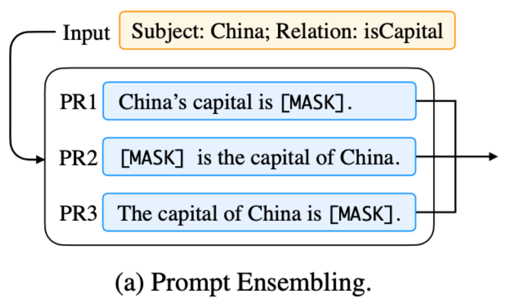
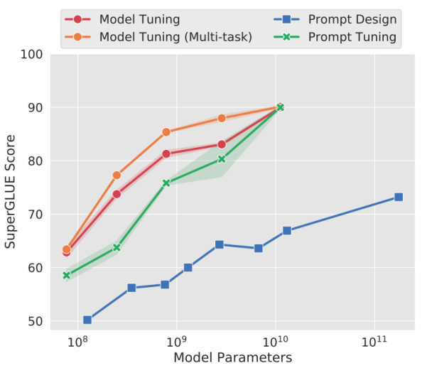

# A Guide to Parameter-Efficient Fine-Tuning (PEFT) for Large Language Models

> This guide provides a comprehensive overview of Parameter-Efficient Fine-Tuning (PEFT) techniques, which are essential for adapting large pre-trained language models (LLMs) to downstream tasks without incurring the prohibitive costs of full fine-tuning. We will delve into the motivation, technical principles, and key findings of several seminal PEFT methods, including BitFit, Prefix-Tuning, Prompt Tuning, P-Tuning, and its successor, P-Tuning v2. To provide a more complete picture, we also introduce other critical techniques like Adapter Tuning and the highly popular Low-Rank Adaptation (LoRA). The guide concludes with a curated set of theoretical and practical interview questions, complete with detailed answers and code implementations, to prepare you for rigorous data science interviews.

## Knowledge Section

### What is Parameter-Efficient Fine-Tuning (PEFT)?

Full fine-tuning, which involves updating every single weight of a massive pre-trained model for each new task, presents significant challenges:

*   **Computational Cost:** Training a model with billions of parameters requires substantial GPU resources and time.
*   **Storage Overhead:** Storing a separate, multi-gigabyte copy of the model for every single task is impractical and expensive.
*   **Catastrophic Forgetting:** Fine-tuning on a new task can cause the model to lose its powerful, general capabilities learned during pre-training.

**Parameter-Efficient Fine-Tuning (PEFT)** is a collection of methods designed to address these challenges. The core principle of PEFT is to freeze the vast majority of the pre-trained model's parameters and introduce a small number of new, trainable parameters or selectively unfreeze a tiny fraction of existing ones. This allows the model to be adapted to new tasks efficiently, leading to:

*   **Drastically reduced computational and storage costs.**
*   **Easier deployment and maintenance**, as a single base model can be used with small, task-specific "plugins."
*   **Mitigation of catastrophic forgetting** by preserving the original pre-trained weights.
*   **Better performance in low-data regimes** by preventing the overfitting of a large number of parameters on a small dataset.

### 1. BitFit: Fine-Tuning Only the Bias Parameters

#### Motivation

The ideal PEFT method should match the performance of full fine-tuning while only modifying a tiny, consistent subset of parameters. This makes deployment and maintenance scalable. BitFit (Bias-term Fine-tuning) hypothesizes that adapting a model's behavior might not require changing its core learned features (in the weights) but simply shifting their activation patterns, a function largely controlled by bias terms.

#### Methodology

BitFit is a sparse fine-tuning approach that operates on a simple principle: **freeze all non-bias parameters of the Transformer model and only train the bias terms.**

In a standard Transformer block, bias terms exist in several key locations:
*   The linear projections for Query (Q), Key (K), and Value (V) in the attention mechanism.
*   The output projection layer after combining heads in multi-head attention.
*   The two fully-connected layers within the Feed-Forward Network (FFN).
*   The Layer Normalization layers.

The total number of bias parameters in a model like BERT-Large is minuscule, representing only about **0.08% to 0.09%** of the total parameters. During BitFit, only these bias parameters and the parameters of the final task-specific classification head are updated.

#### Key Findings and Results

*   **Competitive Performance:** As shown in the GLUE benchmark results, BitFit performs comparably to more complex methods like Adapter-Tuning and Diff-Pruning, despite using far fewer trainable parameters. While it doesn't always match full fine-tuning, it significantly outperforms a fully frozen model.

    *Figure 1: Performance comparison of BitFit against Full Fine-tuning, Adapters, and Diff-Pruning on the GLUE benchmark.*
    

*   **Not All Biases are Equal:** An ablation study revealed that the most significant performance gains came from updating the bias terms in the **query projection** and the **first layer of the FFN**. Fixing either of these resulted in a substantial performance drop, suggesting they are critical for task adaptation.

    *Figure 2: Analysis of bias parameter changes during BitFit fine-tuning, highlighting the importance of query and FFN intermediate biases.*
    

#### Pros and Cons

*   **Pros:**
    *   Extremely simple to implement.
    *   Minimal number of trainable parameters, leading to very small model checkpoints.
*   **Cons:**
    *   Performance may lag behind full fine-tuning on more complex tasks.
    *   Less expressive than methods that add new modules or modify weights more directly.

### 2. Prefix-Tuning: Guiding Generations with Continuous Prefixes

#### Motivation

Traditional fine-tuning creates entirely new model versions for each task. Another approach, using discrete prompts (e.g., "Translate English to French: ..."), is highly sensitive to wording and difficult to optimize. Prefix-Tuning proposes a middle ground: keep the base LLM frozen but prepend a sequence of continuous, learnable vectors (a "prefix") to the input. This prefix acts as a task-specific instruction that steers the model's behavior without altering its internal weights.

*Figure 3: A comparison between traditional fine-tuning (which creates a new model copy for each task) and Prefix-Tuning (which uses a single frozen model with small, task-specific prefixes).*


#### Methodology

Prefix-Tuning introduces a sequence of trainable virtual tokens, $P = \{p_1, ..., p_k\}$, which are prepended to the input sequence. The key innovation is that these prefix vectors are not just added at the input layer; their corresponding hidden states are injected at **every layer of the Transformer**.

The prefix parameters are organized into a matrix $P_\theta \in \mathbb{R}^{|\text{prefix}| \times \text{dim}}$. Directly training $P_\theta$ can be unstable. To address this, Prefix-Tuning employs a **reparameterization** technique: a smaller matrix $P'_{\theta}$ is trained and projected to the full prefix dimensions using a small Multi-Layer Perceptron (MLP).
$$ P_\theta[i,:] = \text{MLP}_\theta(P'_{\theta}[i,:]) $$
After training, the MLP is discarded, and only the final prefix parameters $P_\theta$ are saved.

*   **For Autoregressive Models (e.g., GPT):** The prefix is added before the input text: `z = [PREFIX; x; y]`. The prefix guides the model in generating the target `y`.
*   **For Encoder-Decoder Models (e.g., T5, BART):** Prefixes are added to both the encoder and the decoder inputs: `z = [PREFIX; x; PREFIX'; y]`.

*Figure 4: Application of Prefix-Tuning to Autoregressive (left) and Encoder-Decoder (right) architectures.*


This learnable prefix is a form of **soft prompt** or **continuous prompt**, which is easier to optimize via gradient descent than discrete, textual prompts.

*Figure 5: Conceptual difference between discrete, human-engineered prompts and continuous, learnable prefixes.*


*Figure 6: The reparameterization mechanism in Prefix-Tuning, where a smaller matrix P' is projected by an MLP to get the full prefix parameters P. Only P' is trained.*


#### Key Findings and Results

*   **Deep Prompting is Crucial:** An ablation study confirmed that injecting the prefix at every layer is vital for good performance. A variant that only tuned the embedding layer performed significantly worse.

    *Figure 7: Ablation study showing that applying prefixes at every layer (Prefix-Tuning) is crucial for performance, compared to only tuning the embedding layer (Embedding-only).*
    

*   **Prefix Position Matters:** The study found that placing the learnable tokens at the beginning of the sequence (Prefix-Tuning) outperformed placing them in the middle (Infix-Tuning).

    *Figure 8: Performance comparison between Prefix-Tuning and Infix-Tuning, demonstrating the advantage of placing the prompt at the beginning of the sequence.*
    

### 3. Prompt-Tuning: A Simpler Approach to Continuous Prompts

#### Motivation

Prompt-Tuning was developed as a simpler, more streamlined alternative to Prefix-Tuning. The goal remained the same: adapt a frozen LLM to new tasks using soft prompts. However, Prompt-Tuning simplifies the architecture and demonstrates a remarkable scaling property.

#### Methodology

Prompt-Tuning is essentially a simplified version of Prefix-Tuning. Its key characteristics are:

1.  **Input Layer Only:** Unlike Prefix-Tuning, which injects prompts at every layer, Prompt-Tuning only prepends the learnable prompt tokens at the **input embedding layer**. The rest of the model architecture is untouched.
2.  **No Reparameterization:** It dispenses with the MLP reparameterization network used in Prefix-Tuning, finding that direct optimization of the prompt parameters is stable enough, especially for large models.
3.  **End-to-End Training:** The prompt token embeddings are initialized and learned end-to-end along with a task-specific classification head.

*Figure 9: Illustration of Prompt Tuning, where learnable prompt embeddings are prepended to the input layer embeddings.*


A notable contribution of Prompt-Tuning is **Prompt Ensembling**. This involves training multiple prompts for the same task within the same batch. It's like asking the model the same question in several different (learned) ways, which improves robustness and performance at a much lower cost than traditional model ensembling.

*Figure 11: Prompt Ensembling, where multiple prompts for the same task are trained and used within a single batch to improve robustness.*


#### Key Findings and Results

*   **The Power of Scale:** The most important finding is that as the pre-trained model size increases (e.g., beyond 10 billion parameters), the performance of Prompt-Tuning **catches up to and matches that of full fine-tuning**. For smaller models, a significant performance gap remains. This suggests that larger models are better "few-shot learners" and can be effectively steered by simple prompts.

    *Figure 10: The performance of Prompt Tuning approaches that of full fine-tuning as model scale increases.*
    

### 4. P-Tuning: Optimizing Prompts with a Neural Encoder

#### Motivation

P-Tuning addresses the two primary issues with manual prompting: the extreme sensitivity of model performance to prompt wording and the difficulty of finding the optimal discrete prompt.

*Figure 12: Demonstration of the sensitivity of manual prompts, where minor changes lead to large performance variance.*


Like Prefix-Tuning and Prompt-Tuning, it turns to continuous, learnable prompts. However, it introduces a mechanism to ensure the prompt embeddings are related and optimized more effectively.

*Figure 13: The concept of using continuous, learnable prompts to overcome the brittleness of discrete, manual prompts.*


#### Methodology

P-Tuning introduces several key differences from its predecessors:

1.  **Prompt Encoder:** The core innovation is the use of a small **prompt encoder** (e.g., a Bi-LSTM with an MLP) to generate the virtual token embeddings. This encoder introduces an inductive bias, encouraging dependencies between the prompt tokens and making optimization more stable and effective compared to training independent prompt vectors.
2.  **Flexible Insertion:** While Prompt-Tuning and Prefix-Tuning prepend prompts, P-Tuning allows the virtual tokens to be inserted anywhere within the input sequence, offering more flexibility. The goal is to replace human-chosen template words with learnable vectors.
3.  **Input Layer Only:** Similar to Prompt-Tuning, P-Tuning only modifies the input embedding layer and does not inject prompts into deeper layers.

*Figure 14: The P-Tuning architecture, which uses a prompt encoder (e.g., an MLP+LSTM) to generate task-specific virtual token embeddings.*


*Figure 15: P-Tuning inserts learnable virtual tokens into the input sequence, which can be placed at various positions, not just as a prefix.*


#### Key Findings and Results

*   **Outperforms GPT-3:** On NLU benchmarks, P-Tuning demonstrated that a GPT-style model could achieve performance superior to a similarly-sized BERT model, which was not the case with standard fine-tuning.
*   **Matches Full Fine-Tuning:** It was one of the first methods to show that a prompt-based approach could match the performance of full fine-tuning on NLU tasks, even with moderately sized models.

### 5. P-Tuning v2: Deep Prompt Tuning for Universal Performance

#### Motivation

P-Tuning v2 was designed to overcome two critical limitations of earlier methods like Prompt-Tuning and P-Tuning v1:
1.  **Lack of Universality:** These methods worked well on some NLU tasks and at very large model scales (>10B parameters) but failed to match fine-tuning performance on smaller models (100M-1B) or on more complex, hard sequence tasks like sequence tagging (e.g., Named Entity Recognition).
2.  **Shallow Prompting:** By only inserting prompts at the input layer, their influence on the final prediction is indirect. The trainable parameter count is also very limited by the input sequence length.

#### Methodology

P-Tuning v2 incorporates ideas from Prefix-Tuning to create a more powerful and universally applicable method. It is essentially an optimized and adapted version of **deep prompt tuning** for NLU tasks.

*   **Deep Prompts:** Like Prefix-Tuning, P-Tuning v2 applies trainable prompt tokens at **every layer** of the Transformer. This provides more trainable parameters (0.1%-3% of total) and allows the prompts to influence model activations more directly at each stage of processing.

    *Figure 16: The architecture of P-Tuning v2, illustrating the application of "deep" prompts at every layer of the Transformer, similar to Prefix-Tuning.*
    

*   **Key Improvements over Prefix-Tuning:**
    *   **No Reparameterization:** The MLP/LSTM encoders from Prefix-Tuning and P-Tuning v1 were removed, as they were found to provide little benefit and could sometimes harm performance on NLU tasks.
    *   **Task-Specific Prompt Lengths:** It recognizes that different tasks require different prompt lengths for optimal performance (e.g., simple tasks need shorter prompts, complex tasks need longer ones).
    *   **Return to Traditional Classification:** It abandons the `Verbalizer` (which maps class labels to words, e.g., 'positive', 'negative') in favor of a standard linear classification head on top of the `[CLS]` token or sequence embeddings. This makes the method applicable to any task, including sequence tagging where labels have no semantic meaning.
    *   **Multi-task Learning:** P-Tuning v2 can optionally be enhanced by pre-training the prompts on a mixture of tasks, which helps initialize them for better performance on downstream tasks.

#### Key Findings and Results

*   **Universal Performance:** P-Tuning v2 successfully closes the performance gap with full fine-tuning across a wide range of model scales (from 330M to 10B) and tasks, including challenging sequence tagging problems where previous methods failed.

    *Figure 17: P-Tuning v2 performance compared to fine-tuning across various model scales, showing its strong performance even on smaller models.*
    

*   **Prompt Length Matters:** The optimal prompt length is task-dependent. Simple classification tasks may only need a prompt of length ~20, while complex reading comprehension tasks can benefit from prompts of length ~100.

    *Figure 18: Ablation study on the effect of prompt length in P-Tuning v2, indicating that more complex tasks benefit from longer prompts.*
    

### 6. Other Key PEFT Methods

#### Adapter-Tuning
Adapter-Tuning involves injecting small, bottleneck-shaped neural network modules, called "adapters," inside each layer of the pre-trained Transformer.
*   **Mechanism:** The original Transformer weights are frozen. After the multi-head attention and feed-forward sub-layers, an adapter module is inserted. It typically consists of a down-projection MLP, a non-linearity (like ReLU), and an up-projection MLP, with a residual connection around it.
*   **Benefit:** Only the adapter weights (a tiny fraction of the total) are trained. This keeps the original model intact and allows for modular, task-specific adaptations.

#### LoRA: Low-Rank Adaptation
LoRA is one of the most popular and effective PEFT methods today. It is based on the hypothesis that the change in weights during model adaptation has a low "intrinsic rank."
*   **Mechanism:** For a pre-trained weight matrix $W_0 \in \mathbb{R}^{d \times k}$, LoRA models the update as a low-rank decomposition: $W = W_0 + \Delta W = W_0 + BA$. Here, the original weights $W_0$ are frozen. The update $\Delta W$ is represented by two much smaller matrices, $B \in \mathbb{R}^{d \times r}$ and $A \in \mathbb{R}^{r \times k}$, where the rank $r \ll \min(d, k)$. Only $A$ and $B$ are trained.
*   **Benefit:** This drastically reduces the number of trainable parameters. For example, if $d=k=4096$ and $r=8$, full fine-tuning requires training $4096^2 \approx 16.7M$ parameters, while LoRA only requires training $2 \times 4096 \times 8 \approx 65k$ parameters. The updated weights can also be merged back into the original weights for zero inference latency.

---

## Interview Questions

### Theoretical Questions

**1. What is Parameter-Efficient Fine-Tuning (PEFT), and why is it crucial for modern LLMs?**
**Answer:**
Parameter-Efficient Fine-Tuning (PEFT) refers to a set of techniques used to adapt large pre-trained language models to new, specific tasks by training only a small fraction of the model's parameters, while keeping the majority of the pre-trained weights frozen.

It is crucial for modern LLMs for several reasons:
*   **Reduces Computational Cost:** Full fine-tuning of models with billions of parameters (e.g., GPT-3, Llama) is extremely expensive, requiring massive amounts of GPU memory and time. PEFT makes fine-tuning accessible with much less hardware.
*   **Minimizes Storage:** Instead of saving a full multi-gigabyte model for each task, PEFT requires storing only the small set of trained parameters (often just a few megabytes), using a single shared base model.
*   **Mitigates Catastrophic Forgetting:** By keeping the original weights frozen, PEFT largely preserves the vast knowledge learned during pre-training. Full fine-tuning can degrade this general knowledge as the model overfits to the new task's data distribution.
*   **Enables Multi-Task Deployment:** A single LLM instance in production can serve requests for multiple tasks simultaneously by dynamically loading the small, task-specific PEFT parameters, making deployment highly efficient.

**2. Explain the core idea behind BitFit. Why might tuning only bias parameters be an effective adaptation strategy?**
**Answer:**
The core idea of BitFit is to achieve task adaptation by freezing all weight matrices in a Transformer model and only fine-tuning the **bias parameters**. This is a form of sparse fine-tuning, as bias terms constitute less than 0.1% of a model's total parameters.

Tuning only bias parameters can be effective because biases directly control the firing threshold and output distribution of neurons without altering the learned features encoded in the weight matrices. A weight matrix $W$ transforms an input vector $x$, while the bias term $b$ shifts the entire transformed space: $y = Wx + b$. By modifying $b$, we can shift the mean of a layer's activations, effectively making certain learned features more or less prominent. This simple shift can be sufficient to adapt the model's behavior for a new task, especially if the new task is closely related to the pre-training data and doesn't require learning fundamentally new features.

**3. Compare and contrast Prefix-Tuning and Prompt-Tuning.**
**Answer:**
**Similarities:**
*   Both are "prompt-based" PEFT methods that keep the original LLM frozen.
*   Both use **soft prompts** (continuous, learnable embedding vectors) instead of discrete text prompts.
*   Both prepend these learnable prompts to the input to steer the model's behavior for a specific task.

**Differences:**

| Feature | Prefix-Tuning | Prompt-Tuning |
| :--- | :--- | :--- |
| **Prompt Injection** | **Deep:** Injects prompt hidden states at **every layer** of the Transformer. | **Shallow:** Inserts prompt embeddings only at the **input embedding layer**. |
| **Complexity** | More complex. Often uses a **reparameterization network** (MLP) to stabilize training of prompt parameters. | Simpler. Directly optimizes prompt embeddings without a reparameterization network. |
| **Number of Parameters** | More trainable parameters due to the deep injection. | Fewer trainable parameters, as they are only at the input layer. |
| **Performance** | Generally stronger, especially on smaller models and more complex tasks, due to its deeper influence on the model. | Performance is highly dependent on model scale. It struggles with smaller models but can match full fine-tuning on very large models (>10B parameters). |

**4. What problem does the reparameterization network (e.g., the MLP in Prefix-Tuning) solve?**
**Answer:**
The reparameterization network in Prefix-Tuning solves the problem of **training instability**. Directly optimizing a large matrix of prompt parameters ($P_\theta$) from a random initialization can be difficult and lead to suboptimal results.

The MLP acts as a projection layer. Instead of training the full-sized prefix parameter matrix $P_\theta$ directly, a much smaller, randomly initialized matrix $P'_{\theta}$ is trained. This smaller matrix is then passed through the MLP to generate the final, larger prefix parameters used by the model: $P_\theta = \text{MLP}_\theta(P'_{\theta})$.

This approach helps in two ways:
1.  **Stabilization:** The MLP, with its non-linearities, can create a smoother optimization landscape. Training the smaller matrix $P'_{\theta}$ is more stable.
2.  **Parameter Efficiency:** The number of trainable parameters is reduced to those in the smaller matrix $P'_{\theta}$ and the MLP, which is more efficient than training the full $P_\theta$. After training, the MLP is discarded, and only the resulting $P_\theta$ is saved.

**5. Explain the motivation behind P-Tuning's use of an LSTM-based prompt encoder.**
**Answer:**
The motivation for P-Tuning's LSTM-based prompt encoder is to address the assumption that prompt tokens should be independent. When initializing learnable prompt embeddings randomly, there is no inherent relationship between them. This can make optimization harder, as the model has to learn these relationships from scratch.

The LSTM encoder introduces a powerful **inductive bias**. By processing the initial prompt embeddings sequentially, the LSTM ensures that the final prompt vectors passed to the LLM are not independent but are instead contextually aware of each other. This creates a smoother, more structured "prompt space" that is easier to optimize, leading to faster convergence and better performance. In essence, it helps the model learn a more coherent and effective "instruction" for the downstream task.

**6. P-Tuning v2 is described as a more universal solution. What specific limitations of earlier methods did it address?**
**Answer:**
P-Tuning v2 addressed two major limitations of earlier methods like Prompt-Tuning and P-Tuning v1:

1.  **Lack of Scale & Task Universality:**
    *   **Scale:** Prompt-Tuning and P-Tuning v1 only performed well on extremely large models (>10B parameters). On more common medium-sized models (100M - 1B), they significantly underperformed full fine-tuning. P-Tuning v2 closes this gap across all scales.
    *   **Task:** The earlier methods were effective for some NLU classification tasks but failed on complex, token-level sequence tasks like Named Entity Recognition (NER) or extractive question answering. P-Tuning v2 was explicitly designed to work well on these "hard" sequence tasks.

2.  **Shallow Prompting and Limited Expressiveness:**
    *   By only inserting prompts at the input layer, the influence on the model's final prediction was indirect and limited. P-Tuning v2 adopted **deep prompt tuning** (like Prefix-Tuning), inserting prompts at every layer. This gives the prompts more direct control over the model's internal processing and increases the number of trainable parameters, providing more expressive power for adaptation.

Additionally, by dropping the `Verbalizer` for a standard classification head, P-Tuning v2 became applicable to a much broader range of tasks where class labels have no semantic meaning.

**7. Explain the mechanism of Low-Rank Adaptation (LoRA). Derive the number of trainable parameters for a LoRA layer.**
**Answer:**
**Mechanism:**
LoRA works on the principle that the change in a model's weights during fine-tuning, $\Delta W$, has a low intrinsic rank. Instead of learning the entire dense matrix $\Delta W$, LoRA approximates it with a low-rank decomposition. For a pre-trained weight matrix $W_0 \in \mathbb{R}^{d \times k}$, the LoRA-updated weight matrix $W$ is:
$$ W = W_0 + \Delta W = W_0 + BA $$
Here:
*   $W_0$ is the original, frozen weight matrix.
*   $A \in \mathbb{R}^{r \times k}$ and $B \in \mathbb{R}^{d \times r}$ are two small, trainable "adapter" matrices.
*   $r$ is the rank of the decomposition, where $r \ll \min(d, k)$.

During training, only matrices $A$ and $B$ are updated. The forward pass is modified from $h = W_0 x$ to $h = W_0 x + B A x$.

**Derivation of Trainable Parameters:**
Let the dimensions of the original weight matrix $W_0$ be $d \times k$.
The number of parameters in $W_0$ is $d \times k$. For full fine-tuning, all $d \times k$ parameters are trainable.

With LoRA, we introduce two new matrices:
*   Matrix $A$ has dimensions $r \times k$. Number of parameters = $r \times k$.
*   Matrix $B$ has dimensions $d \times r$. Number of parameters = $d \times r$.

Therefore, the total number of trainable parameters in a LoRA layer is the sum of the parameters in $A$ and $B$:
$$ \text{Trainable Params (LoRA)} = (r \times k) + (d \times r) = r(d+k) $$
Since the rank $r$ is chosen to be very small (e.g., 4, 8, 16), this number is significantly smaller than $d \times k$. For a square matrix where $d=k$, the number of parameters is $2dr$, which is much less than $d^2$.

**8. What is "catastrophic forgetting" in the context of fine-tuning, and how do PEFT methods help mitigate it?**
**Answer:**
**Catastrophic forgetting** is the phenomenon where a neural network, upon being trained on a new task, rapidly loses the knowledge and capabilities it learned from a previous task (or its pre-training). In the context of LLMs, full fine-tuning on a small, domain-specific dataset (e.g., legal documents) can cause the model to forget its general abilities in language understanding, reasoning, and generation that it acquired from the vast and diverse pre-training corpus.

PEFT methods mitigate catastrophic forgetting by design. The core principle of PEFT is to **freeze the vast majority of the pre-trained model's parameters**. Since the weights that store the model's core knowledge are not updated, the model cannot "forget" them. The adaptation to the new task is handled by the small set of new or unfrozen parameters (e.g., LoRA adapters, prompts, biases). This approach effectively isolates the task-specific knowledge from the general knowledge, preserving the model's powerful foundational capabilities.

**9. If you had a 1B parameter model and needed to adapt it for a sequence tagging task (like NER), which PEFT method would you choose and why?**
**Answer:**
For a 1B parameter model on a sequence tagging task like NER, my top choice would be **P-Tuning v2**.

**Justification:**
1.  **Proven Effectiveness on Sequence Tasks:** P-Tuning v2 was specifically designed and validated to perform well on "hard" sequence tasks like NER, where earlier methods like Prompt-Tuning and P-Tuning v1 failed. NER requires making a prediction for each token, a task that benefits from the deep and direct influence that P-Tuning v2's prompts have on every layer.
2.  **Strong Performance on Medium-Scale Models:** The P-Tuning v2 paper explicitly demonstrates that it closes the performance gap with full fine-tuning on models in the 100M-1B parameter range, which is exactly the scale of the model in question.
3.  **No Need for a Verbalizer:** P-Tuning v2 uses a standard token-level classification head, which is perfect for NER. The labels in NER (e.g., B-PER, I-ORG, O) have no semantic meaning that a verbalizer could map to, making methods that rely on them unsuitable.

**Alternatives and why they are less ideal:**
*   **LoRA:** LoRA is also a very strong candidate and might be my second choice. It is generally effective across tasks. However, P-Tuning v2's design is more explicitly tailored for the challenges of sequence tasks.
*   **Prompt-Tuning / P-Tuning v1:** These would be poor choices because they are known to underperform on smaller models and sequence tagging tasks.
*   **BitFit:** While simple, it is likely not expressive enough to capture the complex token-level patterns required for high-performance NER.

**10. What is "Prompt Ensembling" and how is it more efficient than traditional model ensembling?**
**Answer:**
**Prompt Ensembling**, introduced in the Prompt-Tuning paper, is a technique to improve model robustness and performance by using multiple different prompts for the same task. Instead of training just one soft prompt, you train a set of `k` prompts. During inference (or even training), you can run the same input with each of the `k` prompts and average the predictions.

It is vastly more efficient than **traditional model ensembling** for the following reasons:
*   **Parameter Cost:** Traditional ensembling involves training `k` full models, meaning you have `k` separate sets of all model parameters. Prompt ensembling uses a single frozen base model and only trains `k` small prompt vectors. The memory and storage footprint is minuscule in comparison.
*   **Training Cost:** Training `k` full models is `k` times as expensive as training one. The `k` prompts for prompt ensembling can be trained jointly in the same batch, adding very little overhead compared to training a single prompt.
*   **Inference Cost:** While both methods require `k` forward passes at inference time, prompt ensembling can be optimized. Since the base model is shared, its activations for the input text can potentially be cached and reused across the different prompt runs, leading to further speedups.

### Practical & Coding Questions

**1. Implement a BitFit-style training loop in PyTorch. Show how to freeze all parameters except the biases.**
**Answer:**
Here is a complete, runnable example in PyTorch. We'll define a simple Transformer block, freeze its weights, and show a mock training step.

```python
import torch
import torch.nn as nn
import torch.optim as optim

# A simplified Transformer Encoder Block for demonstration
class SimpleTransformerBlock(nn.Module):
    def __init__(self, d_model=512, nhead=8, dim_feedforward=2048):
        super().__init__()
        self.self_attn = nn.MultiheadAttention(d_model, nhead, batch_first=True)
        self.linear1 = nn.Linear(d_model, dim_feedforward)
        self.relu = nn.ReLU()
        self.linear2 = nn.Linear(dim_feedforward, d_model)
        self.norm1 = nn.LayerNorm(d_model)
        self.norm2 = nn.LayerNorm(d_model)

    def forward(self, src):
        # Self-attention block
        attn_output, _ = self.self_attn(src, src, src)
        src = src + attn_output
        src = self.norm1(src)
        # Feed-forward block
        ff_output = self.linear2(self.relu(self.linear1(src)))
        src = src + ff_output
        src = self.norm2(src)
        return src

# 1. Instantiate the model
model = SimpleTransformerBlock(d_model=128, nhead=4, dim_feedforward=512)
print("--- Model Architecture ---")
print(model)
print("\n")

# 2. Implement BitFit: Freeze all parameters except biases
total_params = 0
trainable_params = 0
for name, param in model.named_parameters():
    total_params += param.numel()
    if 'bias' in name:
        param.requires_grad = True
        trainable_params += param.numel()
        print(f"Unfrozen (Trainable): {name} with {param.numel()} parameters")
    else:
        param.requires_grad = False
        
print(f"\nTotal parameters: {total_params}")
print(f"Trainable parameters (BitFit): {trainable_params}")
print(f"Trainable percentage: {100 * trainable_params / total_params:.4f}%")
print("\n")

# 3. Create an optimizer that only sees the trainable parameters
optimizer = optim.Adam([p for p in model.parameters() if p.requires_grad], lr=1e-4)
loss_fn = nn.MSELoss()

# 4. Mock training step
print("--- Mock Training Step ---")
model.train()

# Dummy data
batch_size = 4
seq_len = 10
d_model = 128
dummy_input = torch.randn(batch_size, seq_len, d_model)
dummy_target = torch.randn(batch_size, seq_len, d_model)

# Forward pass
output = model(dummy_input)

# Calculate loss
loss = loss_fn(output, dummy_target)
print(f"Initial Loss: {loss.item()}")

# Backward pass and optimization
optimizer.zero_grad()
loss.backward()

# Check gradients
print("Gradients check (only bias should have grad):")
for name, param in model.named_parameters():
    if param.grad is not None:
        print(f"  - Gradient computed for: {name}")

optimizer.step()

# Forward pass after one step
output_after_step = model(dummy_input)
loss_after_step = loss_fn(output_after_step, dummy_target)
print(f"Loss after one step: {loss_after_step.item()}")

```

**2. Implement a simple LoRA layer from scratch in PyTorch.**
**Answer:**
Here is a self-contained implementation of a `LoRALinear` layer that can be used as a drop-in replacement for `torch.nn.Linear`.

```python
import torch
import torch.nn as nn
import math

class LoRALinear(nn.Module):
    def __init__(self, in_features: int, out_features: int, r: int, lora_alpha: float = 1.0):
        """
        LoRA Linear Layer.

        Args:
            in_features (int): Number of input features for the original linear layer.
            out_features (int): Number of output features for the original linear layer.
            r (int): The rank of the low-rank decomposition.
            lora_alpha (float): The scaling factor for the LoRA update.
        """
        super().__init__()
        self.in_features = in_features
        self.out_features = out_features
        self.r = r
        self.lora_alpha = lora_alpha

        # The original, pre-trained weight matrix (W_0)
        self.weight = nn.Parameter(torch.zeros(out_features, in_features))
        # Optional bias term
        self.bias = nn.Parameter(torch.zeros(out_features))
        
        # Low-rank matrices A and B for the update (delta_W = B @ A)
        self.lora_A = nn.Parameter(torch.zeros(r, in_features))
        self.lora_B = nn.Parameter(torch.zeros(out_features, r))
        
        # Scaling factor
        self.scaling = self.lora_alpha / self.r

        self.reset_parameters()

    def reset_parameters(self):
        # Initialize the original weights as a standard Linear layer would
        nn.init.kaiming_uniform_(self.weight, a=math.sqrt(5))
        if self.bias is not None:
            fan_in, _ = nn.init._calculate_fan_in_and_fan_out(self.weight)
            bound = 1 / math.sqrt(fan_in)
            nn.init.uniform_(self.bias, -bound, bound)
            
        # Initialize LoRA matrices
        nn.init.kaiming_uniform_(self.lora_A, a=math.sqrt(5))
        nn.init.zeros_(self.lora_B) # Initialize B with zeros, so delta_W is zero at the start

    def train(self, mode: bool = True):
        """
        Override the train method to control which parameters are trainable.
        """
        super().train(mode)
        # Freeze the original weights, only LoRA matrices are trainable
        self.weight.requires_grad = False
        if self.bias is not None:
            self.bias.requires_grad = False # Typically bias is also frozen or made trainable
        self.lora_A.requires_grad = True
        self.lora_B.requires_grad = True

    def eval(self):
        """
        Set the layer to evaluation mode.
        """
        super().eval()
        self.weight.requires_grad = False
        if self.bias is not None:
            self.bias.requires_grad = False
        self.lora_A.requires_grad = False
        self.lora_B.requires_grad = False

    def forward(self, x: torch.Tensor):
        # Original forward pass
        original_result = F.linear(x, self.weight, self.bias)
        
        # LoRA update
        if self.r > 0:
            lora_update = (self.lora_B @ self.lora_A) * self.scaling
            lora_result = F.linear(x, lora_update)
            return original_result + lora_result
        else:
            return original_result

# Example Usage
import torch.nn.functional as F

# Configuration
in_dim = 512
out_dim = 1024
lora_rank = 8
lora_alpha = 16

# Create LoRA layer
lora_layer = LoRALinear(in_features=in_dim, out_features=out_dim, r=lora_rank, lora_alpha=lora_alpha)

# Set to training mode (this freezes the base weights)
lora_layer.train()

# Check trainable parameters
trainable_params = sum(p.numel() for p in lora_layer.parameters() if p.requires_grad)
total_params = sum(p.numel() for p in lora_layer.parameters())

print(f"--- LoRA Layer Parameter Count ---")
print(f"Original W matrix params: {lora_layer.weight.numel()}")
print(f"LoRA A matrix params: {lora_layer.lora_A.numel()}")
print(f"LoRA B matrix params: {lora_layer.lora_B.numel()}")
print(f"Total parameters in layer: {total_params}")
print(f"Trainable parameters (LoRA): {trainable_params}")
print(f"Expected trainable (r*(in+out)): {lora_rank * (in_dim + out_dim)}")

# Test forward pass
dummy_input = torch.randn(16, in_dim) # Batch of 16
output = lora_layer(dummy_input)
print(f"\nOutput shape: {output.shape}")

```

**3. Write a PyTorch function to identify and count trainable parameters in a model, and apply it to a LoRA-enabled model.**
**Answer:**
This is a very useful utility function for verifying PEFT implementations.

```python
import torch
import torch.nn as nn
from typing import Tuple

# Use the LoRALinear class from the previous question
class LoRALinear(nn.Module):
    def __init__(self, in_features: int, out_features: int, r: int, lora_alpha: float = 1.0):
        super().__init__()
        self.in_features, self.out_features, self.r, self.lora_alpha = in_features, out_features, r, lora_alpha
        self.weight = nn.Parameter(torch.zeros(out_features, in_features))
        self.bias = nn.Parameter(torch.zeros(out_features))
        self.lora_A = nn.Parameter(torch.zeros(r, in_features))
        self.lora_B = nn.Parameter(torch.zeros(out_features, r))
        self.scaling = self.lora_alpha / self.r
        self.reset_parameters()

    def reset_parameters(self):
        nn.init.kaiming_uniform_(self.weight, a=math.sqrt(5))
        fan_in, _ = nn.init._calculate_fan_in_and_fan_out(self.weight)
        bound = 1 / math.sqrt(fan_in)
        nn.init.uniform_(self.bias, -bound, bound)
        nn.init.kaiming_uniform_(self.lora_A, a=math.sqrt(5))
        nn.init.zeros_(self.lora_B)

    def train(self, mode: bool = True):
        super().train(mode)
        self.weight.requires_grad = False
        self.bias.requires_grad = False
        self.lora_A.requires_grad = True
        self.lora_B.requires_grad = True
        return self

    def eval(self):
        super().eval()
        self.weight.requires_grad = False
        self.bias.requires_grad = False
        self.lora_A.requires_grad = False
        self.lora_B.requires_grad = False
        return self

    def forward(self, x: torch.Tensor):
        original_result = F.linear(x, self.weight, self.bias)
        if self.r > 0 and self.training:
            lora_update = (self.lora_B @ self.lora_A) * self.scaling
            return original_result + F.linear(x, lora_update)
        return original_result

# The utility function to count parameters
def count_parameters(model: nn.Module) -> Tuple[int, int]:
    """
    Counts the total and trainable parameters of a PyTorch model.

    Args:
        model (nn.Module): The model to inspect.

    Returns:
        A tuple containing:
        - total_params (int): The total number of parameters in the model.
        - trainable_params (int): The number of trainable parameters (requires_grad=True).
    """
    total_params = sum(p.numel() for p in model.parameters())
    trainable_params = sum(p.numel() for p in model.parameters() if p.requires_grad)
    return total_params, trainable_params

# Define a simple model with some LoRA layers
class SimpleLoRAModel(nn.Module):
    def __init__(self):
        super().__init__()
        self.linear1 = nn.Linear(128, 256)
        self.lora_layer = LoRALinear(256, 512, r=8, lora_alpha=16)
        self.activation = nn.ReLU()
        self.output_layer = nn.Linear(512, 10) # A standard linear layer

    def forward(self, x):
        x = self.linear1(x)
        x = self.lora_layer(x)
        x = self.activation(x)
        x = self.output_layer(x)
        return x

# Instantiate the model
model = SimpleLoRAModel()

# Scenario 1: Full Fine-Tuning (for comparison)
print("--- Scenario 1: Full Fine-Tuning Mode ---")
model.train() # Default train mode makes all params trainable
# In our LoRA layer, we need to manually unfreeze for this demo
for param in model.parameters():
    param.requires_grad = True

total, trainable = count_parameters(model)
print(f"Total parameters:     {total:,}")
print(f"Trainable parameters: {trainable:,}")
print(f"Trainable percentage: {100 * trainable / total:.2f}%")
print("\n")


# Scenario 2: PEFT with LoRA
print("--- Scenario 2: PEFT Mode (LoRA Enabled) ---")
# Freeze all parameters first
for param in model.parameters():
    param.requires_grad = False

# Now, selectively unfreeze LoRA parameters and the final classification head
# The .train() method of our custom LoRA layer handles its own parameters.
model.lora_layer.train() 
# It's common practice to also train the final classification head
for param in model.output_layer.parameters():
    param.requires_grad = True

total, trainable = count_parameters(model)
print(f"Total parameters:     {total:,}")
print(f"Trainable parameters: {trainable:,}")
print(f"Trainable percentage: {100 * trainable / total:.2f}%")
print("\n")

print("Breakdown of trainable parameters in PEFT mode:")
for name, param in model.named_parameters():
    if param.requires_grad:
        print(f"  - {name}: {param.numel():,} parameters")

```