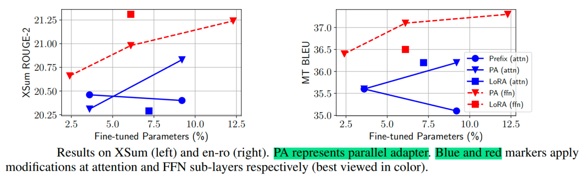
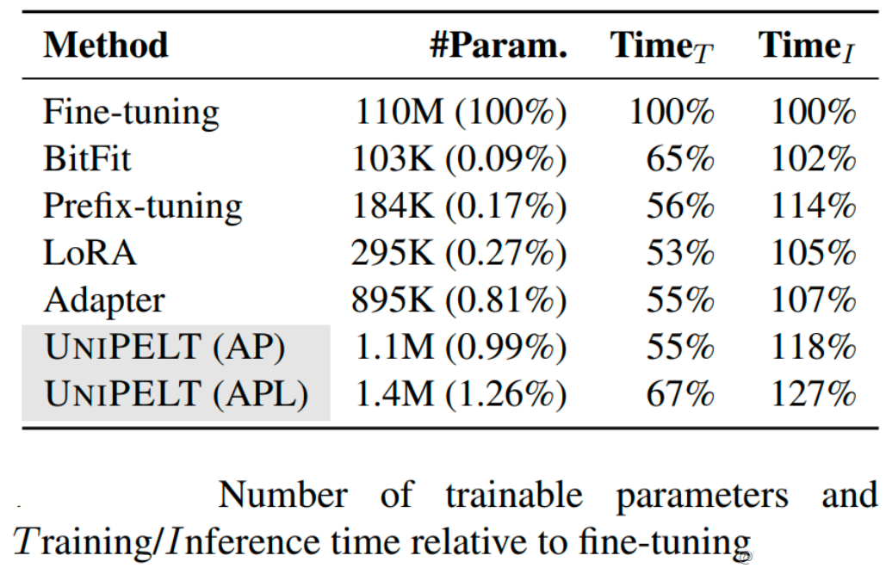

# A Deep Dive into Adapter-Based Parameter-Efficient Fine-Tuning (PEFT)

> This guide provides a comprehensive overview of Parameter-Efficient Fine-Tuning (PEFT) methods, with a special focus on the evolution of Adapter-based techniques. We begin with the foundational Adapter Tuning, exploring its architecture and motivation. We then expand to related pivotal methods like LoRA and Prefix-Tuning to provide a broader context. The guide subsequently delves into advanced variations such as AdapterFusion for multi-task learning, AdapterDrop for inference optimization, and unifying frameworks like MAM Adapter and UniPELT. The document culminates in a set of theoretical and practical interview questions, complete with detailed answers and Python/PyTorch code implementations, designed to prepare candidates for rigorous data science and machine learning interviews.

## Knowledge Section

### 1. What is Parameter-Efficient Fine-Tuning (PEFT)?

As Pre-trained Language Models (PLMs) like BERT, GPT, and Llama have grown to hundreds of billions of parameters, the traditional method of **full fine-tuning**—updating all model weights for a downstream task—has become prohibitively expensive. It requires immense computational resources, significant training time, and results in a separate, massive model checkpoint for every single task.

**Parameter-Efficient Fine-Tuning (PEFT)** is a collection of techniques designed to address this challenge. The core idea is to freeze the vast majority of the pre-trained model's parameters and only tune a small, carefully selected subset of new or existing parameters. This approach offers several key advantages:

*   **Computational Efficiency:** Dramatically reduces the number of trainable parameters, lowering memory (VRAM) requirements and speeding up training.
*   **Storage Efficiency:** Instead of saving a full 100GB model for each task, you only need to store the small "delta" of tuned parameters, often just a few megabytes.
*   **Mitigation of Catastrophic Forgetting:** Since the original pre-trained weights are frozen, the model retains its powerful, general-purpose knowledge learned during pre-training. Full fine-tuning risks overwriting this knowledge, a phenomenon known as catastrophic forgetting.
*   **Effective Performance:** Remarkably, PEFT methods can achieve performance comparable to, and sometimes even better than, full fine-tuning on many downstream tasks.

### 2. Foundational PEFT Methodologies

#### 2.1. Adapter Tuning: The Original Bottleneck Approach

Adapter Tuning was one of the pioneering PEFT methods that demonstrated the viability of tuning only a small fraction of parameters.

##### **Motivation**

The primary motivation was to adapt large PLMs to various downstream tasks without the exorbitant cost of full fine-tuning. The hypothesis was that task-specific knowledge could be injected into the model through small, non-disruptive modules.

##### **Core Principle and Architecture**

The strategy is to insert small, trainable modules called "Adapters" inside each layer of a pre-trained Transformer. The original model's weights are kept frozen. For each Transformer layer, two Adapters are typically inserted: one after the multi-head attention (MHA) projection and another after the feed-forward network (FFN).

An Adapter module has a bottleneck architecture:
1.  **Down-Projection:** A linear layer projects the high-dimensional input hidden state `d` to a much smaller dimension `m`.
2.  **Non-linearity:** A non-linear activation function (e.g., ReLU, GeLU) is applied.
3.  **Up-Projection:** A linear layer projects the low-dimensional representation back up to the original dimension `d`.
4.  **Residual Connection:** The output of the Adapter is added back to the original input hidden state via a skip connection.

This structure ensures that even if the Adapter's weights are initialized close to zero, the residual connection makes the entire module an identity function, preventing training instability at the beginning.


*Figure 1: Adapter Tuning Architecture. Adapters are inserted after the attention and feed-forward sub-layers. The original model weights (in blue) are frozen, and only the new Adapter parameters (in orange) are trained.*

##### **Mathematical Formulation**

Given an input hidden state $h \in \mathbb{R}^d$ from a Transformer sub-layer, the Adapter module processes it as follows:

$$
h_{out} = h + g(h W_{down}) W_{up}
$$

Where:
*   $W_{down} \in \mathbb{R}^{d \times m}$ is the weight matrix for the down-projection.
*   $W_{up} \in \mathbb{R}^{m \times d}$ is the weight matrix for the up-projection.
*   $g(\cdot)$ is a non-linear activation function.
*   The bottleneck dimension `m` is a hyperparameter, where $m \ll d$.
*   The entire operation adds only $2md$ parameters per Adapter, which is a tiny fraction of the full model's size.

Experiments show that by tuning just 0.5% to 5% of the model's parameters, Adapter Tuning can achieve performance within 1% of full fine-tuning.

#### 2.2. LoRA (Low-Rank Adaptation)

LoRA is another highly popular PEFT method that operates on a different principle. Instead of adding new sequential modules, LoRA adapts existing weight matrices by representing their update as a low-rank decomposition.

##### **Core Principle and Architecture**

The key insight is that the change in weights ($\Delta W$) during model adaptation has a low "intrinsic rank." Therefore, we can approximate this change with two smaller matrices. For a pre-trained weight matrix $W_0 \in \mathbb{R}^{d \times k}$, the update is represented as:

$$
W = W_0 + \Delta W = W_0 + B A
$$

Where:
*   $W_0$ is frozen.
*   $B \in \mathbb{R}^{d \times r}$ and $A \in \mathbb{R}^{r \times k}$ are the trainable low-rank matrices.
*   The rank `r` is a hyperparameter, where $r \ll \min(d, k)$.

The forward pass is modified from $h = xW_0$ to $h = xW_0 + xBA$. This is computationally efficient because we can compute $xW_0$ and $xBA$ in parallel and add the results. After training, the product $BA$ can be merged with $W_0$ to form a new matrix $W_{new} = W_0 + BA$, resulting in zero inference latency compared to the original model.

#### 2.3. Prefix-Tuning and Prompt Tuning

These methods focus on adapting the attention mechanism. Instead of modifying weights, they introduce a small set of trainable vectors (a "soft prompt" or "prefix") that are prepended to the key and value sequences at each Transformer layer. The model then learns to attend to these virtual tokens to steer its behavior for the specific task, without altering any of the original weights.

### 3. Advanced Adapter-Based Techniques

#### 3.1. AdapterFusion: Combining Knowledge from Multiple Tasks

##### **Motivation**

While Adapters are great for single tasks, we often want to leverage knowledge from multiple source tasks to improve performance on a target task. Simple sequential fine-tuning can lead to catastrophic forgetting, and standard multi-task learning can suffer from task interference and balancing issues. AdapterFusion was proposed to non-destructively combine knowledge from multiple pre-trained Adapters.

##### **Technical Principle**

AdapterFusion employs a two-stage learning process:

1.  **Knowledge Extraction:** First, individual Adapters are trained for several different source tasks (e.g., one Adapter for sentiment analysis, one for question answering). During this phase, the PLM is frozen, and only the task-specific Adapters are trained. This can be done independently for each task (Single-Task Adapters, ST-A) or jointly (Multi-Task Adapters, MT-A).

2.  **Knowledge Composition:** For a new target task, the PLM and all the pre-trained source Adapters are frozen. A new module, the **AdapterFusion** layer, is introduced. This layer learns how to combine the outputs of the different Adapters in an optimal way for the target task.


*Figure 2: The two-stage process of AdapterFusion. Stage 1 involves training separate adapters for different tasks. Stage 2 freezes these adapters and learns a fusion layer to combine their knowledge for a target task.*

##### **AdapterFusion Architecture**

The fusion mechanism is a specialized attention mechanism. At each Transformer layer:
*   The **Query** is the output of the Transformer sub-layer (e.g., the FFN).
*   The **Keys** and **Values** are the outputs of the *N* different pre-trained source Adapters for that layer.

The AdapterFusion layer computes attention scores to weigh the contributions of each source Adapter, producing a combined representation. This allows the model to dynamically select which task knowledge is most relevant at each layer and for each token.


*Figure 3: Detailed architecture of the AdapterFusion mechanism, which uses attention to weigh and combine the outputs of multiple task-specific adapters.*

AdapterFusion demonstrates superior performance compared to full fine-tuning and standard Adapter Tuning, especially on datasets that can benefit from multi-task knowledge transfer.

#### 3.2. AdapterDrop: Optimizing for Inference Speed

##### **Motivation**

While Adapters are parameter-efficient, they add extra computation at each layer, slightly increasing inference latency (by 4-6%). AdapterDrop was introduced to improve this computational efficiency without sacrificing much performance.

##### **Technical Principle**

AdapterDrop is a simple yet effective technique: **dynamically remove (drop) Adapters from the lower layers of the Transformer during inference.** The core insight is that lower layers of a Transformer tend to learn more general, task-agnostic features, while higher layers learn more specialized, task-specific features. Therefore, task-specific adaptation might be less critical in the early layers.


*Figure 4: Illustration of AdapterDrop. Adapters in the lower layers (e.g., layers 1 to `n`) are removed to speed up computation.*

Experiments show that dropping Adapters from the first five Transformer layers can increase inference speed by up to 39% in a multi-task setting with minimal impact on performance. The technique can also be applied to prune unnecessary Adapters within an AdapterFusion setup, further boosting efficiency.


*Figure 5: Pruning AdapterFusion with AdapterDrop. Most adapters in the fusion layer can be removed while maintaining performance, significantly improving inference speed.*

### 4. Unifying PEFT Methods

More recent research has focused on understanding the fundamental connections between different PEFT methods, leading to unified frameworks that combine their strengths.

#### 4.1. MAM Adapter: A Unified View of PEFT

##### **Motivation**

Methods like Adapter Tuning, LoRA, and Prefix Tuning appear structurally different. Why do they all achieve similar, strong performance? The MAM (Mix-and-Match) Adapter paper investigated this question to find a unifying principle.

##### **Technical Principle**

The authors re-framed all these methods as ways of adding a modification vector, $\Delta h$, to a specific hidden state, $h$, within the PLM. They identified a set of "design dimensions" that characterize how each method works.


*Figure 6: A unified perspective where different PEFT methods are seen as applying a transformation (f) and a composition (+) to a hidden representation (h).*


*Figure 7: Structural comparison showing how Adapter, Prefix-Tuning, LoRA, and proposed variants (Parallel Adapter, Scaled PA) are inserted into the Transformer architecture.*

The key design dimensions are:
*   **Functional Form:** The structure of the trainable module (e.g., bottleneck for Adapters, low-rank for LoRA).
*   **Insertion Form:** How the module is integrated—sequentially (one after another) or in parallel (at the same time).
*   **Modified Representation:** Which hidden state is being modified (e.g., the output of MHA or FFN).
*   **Composition Function:** How the modification is applied (e.g., addition, scaling).


*Figure 8: A breakdown of PEFT methods along key design dimensions.*

Based on their analysis, the authors proposed the **MAM Adapter**, a novel combination that cherry-picks the best design choices:
*   **Parallel Adapters** placed at the FFN layer.
*   **Soft Prompts (Prefix-Tuning)** to modify the attention mechanism.


*Figure 9: Analysis showing that parallel adapters at the FFN layer (red) and soft prompts at the attention layer (blue) are highly effective.*

This hybrid approach, MAM Adapter, consistently outperformed individual methods like LoRA, Adapter, and Prefix Tuning.

#### 4.2. UniPELT: Gating for Optimal Combination

##### **Motivation**

No single PEFT method is universally the best for all tasks and data regimes. Choosing the right one is often a tedious process of trial and error. UniPELT addresses this by creating a framework that learns to combine multiple PEFT methods dynamically.

##### **Technical Principle**

UniPELT integrates LoRA, Prefix-Tuning, and Adapters into a single architecture. The key innovation is a **learnable gating mechanism** that controls the contribution of each method.


*Figure 10: The UniPELT architecture, which combines LoRA, Prefix-Tuning, and Adapters. Trainable gating parameters (G_L, G_P, G_A) control the influence of each sub-module.*

Specifically:
*   **LoRA** is applied to the query and value matrices in the MHA.
*   **Prefix-Tuning** is applied to the keys and values in the MHA.
*   **Adapters** are added after the FFN sub-layer.
*   Each module has an associated **gate**—a small linear layer whose output scalar value ($g_L, g_P, g_A$) determines the module's influence.

The final output is a weighted sum of the modifications from each sub-module. The model learns not only the parameters of the PEFT modules but also the optimal gating weights for the given task and data.

UniPELT shows strong performance, especially in low-data scenarios, often outperforming the best-performing individual sub-module.


*Figure 11: UniPELT trade-offs. While it has slightly more parameters and higher latency than some individual methods, it provides robust and superior performance.*

### 5. Summary of Methodologies and Trade-offs

| Method            | Primary Goal                                  | Trainable Params | Inference Latency | Key Feature                                        | Best For                                                              |
| ----------------- | --------------------------------------------- | ---------------- | ----------------- | -------------------------------------------------- | --------------------------------------------------------------------- |
| **Full Fine-Tune**| Max Performance                               | 100%             | Baseline          | Updates all weights                                | Tasks with large datasets and unlimited resources.                    |
| **Adapter Tuning**| Parameter Efficiency                          | Low (0.5-5%)     | Slight Increase   | Sequential bottleneck modules                      | General-purpose, single-task adaptation.                              |
| **LoRA**          | Parameter Efficiency & No Inference Latency   | Very Low (0.01-1%) | Zero (after merge)| Low-rank decomposition of weight updates         | Scenarios where inference speed is critical.                          |
| **AdapterFusion** | Multi-Task Knowledge Transfer                 | Medium           | Increase          | Attention-based fusion of pre-trained adapters     | Improving performance on a target task using multiple source tasks.   |
| **AdapterDrop**   | Reduce Inference Latency of Adapters          | Low (same as Adapter) | Decrease      | Drops adapters from lower layers                 | Deploying adapter-tuned models where speed is a priority.             |
| **MAM Adapter**   | Unified Performance                           | Medium           | Increase          | Mix-and-match of parallel adapters and prefixes  | Achieving state-of-the-art PEFT performance.                          |
| **UniPELT**       | Robustness & Automatic Method Selection       | Medium           | Increase          | Gated combination of LoRA, Prefixes, and Adapters  | Low-data scenarios and avoiding manual PEFT method selection.         |

---

## Interview Questions

### Theoretical Questions

#### **Question 1: What is the core motivation behind PEFT methods like Adapters compared to full fine-tuning?**
**Answer:**
The core motivation is to overcome the significant drawbacks of full fine-tuning for large pre-trained language models (PLMs). There are three main problems with full fine-tuning:
1.  **High Computational and Storage Costs:** Full fine-tuning requires updating billions of parameters, demanding powerful GPUs with high VRAM and extensive training time. Furthermore, it produces a complete, large model checkpoint (e.g., 10s or 100s of GB) for every single downstream task, which is inefficient for storage and deployment.
2.  **Catastrophic Forgetting:** When all weights of a PLM are updated for a specific, often smaller, downstream dataset, the model can lose the rich, general knowledge it acquired during pre-training. This degradation of general capabilities is known as catastrophic forgetting.
3.  **Deployment Inefficiency:** Managing and serving dozens of unique, large model checkpoints for different tasks is a major operational challenge (MLOps).

PEFT methods address these issues by freezing the base PLM and only tuning a very small number of parameters (<<1% of the total). This drastically reduces computational and storage costs, prevents catastrophic forgetting by preserving the original weights, and simplifies deployment as only a small "adapter" or "delta" needs to be loaded for each task.

#### **Question 2: Explain the architecture of a standard Adapter module and where they are typically inserted in a Transformer layer.**
**Answer:**
A standard Adapter module has a **bottleneck architecture** designed to be computationally cheap yet expressive enough to learn task-specific information. Its components are:
1.  **Down-Projection Layer:** A feed-forward linear layer that projects the input hidden state from its high dimension, $d$, to a small bottleneck dimension, $m$ (where $m \ll d$).
2.  **Non-linearity:** An activation function like ReLU or GeLU is applied to the low-dimensional representation to introduce non-linear transformations.
3.  **Up-Projection Layer:** Another feed-forward linear layer that projects the representation back from the bottleneck dimension $m$ to the original dimension $d$.
4.  **Residual Connection:** The output of the up-projection layer is added back to the original input hidden state. This is crucial as it allows the Adapter to learn an identity function initially (if weights are near zero), ensuring stable training from the start.

The mathematical formula is: $h_{out} = h_{in} + g(h_{in}W_{down})W_{up}$.

**Insertion:** In a standard Transformer block, Adapters are inserted **sequentially** within the architecture. Typically, two adapters are added per block:
*   One immediately after the Multi-Head Self-Attention (MHA) sub-layer (but before the residual connection and layer normalization).
*   One immediately after the Feed-Forward Network (FFN) sub-layer (also before its corresponding residual connection and layer normalization).

#### **Question 3: Mathematically, what is the fundamental difference between an Adapter module and LoRA?**
**Answer:**
The fundamental difference lies in how they modify the information flow and the model's weights.

*   **Adapter (Sequential Modification):** An Adapter is a *sequential* module that processes the output of a layer and adds its result back. It introduces new layers into the model's forward pass.
    *   Formula: $h_{out} = h_{in} + g(h_{in} W_{down}) W_{up}$
    *   Here, $h_{in}$ is first passed through a new set of layers ($W_{down}$, $g$, $W_{up}$) and the result is then added to the original $h_{in}$. The original weights of the Transformer layer are untouched and frozen.

*   **LoRA (Parallel Modification):** LoRA is a *parallel* modification that directly approximates the update to an *existing* weight matrix ($W_0$). It does not add new layers in a sequential manner.
    *   Formula: $h_{out} = h_{in}W_0 + h_{in}(BA)$
    *   Here, the original forward pass ($h_{in}W_0$) is computed in parallel with the low-rank update pass ($h_{in}BA$). The results are then summed. The key is that LoRA modifies the behavior of a specific weight matrix, whereas an Adapter modifies the activation *after* a weight matrix has been applied. After training, the matrices can be merged ($W_{new} = W_0 + BA$), resulting in no additional inference latency.

In summary: **Adapter = Sequential bottleneck block**. **LoRA = Parallel low-rank update to an existing weight matrix**.

#### **Question 4: How does AdapterFusion solve the problem of knowledge interference that can occur in standard multi-task learning?**
**Answer:**
AdapterFusion solves the problem of knowledge interference by separating the learning process into two distinct stages: knowledge extraction and knowledge composition.

1.  **Stage 1: Knowledge Extraction.** In this stage, individual adapters are trained for each source task independently. For example, one adapter learns "sentiment analysis" and another learns "summarization". Because these adapters are trained separately (or in a multi-task setup where their parameters are distinct), the knowledge for each task is encapsulated within its own set of weights. Task A's gradient doesn't directly update Task B's adapter, preventing the kind of "tug-of-war" between tasks that can happen in traditional multi-task learning where parameters are shared.

2.  **Stage 2: Knowledge Composition.** In this stage, all the pre-trained task adapters are **frozen**. A new, lightweight AdapterFusion layer is introduced to learn how to **combine** the outputs of these frozen adapters. This fusion layer uses an attention mechanism where the target task's hidden state acts as a query to "ask" for relevant information from the source adapters (keys and values).

By freezing the source adapters, AdapterFusion ensures that the specialized knowledge learned in Stage 1 is not corrupted or forgotten. The model only learns *how to mix* this knowledge, not the knowledge itself. This prevents negative interference and allows the model to dynamically select the most useful information from each source task for the target task at hand.

#### **Question 5: What problem does AdapterDrop address, and what is its core hypothesis about Transformer layers?**
**Answer:**
**Problem Addressed:** AdapterDrop addresses the **inference latency** introduced by Adapter modules. While adapters are parameter-efficient, they add extra computational layers to the model, which slows down the forward pass during inference.

**Core Hypothesis:** The core hypothesis of AdapterDrop is that **different layers in a Transformer have different levels of task specificity**. Specifically, it posits that:
*   **Lower layers** of a Transformer learn more general, foundational features of language (e.g., syntax, basic semantics). These features are largely task-agnostic.
*   **Higher layers** of a Transformer build on these general features to learn more abstract, complex, and task-specific representations.

Based on this hypothesis, task-specific modifications (like Adapters) are most critical in the higher layers and may be redundant or unnecessary in the lower layers. Therefore, one can safely "drop" the adapters from the initial layers of the model during inference to save computation without significantly harming task performance.

### Practical & Coding Questions

#### **Question 1: Implement a basic Adapter module in PyTorch.**
**Answer:** Here is a complete, commented implementation of an Adapter module using `torch.nn`.

```python
import torch
import torch.nn as nn

class Adapter(nn.Module):
    """
    A PyTorch implementation of a sequential Adapter module.
    """
    def __init__(self, input_dim: int, bottleneck_dim: int, activation=nn.ReLU()):
        """
        Initializes the Adapter module.

        Args:
            input_dim (int): The feature dimension of the input and output.
            bottleneck_dim (int): The dimensionality of the inner bottleneck layer.
            activation (nn.Module): The non-linear activation function to use.
        """
        super().__init__()
        self.input_dim = input_dim
        self.bottleneck_dim = bottleneck_dim

        # 1. Down-projection layer
        self.down_project = nn.Linear(input_dim, bottleneck_dim)

        # 2. Non-linear activation function
        self.activation = activation

        # 3. Up-projection layer
        self.up_project = nn.Linear(bottleneck_dim, input_dim)

        # Initialize up_project weights to near-zero for stable training
        nn.init.zeros_(self.up_project.weight)
        nn.init.zeros_(self.up_project.bias)

    def forward(self, x: torch.Tensor) -> torch.Tensor:
        """
        Forward pass for the Adapter module.

        Args:
            x (torch.Tensor): The input tensor from the previous layer.

        Returns:
            torch.Tensor: The output tensor with the adapter's transformation added.
        """
        # Save the original input for the residual connection
        residual = x

        # Pass through the adapter layers
        x = self.down_project(x)
        x = self.activation(x)
        x = self.up_project(x)

        # 4. Add the residual connection
        output = x + residual
        return output

# --- Example Usage ---
# Define dimensions
d_model = 768  # e.g., for BERT-base
adapter_bottleneck_dim = 64

# Create an adapter instance
adapter_module = Adapter(input_dim=d_model, bottleneck_dim=adapter_bottleneck_dim)

# Create a dummy input tensor
batch_size = 4
seq_length = 128
dummy_input = torch.randn(batch_size, seq_length, d_model)

# Pass the input through the adapter
output = adapter_module(dummy_input)

# Verify the output shape
print(f"Input shape: {dummy_input.shape}")
print(f"Output shape: {output.shape}")

# Verify the number of parameters
total_params = sum(p.numel() for p in adapter_module.parameters() if p.requires_grad)
print(f"Number of trainable parameters in the adapter: {total_params:,}")
# Expected params: (768*64 + 64) + (64*768 + 768) = 49216 + 49920 = 99136
```

#### **Question 2: Code a simplified Transformer Encoder block and show where you would insert two Adapter modules.**
**Answer:** This implementation shows a standard Transformer Encoder block and clearly marks the insertion points for the Adapters.

```python
import torch
import torch.nn as nn
from typing import Optional

# We'll use the Adapter class from the previous question
class Adapter(nn.Module):
    def __init__(self, input_dim: int, bottleneck_dim: int, activation=nn.ReLU()):
        super().__init__()
        self.down_project = nn.Linear(input_dim, bottleneck_dim)
        self.activation = activation
        self.up_project = nn.Linear(bottleneck_dim, input_dim)
        nn.init.zeros_(self.up_project.weight)
        nn.init.zeros_(self.up_project.bias)
    def forward(self, x):
        residual = x
        x = self.down_project(x)
        x = self.activation(x)
        x = self.up_project(x)
        return x + residual

class TransformerEncoderBlockWithAdapters(nn.Module):
    """
    A simplified Transformer Encoder Block with Adapters inserted.
    """
    def __init__(self, d_model: int, n_heads: int, d_ff: int, adapter_bottleneck_dim: int, dropout: float = 0.1):
        super().__init__()
        
        # Multi-Head Attention sub-layer
        self.self_attn = nn.MultiheadAttention(d_model, n_heads, dropout=dropout, batch_first=True)
        self.norm1 = nn.LayerNorm(d_model)
        self.dropout1 = nn.Dropout(dropout)
        
        # Feed-Forward Network sub-layer
        self.ffn = nn.Sequential(
            nn.Linear(d_model, d_ff),
            nn.ReLU(),
            nn.Dropout(dropout),
            nn.Linear(d_ff, d_model)
        )
        self.norm2 = nn.LayerNorm(d_model)
        self.dropout2 = nn.Dropout(dropout)

        # === ADAPTER INSERTION ===
        # We instantiate two adapter modules
        self.mha_adapter = Adapter(d_model, adapter_bottleneck_dim)
        self.ffn_adapter = Adapter(d_model, adapter_bottleneck_dim)
        
    def forward(self, src: torch.Tensor, src_mask: Optional[torch.Tensor] = None) -> torch.Tensor:
        # 1. Multi-Head Attention part
        attn_output, _ = self.self_attn(src, src, src, attn_mask=src_mask)
        # --- The original model would do this:
        # src = src + self.dropout1(attn_output)
        
        # --- With Adapters, we do this instead:
        # Pass the output of the attention mechanism through the first adapter
        adapted_attn_output = self.mha_adapter(attn_output)
        
        # Then apply dropout and the residual connection
        src = src + self.dropout1(adapted_attn_output)
        src = self.norm1(src)

        # 2. Feed-Forward Network part
        ffn_output = self.ffn(src)
        # --- The original model would do this:
        # src = src + self.dropout2(ffn_output)

        # --- With Adapters, we do this instead:
        # Pass the output of the FFN through the second adapter
        adapted_ffn_output = self.ffn_adapter(ffn_output)
        
        # Then apply dropout and the residual connection
        src = src + self.dropout2(adapted_ffn_output)
        src = self.norm2(src)
        
        return src

# --- Example Usage ---
d_model = 512
n_heads = 8
d_ff = 2048
adapter_dim = 64

# Create the block
encoder_block = TransformerEncoderBlockWithAdapters(d_model, n_heads, d_ff, adapter_dim)

# Create a dummy input
dummy_input = torch.rand(16, 100, d_model) # (batch, seq_len, d_model)
output = encoder_block(dummy_input)

print(f"Input shape: {dummy_input.shape}")
print(f"Output shape: {output.shape}")

# To freeze the original model and train only adapters:
for name, param in encoder_block.named_parameters():
    if 'adapter' not in name:
        param.requires_grad = False

# Verify which parameters are trainable
print("\nTrainable parameters:")
for name, param in encoder_block.named_parameters():
    if param.requires_grad:
        print(name)
```

#### **Question 3: Using NumPy, implement the core logic of LoRA for a single linear layer.**
**Answer:** This shows the LoRA logic without a deep learning framework, focusing on the matrix operations.

```python
import numpy as np

class LoRALinear:
    """
    A NumPy implementation of a LoRA-enhanced linear layer.
    """
    def __init__(self, input_dim: int, output_dim: int, rank: int, alpha: float = 1.0):
        """
        Initializes the LoRA layer.
        
        Args:
            input_dim (int): Input feature dimension.
            output_dim (int): Output feature dimension.
            rank (int): The rank of the low-rank update matrices.
            alpha (float): A scaling factor for the LoRA output.
        """
        # Pre-trained, frozen weight matrix
        self.W0 = np.random.randn(input_dim, output_dim) * 0.02 # Simulate a pre-trained weight

        # LoRA trainable matrices
        # In a real scenario, these would be initialized more carefully
        self.A = np.random.randn(input_dim, rank) * 0.01 # Down-projection
        self.B = np.zeros((rank, output_dim)) # Up-projection, initialized to zero

        # Hyperparameters
        self.rank = rank
        self.alpha = alpha
        
        print(f"Original W0 shape: {self.W0.shape}")
        print(f"LoRA A shape: {self.A.shape}")
        print(f"LoRA B shape: {self.B.shape}")
        
        # Calculate parameter counts
        self.params_W0 = self.W0.size
        self.params_lora = self.A.size + self.B.size
        print(f"Params in W0: {self.params_W0:,}")
        print(f"Trainable params in LoRA (A+B): {self.params_lora:,}")
        print(f"Parameter reduction: {100 * (1 - self.params_lora / self.params_W0):.2f}%")


    def forward(self, x: np.ndarray) -> np.ndarray:
        """
        Performs the forward pass using the LoRA logic.
        
        Args:
            x (np.ndarray): Input data of shape (batch_size, input_dim).
            
        Returns:
            np.ndarray: Output data of shape (batch_size, output_dim).
        """
        # Original model's forward pass
        h0 = x @ self.W0
        
        # LoRA's parallel forward pass
        # The scaling factor alpha/rank is a common practice
        h_lora = (x @ self.A) @ self.B * (self.alpha / self.rank)
        
        # Combine the two
        return h0 + h_lora

    def merge_weights(self) -> np.ndarray:
        """
        Merges LoRA weights into the base weight for zero inference latency.
        
        Returns:
            np.ndarray: The new, combined weight matrix.
        """
        delta_W = self.A @ self.B * (self.alpha / self.rank)
        merged_W = self.W0 + delta_W
        return merged_W

# --- Example Usage ---
input_dim = 768
output_dim = 768
lora_rank = 8
alpha_scale = 16

# Create the LoRA layer
lora_layer = LoRALinear(input_dim, output_dim, rank=lora_rank, alpha=alpha_scale)

# Create dummy input data
batch_size = 4
dummy_input = np.random.randn(batch_size, input_dim)

# Forward pass
output = lora_layer.forward(dummy_input)
print(f"\nInput shape: {dummy_input.shape}")
print(f"Output shape: {output.shape}")

# Demonstrate weight merging for inference
merged_W = lora_layer.merge_weights()
print(f"\nMerged weight matrix shape: {merged_W.shape}")

# Inference with merged weights (should be identical to the LoRA forward pass)
inference_output = dummy_input @ merged_W

# Check if the outputs are numerically close
assert np.allclose(output, inference_output)
print("\nOutput from LoRA forward pass and merged-weight pass are identical.")
```

### References
*   Houlsby, N., Giurgiu, A., Jastrzebski, S., Morrone, B., De Laroussilhe, Q., Gesmundo, A., ... & Gelly, S. (2019). Parameter-Efficient Transfer Learning for NLP. *ICML*.
*   Pfeiffer, J., Ruder, S., Vulić, I., & Gurevych, I. (2020). AdapterFusion: Non-Destructive Task Composition for Transfer Learning. *EACL*.
*   Rücklé, A., Geigle, G., Poth, C., & Gurevych, I. (2020). AdapterDrop: On the Efficiency of Adapters in Transformers. *EMNLP*.
*   He, J., Zhou, C., Ma, X., Berg-Kirkpatrick, T., & Neubig, G. (2021). Towards a Unified View of Parameter-Efficient Transfer Learning. *ICLR 2022*.
*   Mao, Y., Mathias, L., Hou, Z., & Bansal, M. (2022). UniPELT: A Unified Framework for Parameter-Efficient Language Model Tuning. *ACL*.
*   [Zhihu Article: 大模型参数高效微调技术原理综述（四）-Adapter Tuning及其变体](https://zhuanlan.zhihu.com/p/636038478)