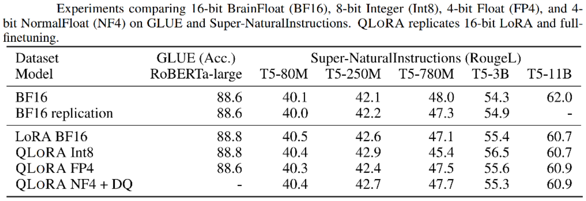

# A Comprehensive Guide to Parameter-Efficient Fine-Tuning: LoRA, AdaLoRA, and QLoRA

> This guide provides a deep dive into Parameter-Efficient Fine-Tuning (PEFT) techniques, focusing on LoRA, AdaLoRA, and QLoRA. It is designed for data scientists and machine learning engineers preparing for interviews that cover large language models (LLMs). The document breaks down the theoretical underpinnings, mathematical formulations, and practical applications of these methods. It begins with a detailed knowledge section explaining the core concepts, followed by a comprehensive set of theoretical and practical interview questions with detailed answers and Python code implementations.

## Knowledge Section

### 1. The Challenge of Fine-Tuning Large Language Models

As Large Language Models (LLMs) like GPT-3, LLaMA, and PaLM have grown to hundreds of billions of parameters, the process of adapting them to specific downstream tasks—known as fine-tuning—has become computationally prohibitive.

**Full fine-tuning**, which involves updating all of the model's weights, presents two major challenges:

1.  **Training Costs:** Updating billions of parameters requires a massive amount of GPU memory to store the weights, gradients, and optimizer states (e.g., Adam optimizer states can take up to twice the memory of the model parameters themselves). This makes fine-tuning accessible only to organizations with substantial hardware resources.
2.  **Deployment Costs:** If multiple tasks require fine-tuned models, each task would necessitate storing a complete, multi-gigabyte copy of the model. This is highly inefficient and costly for storage and deployment.

To address these issues, the field of **Parameter-Efficient Fine-Tuning (PEFT)** has emerged. PEFT methods aim to adapt LLMs to new tasks by training only a small fraction of the total parameters while keeping the vast majority of the pre-trained weights frozen. This dramatically reduces memory requirements and storage costs. We will explore three seminal PEFT techniques: LoRA, AdaLoRA, and QLoRA.

### 2. LoRA: Low-Rank Adaptation of Large Language Models

LoRA is a groundbreaking PEFT technique that has become a standard for efficient fine-tuning.

#### 2.1 The Low-Rank Hypothesis

The foundational insight behind LoRA comes from a 2020 paper by Aghajanyan et al., which observed that pre-trained language models have a **low "intrinsic dimension."** This means that while their weight matrices are high-dimensional (e.g., 4096x4096), the changes required to adapt them to a new task can be represented in a much smaller subspace.

LoRA builds on this by hypothesizing that the **weight update matrix** ($\Delta W$) during fine-tuning also has a **low intrinsic rank**. A full-rank matrix can capture complex, arbitrary transformations, but the adaptation for a specific task may only require a simpler, low-rank transformation. LoRA proposes to model this low-rank update directly, instead of updating the entire high-rank weight matrix $W$.

#### 2.2 Technical Principles

LoRA avoids modifying the original pre-trained weights $W_0$. Instead, it introduces a parallel path with two small, trainable matrices, **A** and **B**, that compose a low-rank approximation of the update $\Delta W$.

For a given pre-trained weight matrix $W_0 \in \mathbb{R}^{d \times k}$, the forward pass is modified as follows:

$$
h = W_0 x + \Delta W x = W_0 x + B A x
$$

Where:
*   $x \in \mathbb{R}^{k}$ is the input vector.
*   $W_0 \in \mathbb{R}^{d \times k}$ is the frozen pre-trained weight matrix.
*   $A \in \mathbb{R}^{r \times k}$ is a low-rank projection matrix that maps the input from dimension $k$ to a smaller dimension $r$.
*   $B \in \mathbb{R}^{d \times r}$ is a low-rank projection matrix that maps the reduced-dimension representation back to the original dimension $d$.
*   The **rank** $r$ is a hyperparameter, and it is typically much smaller than $d$ and $k$ (i.e., $r \ll \min(d, k)$).


**Parameter Efficiency:**
The number of parameters in the original matrix $W_0$ is $d \times k$. By performing full fine-tuning, we would train all $d \times k$ parameters. With LoRA, we only train matrices A and B. The total number of trainable parameters is $d \times r + r \times k = r(d+k)$.

For a typical square matrix in a Transformer where $d=k$, the original parameter count is $d^2$. The LoRA parameter count is $2dr$. If $d=4096$ and $r=8$, the original matrix has ~16.8 million parameters, while the LoRA matrices have only $2 \times 4096 \times 8 = 65,536$ parameters—a reduction of over 99.5%.


**Initialization and Training:**
*   The weights of matrix **A** are initialized from a random Gaussian distribution.
*   The weights of matrix **B** are initialized to **all zeros**.
This ensures that at the beginning of training, the update matrix $\Delta W = BA$ is zero. Therefore, the LoRA module has no effect on the initial output, and the model starts from its pre-trained state, ensuring training stability. A scaling factor $\alpha/r$ is often applied to the output `BAx`, where `alpha` is another hyperparameter. The modified update is $h = W_0 x + \frac{\alpha}{r} B A x$.

**Inference:**
During inference, the trainable LoRA matrices can be merged with the original weights to avoid any additional latency.
$$
W_{new} = W_0 + \Delta W = W_0 + B A
$$
The forward pass becomes $h = W_{new}x$. This means LoRA adds **zero inference overhead** compared to the original, fully fine-tuned model, which is a major advantage over methods like Adapter Tuning that introduce extra layers and latency.

#### 2.3 Application and Empirical Results

The LoRA paper found that applying LoRA to just the attention weight matrices ($W_q$, $W_k$, $W_v$, $W_o$) in a Transformer was sufficient to achieve strong performance. Ablation studies showed that adapting both $W_q$ and $W_v$ yielded the best results.


The choice of rank $r$ is a trade-off. A higher rank allows the model to learn more complex adaptations but increases the number of parameters. Empirically, very small ranks like $r=4, 8,$ or $16$ are often sufficient. The paper notes that increasing the number of adapted weight types is more effective than increasing the rank $r$ for a single weight type.


### 3. AdaLoRA: Adaptive Budget Allocation for LoRA

While effective, LoRA has a limitation: it allocates a **fixed, uniform rank** $r$ to all selected weight matrices. This is suboptimal because not all matrices are equally important for adaptation. Some layers or modules might require more capacity (a higher rank) to learn task-specific features, while others might need very little, or could even be harmed by a rank that is too high, leading to overfitting.

#### 3.1 Motivation for Adaptive Ranks

AdaLoRA was developed to address this rigidity. It introduces a method to **dynamically allocate the parameter budget** (i.e., ranks) across different weight matrices based on their importance. The core idea is to assign higher ranks to more "important" matrices and prune the ranks of less important ones during training. This leads to a more efficient and effective allocation of the limited parameter budget.

The key questions AdaLoRA answers are:
1.  How do we measure the "importance" of a weight matrix during fine-tuning?
2.  How can we dynamically adjust the rank $r$ for each matrix based on this importance score?

#### 3.2 Technical Principles

AdaLoRA reframes the low-rank update $\Delta W$ in a way that makes rank allocation explicit and differentiable. It parameterizes the update $\Delta W$ in its **Singular Value Decomposition (SVD)** form.
$$
\Delta = P \Lambda Q^T
$$
Where:
*   $P \in \mathbb{R}^{d \times r}$ and $Q \in \mathbb{R}^{k \times r}$ are orthogonal matrices representing the left and right singular vectors.
*   $\Lambda \in \mathbb{R}^{r \times r}$ is a diagonal matrix containing the singular values, which represent the "magnitude" or importance of each rank-1 component.

In AdaLoRA, the matrices $P$ and $Q$ are the trainable parameters (analogous to $B$ and a part of $A$ in LoRA), and $\Lambda$ contains learnable magnitude parameters.

**The AdaLoRA procedure is as follows:**
1.  **SVD-based Parameterization:** The update $\Delta W$ is decomposed as $\Delta = P \Lambda Q$. Unlike LoRA's $BA$, this form explicitly separates the basis vectors ($P, Q$) from their importance scores ($\Lambda$).
2.  **Importance Scoring and Pruning:** At each training step, an importance score is calculated for each rank-1 component (each singular value and its corresponding vectors). Based on this score, less important components are pruned away. This effectively reduces the rank $r$ for matrices that do not require high capacity. The total parameter budget is maintained by redistributing the pruned capacity to more important matrices.
3.  **Orthogonality Regularization:** Performing a full SVD at each step is computationally prohibitive. To avoid this, AdaLoRA keeps $P$ and $Q$ as trainable parameters and adds a regularization term to the loss function that encourages them to remain orthogonal. This helps stabilize training and approximates the properties of a true SVD.

By dynamically pruning and redistributing the rank budget, AdaLoRA achieves a more fine-grained and efficient adaptation than LoRA.


### 4. QLoRA: Efficient Fine-tuning of Quantized LLMs

QLoRA tackles the most significant barrier to fine-tuning: the sheer **memory footprint** of the base model itself. Even with LoRA, which drastically reduces the number of *trainable* parameters, the full pre-trained model (e.g., in 16-bit precision) must still be loaded into GPU memory for the forward and backward passes. For a 65-billion parameter model like LLaMA, this requires over 130GB of GPU RAM for the weights alone, making it impossible to fine-tune on a single consumer GPU.

QLoRA's key innovation is to fine-tune a model that has been **quantized to an extremely low precision (4-bit)**, thereby drastically reducing the memory footprint of the base model. The challenge is to do this without sacrificing the performance of a 16-bit fine-tuned model.

#### 4.1 Technical Principles

QLoRA introduces three key innovations to enable high-fidelity 4-bit fine-tuning:


1.  **4-bit NormalFloat (NF4) Data Type:**
    *   Standard quantization methods (like integer or uniform floating-point) are not ideal for neural network weights, which typically follow a zero-centered Normal distribution.
    *   QLoRA introduces **NormalFloat (NF4)**, an information-theoretically optimal data type for normally distributed data. It is built by setting quantiles of a theoretical N(0, 1) distribution such that each of the $2^4 = 16$ quantization bins has an equal number of expected values. This ensures high precision for values near the center of the distribution (where most weights lie) and still captures outlier values.

2.  **Double Quantization (DQ):**
    *   Quantization involves scaling the weights by a "quantization constant" or "block size". These constants are typically stored in 32-bit float, creating a memory overhead.
    *   QLoRA introduces **Double Quantization**, which is the process of quantizing the quantization constants themselves. For example, it might use 8-bit floats with a block size of 256 to quantize the 32-bit float constants, saving an average of ~0.3-0.5 bits per parameter. While the accuracy benefit is small, the memory saving is significant.

3.  **Paged Optimizers:**
    *   Even with a 4-bit model, memory usage can spike during training, especially when using gradient checkpointing, potentially leading to out-of-memory (OOM) errors.
    *   QLoRA leverages **NVIDIA's Unified Memory feature** to create **Paged Optimizers**. This allows optimizer states (which are typically stored on the GPU) to be automatically "paged" to CPU RAM when GPU memory is full, and paged back to the GPU when needed. This acts as a safety net, preventing crashes and enabling the training of very large models on single GPUs with limited VRAM.

**The QLoRA Workflow:**
The workflow distinguishes between the **storage data type** and the **computation data type**:
*   **Storage:** The pre-trained base model weights are stored in the memory-efficient 4-bit NF4 format.
*   **Computation:** During the forward or backward pass, a weight tensor is de-quantized on-the-fly to a higher-precision format like **BFloat16 (BF16)**. All computations (matrix multiplications) are performed in BF16. The LoRA adapter weights themselves are also kept in BF16.

This ensures that while the memory footprint is tiny, the critical computations do not suffer from the precision loss of 4-bit arithmetic, preserving model performance.

#### 4.2 Empirical Results

The QLoRA paper demonstrated that its 4-bit fine-tuning approach could match the performance of 16-bit full fine-tuning and 16-bit LoRA fine-tuning across a range of benchmarks.



This was a revolutionary result, as it democratized the fine-tuning of massive LLMs, making it possible on consumer-grade hardware (e.g., a single 24GB or 48GB GPU).


**Key Takeaway**: QLoRA is not just about making fine-tuning possible; it's about doing so efficiently *without performance degradation*. It has become the de-facto standard for anyone looking to fine-tune large models on personal or limited-resource hardware. Libraries like Hugging Face's `peft` have integrated QLoRA, making it easily accessible.

---

## Interview Questions

### Theoretical Questions

#### Question 1: What is the core hypothesis behind LoRA, and why is it plausible for fine-tuning large pre-trained models?

**Answer:**
The core hypothesis of LoRA is that the **change in weights ($\Delta W$) during the fine-tuning of a large pre-trained model has a low "intrinsic rank."**

This is plausible for two main reasons:
1.  **Pre-trained Knowledge:** Large language models are already trained on vast amounts of data and have learned a rich, general-purpose representation of language. Fine-tuning for a specific downstream task is more about *adapting* this existing knowledge rather than learning entirely new features from scratch. This adaptation can be seen as a small shift or rotation in the high-dimensional weight space, which can be modeled by a low-rank transformation.
2.  **Over-parameterization:** Modern neural networks are heavily over-parameterized. Research has shown that these models have a low "intrinsic dimension," meaning they can be re-parameterized to a much smaller subspace without a significant loss in performance. It is therefore reasonable to assume that the *update* to these weights would also lie in a low-dimensional subspace, making a low-rank approximation effective.

In essence, LoRA posits that you don't need to modify the billions of parameters in a complex, high-rank fashion to teach the model a new task. A simple, low-rank adjustment is sufficient.

#### Question 2: Explain the mathematical formulation of a LoRA layer. Why is the `B` matrix typically initialized to zeros?

**Answer:**
For a standard linear layer with a forward pass $h = W_0 x$, where $W_0$ is the pre-trained weight matrix, LoRA introduces a parallel branch. The modified forward pass is:
$$
h = W_0 x + \Delta W x = W_0 x + B A x
$$
Here:
*   $W_0 \in \mathbb{R}^{d \times k}$ is the frozen, pre-trained weight matrix.
*   $x \in \mathbb{R}^{k}$ is the input.
*   $A \in \mathbb{R}^{r \times k}$ is a trainable matrix that projects the input down to a low-rank space of dimension $r$.
*   $B \in \mathbb{R}^{d \times r}$ is a trainable matrix that projects the low-rank representation back up to the output dimension $d$.
*   $r$ is the rank, where $r \ll \min(d, k)$.

**The `B` matrix is initialized to all zeros for a crucial reason: training stability.**

At the start of fine-tuning, the update matrix is $\Delta W = BA$. If $B$ is initialized to zeros, then $\Delta W$ is also a zero matrix. This means the initial forward pass is simply $h = W_0 x + 0 \cdot A x = W_0 x$.

This initialization ensures that at step zero, the LoRA-adapted layer behaves identically to the original pre-trained layer. The fine-tuning process starts from the robust, pre-trained state of the model and gradually learns the update $\Delta W$ as the weights of $B$ (and $A$) move away from their initial values. This prevents catastrophic forgetting or large, destabilizing updates at the beginning of training.

#### Question 3: How does LoRA reduce the number of trainable parameters? Provide a concrete example with dimensions.

**Answer:**
LoRA reduces trainable parameters by decomposing the large weight update matrix $\Delta W \in \mathbb{R}^{d \times k}$ into two much smaller matrices, $A \in \mathbb{R}^{r \times k}$ and $B \in \mathbb{R}^{d \times r}$.

*   **Original Parameters (Full Fine-Tuning):** We would train the entire matrix $W_0$, which has $d \times k$ parameters.
*   **LoRA Parameters:** We only train matrices $A$ and $B$. The number of parameters is `params(A) + params(B) = (r \times k) + (d \times r) = r(d+k)`.

**Example:**
Consider a linear layer in a Transformer model, such as the query projection matrix $W_q$, where the hidden dimension is $d=k=4096$.

*   **Full Fine-Tuning Parameters:**
    The number of parameters in $W_q$ is $4096 \times 4096 = 16,777,216$.

*   **LoRA Fine-Tuning Parameters:**
    Let's choose a small rank, $r=8$.
    The number of trainable parameters for the LoRA adapter is:
    $r(d+k) = 8 \times (4096 + 4096) = 8 \times 8192 = 65,536$.

**Comparison:**
The number of trainable parameters is reduced from **16,777,216** to just **65,536**. This is a reduction factor of over 256x, or a **99.6% reduction** in trainable parameters for this single layer.

#### Question 4: What problem does AdaLoRA solve compared to LoRA, and how does it achieve this?

**Answer:**
The primary problem AdaLoRA solves is the **static and uniform allocation of parameter budgets** in the original LoRA. LoRA uses a fixed rank $r$ for all targeted layers, which is suboptimal because different layers and weight matrices contribute unequally to the model's adaptation for a new task.

AdaLoRA introduces a mechanism for **adaptive budget allocation**, meaning it dynamically assigns more parameters (a higher effective rank) to important matrices and fewer parameters (a lower effective rank) to less important ones.

It achieves this through three main steps:
1.  **SVD-based Parameterization:** Instead of the generic $BA$ decomposition, AdaLoRA parameterizes the weight update $\Delta W$ in a form inspired by Singular Value Decomposition (SVD): $\Delta W = P \Lambda Q$. Here, $P$ and $Q$ represent the singular vectors (the basis of the update space), and $\Lambda$ is a diagonal matrix of singular values which represent the magnitude/importance of each component.
2.  **Importance-based Pruning:** During training, AdaLoRA calculates an importance score for each rank-one component $(P_i, \lambda_i, Q_i)$. It then prunes the components with the lowest importance scores. This effectively reduces the rank of the update matrix for that layer.
3.  **Dynamic Budget Redistribution:** The "budget" of parameters freed up by pruning one matrix can be reallocated to other, more important matrices, allowing them to increase their rank and capture more detailed information. This is all done within a fixed total parameter budget for the entire model.

In short, AdaLoRA makes LoRA more efficient and effective by intelligently distributing a limited set of trainable parameters to where they are most needed, rather than spreading them uniformly.

#### Question 5: What are the three key innovations of QLoRA? Explain each one briefly.

**Answer:**
The three key innovations of QLoRA are designed to enable high-performance fine-tuning of models that have been quantized to a very low precision (4-bit), thus dramatically reducing memory usage.

1.  **4-bit NormalFloat (NF4):** This is a new, information-theoretically optimal data type for quantizing weights that are normally distributed (which is typical for neural network weights). Unlike standard integer or float quantization, NF4's quantization levels are defined by the quantiles of a standard normal distribution. This provides higher precision for the dense cluster of weights around zero while still being able to represent outlier values, minimizing quantization error for typical weight distributions.

2.  **Double Quantization (DQ):** This is a memory-saving technique that quantizes the quantization constants themselves. After the initial quantization of weights into blocks, each block has an associated quantization constant (e.g., a 32-bit float). Double Quantization reduces the memory overhead of these constants by quantizing them as well (e.g., using 8-bit floats). This saves a small but significant amount of memory (~0.4 bits per parameter) without impacting performance.

3.  **Paged Optimizers:** This technique prevents out-of-memory (OOM) errors that can occur from memory spikes during training. It uses NVIDIA's Unified Memory feature to automatically page optimizer states (e.g., from Adam) from the GPU VRAM to the CPU RAM when the GPU is about to run out of memory. When the optimizer states are needed again for the weight update step, they are paged back to the GPU. This makes the training process more robust and allows for fine-tuning larger models on GPUs with less VRAM than would otherwise be required.

### Practical & Coding Questions

#### Question 1: Implement a `LoRALinear` layer from scratch in PyTorch that can wrap a standard `nn.Linear` layer.

**Answer:**
Here is a complete, well-commented implementation of a `LoRALinear` layer in PyTorch.

```python
import torch
import torch.nn as nn
import torch.nn.functional as F
import math

class LoRALinear(nn.Module):
    def __init__(
        self,
        in_features: int,
        out_features: int,
        rank: int,
        alpha: float = 1.0,
    ):
        """
        A PyTorch module that implements a LoRA-adapted linear layer.
        
        Args:
            in_features (int): Number of input features for the linear layer.
            out_features (int): Number of output features for the linear layer.
            rank (int): The rank of the low-rank decomposition.
            alpha (float): The scaling factor for the LoRA update.
        """
        super().__init__()
        self.in_features = in_features
        self.out_features = out_features
        self.rank = rank
        self.alpha = alpha

        # The original, pre-trained linear layer, which will be frozen.
        self.linear = nn.Linear(in_features, out_features, bias=False)

        # LoRA specific trainable parameters
        # LoRA A matrix (projects input down to rank r)
        self.lora_A = nn.Parameter(torch.zeros(rank, in_features))
        # LoRA B matrix (projects rank r back up to output dimension)
        self.lora_B = nn.Parameter(torch.zeros(out_features, rank))
        
        # Scaling factor
        self.scaling = self.alpha / self.rank

        # Initialize LoRA parameters
        self.reset_parameters()

    def reset_parameters(self):
        """Initialize the parameters of the LoRA layer."""
        # Freeze the original linear layer
        self.linear.weight.requires_grad = False
        
        # Initialize LoRA A with Kaiming uniform initialization
        nn.init.kaiming_uniform_(self.lora_A, a=math.sqrt(5))
        # Initialize LoRA B to zeros
        nn.init.zeros_(self.lora_B)

    def forward(self, x: torch.Tensor) -> torch.Tensor:
        """
        Forward pass for the LoRALinear layer.
        Combines the output of the original frozen layer with the LoRA update.
        """
        # Original frozen path
        frozen_output = self.linear(x)

        # LoRA path
        # 1. Project input x down to the low rank space: lora_A @ x
        # Note: We need to handle batches, so the operation is on the last dimension
        lora_update = (self.lora_B @ self.lora_A) @ x.transpose(-2, -1)
        lora_update = lora_update.transpose(-2, -1)
        
        # Combine the two paths
        return frozen_output + lora_update * self.scaling
    
    def extra_repr(self) -> str:
        return f"in_features={self.in_features}, out_features={self.out_features}, rank={self.rank}, alpha={self.alpha}"

# --- Example Usage ---
# Define model parameters
batch_size = 4
in_dim = 512
out_dim = 1024
lora_rank = 8
lora_alpha = 16

# Create a LoRA layer
lora_layer = LoRALinear(in_features=in_dim, out_features=out_dim, rank=lora_rank, alpha=lora_alpha)
print("LoRA Layer:", lora_layer)

# Create a random input tensor
input_tensor = torch.randn(batch_size, in_dim)

# Perform a forward pass
output = lora_layer(input_tensor)
print("\nOutput shape:", output.shape)

# Verify which parameters are trainable
print("\nTrainable parameters:")
for name, param in lora_layer.named_parameters():
    if param.requires_grad:
        print(f"  - {name}: {param.shape}")

# Verify that the original linear weight is frozen
print(f"\nIs original linear weight frozen? {'Yes' if not lora_layer.linear.weight.requires_grad else 'No'}")

```

#### Question 2: Write a Python function to replace specific `nn.Linear` layers in a pre-trained Transformer model with your `LoRALinear` layer.

**Answer:**
This function demonstrates how to recursively traverse a PyTorch model, identify target linear layers by name, and replace them with our `LoRALinear` implementation.

```python
import torch
import torch.nn as nn
from transformers import AutoModelForCausalLM
import math

# Assume LoRALinear class from the previous question is defined here
class LoRALinear(nn.Module):
    def __init__( self, original_linear_layer: nn.Linear, rank: int, alpha: float = 1.0):
        super().__init__()
        self.in_features = original_linear_layer.in_features
        self.out_features = original_linear_layer.out_features
        self.rank = rank
        self.alpha = alpha

        # Copy the original layer and freeze it
        self.linear = original_linear_layer
        self.linear.weight.requires_grad = False
        
        # Create LoRA parameters
        self.lora_A = nn.Parameter(torch.zeros(rank, self.in_features))
        self.lora_B = nn.Parameter(torch.zeros(self.out_features, rank))
        self.scaling = self.alpha / self.rank

        self.reset_parameters()

    def reset_parameters(self):
        nn.init.kaiming_uniform_(self.lora_A, a=math.sqrt(5))
        nn.init.zeros_(self.lora_B)

    def forward(self, x: torch.Tensor) -> torch.Tensor:
        frozen_output = self.linear(x)
        
        # The forward pass needs to handle the bias if it exists
        # In a more robust implementation, you would handle the bias logic carefully
        lora_output = (self.lora_B @ self.lora_A)
        lora_update = F.linear(x, lora_output) # Use F.linear for clarity
        
        return frozen_output + lora_update * self.scaling

def apply_lora_to_model(model: nn.Module, target_modules: list, rank: int, alpha: int):
    """
    Recursively replaces target linear layers in a model with LoRALinear layers.

    Args:
        model (nn.Module): The model to modify.
        target_modules (list): A list of strings identifying the layers to replace
                               (e.g., ['q_proj', 'v_proj']).
        rank (int): The rank for the LoRA adapters.
        alpha (int): The alpha for the LoRA adapters.
    """
    for name, module in model.named_children():
        if isinstance(module, nn.Linear):
            # Check if the name of the module's parent ends with a target name
            # This is a common pattern, e.g., '...attention.q_proj'
            if any(name.endswith(target) for target in target_modules):
                print(f"Applying LoRA to: {name}")
                # Replace the linear layer with our LoRALinear layer
                lora_layer = LoRALinear(module, rank=rank, alpha=alpha)
                # Set the attribute of the parent module to the new LoRA layer
                setattr(model, name, lora_layer)
        else:
            # Recurse into submodules
            apply_lora_to_model(module, target_modules, rank, alpha)

# --- Example Usage ---
# Load a small pre-trained model for demonstration
model_name = "distilgpt2"
model = AutoModelForCausalLM.from_pretrained(model_name)

print("--- Original Model Structure (Attention Block) ---")
print(model.transformer.h[0].attn)

# Apply LoRA to query and value projections
target_layers_to_adapt = ["q_proj", "v_proj"]
lora_rank = 4
lora_alpha = 8

apply_lora_to_model(model, target_layers_to_adapt, rank=lora_rank, alpha=lora_alpha)

print("\n--- Model Structure After Applying LoRA (Attention Block) ---")
print(model.transformer.h[0].attn)

# Count trainable parameters to verify
total_params = sum(p.numel() for p in model.parameters())
trainable_params = sum(p.numel() for p in model.parameters() if p.requires_grad)

print(f"\nTotal parameters: {total_params:,}")
print(f"Trainable parameters (LoRA): {trainable_params:,}")
print(f"Percentage trainable: {100 * trainable_params / total_params:.4f}%")
```

#### Question 3: Visualize the impact of rank `r` on the trade-off between parameter count and potential model performance.

**Answer:**
This question tests the ability to design an experiment and visualize its results. We can't run a full experiment here, but we can write the code to generate a conceptual plot that illustrates the expected trade-off.

The visualization should show that as rank `r` increases:
1.  The number of trainable parameters increases (linearly).
2.  The model's performance (e.g., validation accuracy) increases, but with diminishing returns, eventually plateauing or even decreasing due to overfitting.

```python
import matplotlib.pyplot as plt
import numpy as np

def calculate_lora_params(d_model: int, ranks: np.ndarray) -> np.ndarray:
    """Calculates the number of LoRA parameters for a square matrix."""
    # For a square matrix d x d, params = r(d+d) = 2*d*r
    return 2 * d_model * ranks

def plot_rank_tradeoff():
    """
    Generates a plot to visualize the trade-off between LoRA rank,
    parameter count, and hypothetical model performance.
    """
    # Model configuration
    d_model = 4096  # Example hidden dimension

    # Define a range of ranks to test
    ranks = np.array([1, 2, 4, 8, 16, 32, 64, 128])

    # Calculate the number of trainable parameters for each rank
    # Assuming we adapt 4 such matrices (e.g., q, k, v, o)
    num_adapted_matrices = 4
    trainable_params = num_adapted_matrices * calculate_lora_params(d_model, ranks)

    # Create hypothetical performance data (e.g., validation accuracy)
    # This should show diminishing returns. We can model this with a logarithmic
    # function that saturates.
    base_performance = 85.0  # Base accuracy
    max_gain = 5.0 # Max possible gain from LoRA
    # A sigmoid-like curve to model saturation
    performance = base_performance + max_gain * (1 - np.exp(-ranks / 16.0))
    # Add some noise and a slight drop for high ranks to simulate overfitting
    performance[ranks > 32] -= np.array([0.1, 0.3])


    # Create the plot
    fig, ax1 = plt.subplots(figsize=(10, 6))

    # Plot 1: Trainable Parameters vs. Rank
    color = 'tab:red'
    ax1.set_xlabel('LoRA Rank (r)')
    ax1.set_ylabel('Trainable Parameters', color=color)
    ax1.plot(ranks, trainable_params, color=color, marker='o', linestyle='--', label='Trainable Parameters')
    ax1.tick_params(axis='y', labelcolor=color)
    ax1.set_yscale('log') # Use log scale for parameters as they grow fast
    ax1.grid(True, which="both", ls="--", alpha=0.5)

    # Create a second y-axis for performance
    ax2 = ax1.twinx()
    color = 'tab:blue'
    ax2.set_ylabel('Hypothetical Validation Accuracy (%)', color=color)
    ax2.plot(ranks, performance, color=color, marker='s', label='Model Performance')
    ax2.tick_params(axis='y', labelcolor=color)
    ax2.set_ylim(84, 91)

    # Final touches
    plt.title('LoRA Rank vs. Parameter Count and Performance Trade-off')
    fig.tight_layout()
    fig.legend(loc="upper left", bbox_to_anchor=(0.1, 0.9))
    plt.show()

# Generate the visualization
plot_rank_tradeoff()

```

This code produces a clear, dual-axis plot demonstrating the core trade-off an engineer must consider when choosing the LoRA rank `r`. It's an excellent way to show conceptual understanding during an interview.

## References

*   Hu, E. J., Shen, Y., Wallis, P., Allen-Zhu, Z., Li, Y., Wang, S., Wang, L., & Chen, W. (2021). **LoRA: Low-Rank Adaptation of Large Language Models**. *arXiv preprint arXiv:2106.09685*. [https://arxiv.org/abs/2106.09685](https://arxiv.org/abs/2106.09685)
*   Zhang, R., L wors, A., & Dehghani, M. (2023). **Adaptive Budget Allocation for Parameter-Efficient Fine-Tuning**. *arXiv preprint arXiv:2303.10512*. [https://arxiv.org/abs/2303.10512](https://arxiv.org/abs/2303.10512)
*   Dettmers, T., Pagnoni, A., Holtzman, A., & Zettlemoyer, L. (2023). **QLoRA: Efficient Finetuning of Quantized LLMs**. *arXiv preprint arXiv:2305.14314*. [https://arxiv.org/abs/2305.14314](https://arxiv.org/abs/2305.14314)