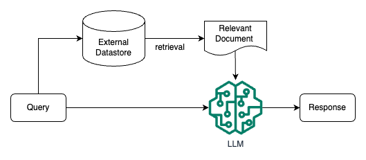

# A Deep Dive into Retrieval-Augmented Generation (RAG) for LLM Interviews

> This guide provides a comprehensive overview of Retrieval-Augmented Generation (RAG), a powerful technique for enhancing Large Language Models (LLMs). We will explore its fundamental concepts, the problems it solves, its core architecture, and advanced patterns. The guide contrasts RAG with Supervised Fine-Tuning (SFT) and concludes with a detailed section of theoretical and practical interview questions, complete with Python and PyTorch implementations, to prepare you for rigorous data science interviews.

## Knowledge Section

### 1. The Core Concept of RAG

Retrieval-Augmented Generation (RAG) is a sophisticated architecture that combines the strengths of pre-trained Large Language Models (LLMs) with an external knowledge retrieval system. In essence, when a user poses a query, the RAG system first retrieves relevant information from a specified knowledge base (e.g., a collection of documents, a database, or a website). This retrieved context is then concatenated with the original query and fed into the LLM, which generates a comprehensive and factually-grounded answer.

This model elegantly bridges the gap between two paradigms:
*   **Retrieval-Only Systems:** Traditional information retrieval (IR) tools like Google Search or internal document search engines are excellent at finding information but cannot synthesize it into a coherent, human-like answer.
*   **Memory-Only Systems:** Standard LLMs store a vast amount of world knowledge implicitly within their parameters, learned during pre-training. However, this knowledge is static (frozen at the time of training), can be incomplete (especially for niche topics), and is not easily verifiable.

RAG enhances a standard LLM by providing it with a "working memory" in the form of its context window, dynamically populated with relevant, up-to-date, and verifiable information.


*Figure 1: A high-level diagram illustrating the fundamental workflow of a RAG system. The user's query is used to retrieve relevant documents, which are then combined with the query to form a rich prompt for the LLM to generate a final answer.*

### 2. Key Problems Solved by RAG

RAG is not just a technical novelty; it directly addresses several critical limitations of standalone LLMs, making it indispensable for enterprise and real-world applications.

#### 2.1. Mitigating Knowledge Gaps (Long-Tail Knowledge)
LLMs exhibit strong performance on topics that are well-represented in their training data. However, their accuracy degrades significantly for niche, specialized, or "long-tail" knowledge. A 2022 ICML paper, [Large Language Models Struggle to Learn Long-Tail Knowledge](https://arxiv.org/abs/2211.08411), demonstrated a strong correlation between the volume of relevant documents in the pre-training corpus and the LLM's factual accuracy on related questions.

While one could theoretically add more long-tail data and retrain the model, this approach is economically and computationally prohibitive. RAG offers a more efficient solution: by placing this specialized knowledge in an external, retrievable database, the LLM can access it on-demand during inference, dramatically improving accuracy without the need for costly retraining.

#### 2.2. Enabling Use of Private and Proprietary Data
General-purpose LLMs like GPT-4 or Claude 3 are trained on public data and have no knowledge of an organization's internal, private information. RAG provides a secure and effective mechanism to query this private data.

By indexing internal documents (e.g., technical manuals, HR policies, project reports) into a secure vector database, a RAG system can answer questions specific to the organization. This avoids the high cost of fine-tuning and, more importantly, mitigates the security risk of embedding sensitive information directly into a model's weights, which could potentially be extracted through sophisticated attacks.

#### 2.3. Ensuring Data Freshness and Timeliness
The knowledge encoded in an LLM's parameters becomes outdated the moment its training is complete. The model is unaware of any events or information that have emerged since its "knowledge cutoff" date.

RAG solves this by connecting the LLM to a dynamic, up-to-date knowledge source. For applications requiring current information, such as news analysis, financial reporting, or customer support with recent product updates, the external database can be continuously updated. This allows the LLM's knowledge to be extended and refreshed in real-time without any modification to the model itself.

#### 2.4. Enhancing Transparency and Verifiability
A major criticism of LLMs is their "black box" nature, often leading to "hallucinations"—confident but incorrect statements. RAG fundamentally improves traceability by grounding the model's output in retrieved evidence.

Because the LLM's response is generated based on specific source documents, the system can cite its sources. This allows users to verify the information and understand the basis for the generated answer, fostering trust and providing a mechanism for fact-checking. This process of grounding significantly reduces hallucinations and increases the reliability of the output.

### 3. The End-to-End RAG Pipeline: A Technical Deep Dive

A robust RAG system is composed of two main stages: **1) Data Indexing (Offline)** and **2) Retrieval and Generation (Online)**.

#### 3.1. Stage 1: Data Indexing and Preparation

This offline process prepares the knowledge base for efficient retrieval.

*   **Data Loading:** The first step is to load data from various sources (e.g., PDFs, text files, Markdown, web pages, databases). Tools like LangChain or LlamaIndex provide a wide array of data loaders.
*   **Document Chunking:** Raw documents are often too long to fit into an embedding model's or LLM's context window. Therefore, they must be split into smaller, coherent chunks. The chunking strategy is critical for retrieval quality. Common strategies include:
    *   **Fixed-Size Chunking:** Simple but can break sentences or concepts apart.
    *   **Recursive Character Text Splitting:** A more intelligent method that splits based on a hierarchy of separators (e.g., `\n\n`, `\n`, ` `, ``) to keep related text together.
    *   **Semantic Chunking:** A sophisticated approach that uses an embedding model to decide where to split the text, aiming to create chunks that are semantically coherent.
*   **Embedding:** Each chunk is then converted into a high-dimensional vector using an **embedding model** (e.g., Sentence-BERT, OpenAI `text-embedding-ada-002`). These embeddings capture the semantic meaning of the text, such that chunks with similar meanings have similar vectors.
*   **Indexing in a Vector Store:** These embeddings are loaded into a specialized **vector database** (e.g., FAISS, ChromaDB, Pinecone, Weaviate). These databases are optimized for Approximate Nearest Neighbor (ANN) search, allowing for extremely fast retrieval of vectors (and thus, text chunks) that are most similar to a given query vector. Metadata (e.g., source document, page number, creation date) is stored alongside each embedding for filtering and citation.

#### 3.2. Stage 2: Retrieval and Generation

This online process occurs each time a user submits a query.

*   **Query Embedding:** The user's query is embedded into a vector using the *same* embedding model used during indexing.
*   **Vector Search (Retrieval):** The query vector is used to search the vector database. The database returns the `top-k` most similar document chunks. The most common similarity metric is **Cosine Similarity**, which measures the cosine of the angle between two vectors. For two vectors $A$ and $B$:
    $$ \text{Cosine Similarity}(A, B) = \frac{A \cdot B}{\|A\| \|B\|} = \frac{\sum_{i=1}^{n} A_i B_i}{\sqrt{\sum_{i=1}^{n} A_i^2} \sqrt{\sum_{i=1}^{n} B_i^2}} $$
    A value closer to 1 indicates higher semantic similarity.
*   **Augmentation (Prompt Engineering):** The retrieved chunks of text (the context) are combined with the original query into a structured prompt for the LLM. A typical prompt template looks like this:
    ```
    Use the following pieces of context to answer the question at the end.
    If you don't know the answer, just say that you don't know, don't try to make up an answer.

    Context:
    {retrieved_context}

    Question:
    {user_query}

    Helpful Answer:
    ```
*   **Generation:** The LLM receives this augmented prompt and synthesizes the final answer, leveraging the provided context to produce a relevant, detailed, and factually-grounded response.

### 4. Advanced RAG Architectures and Patterns

While the standard RAG pipeline is powerful, more advanced patterns offer improved performance and capabilities.


*Figure 2: Three common operational patterns for RAG. Pattern 1 is the standard "naive" RAG. Pattern 2 introduces a long-term memory component by storing Q&A pairs. Pattern 3 implements a cache to quickly serve answers to repeated questions.*

*   **Pattern 1: Standard RAG (Naive RAG):** This is the fundamental architecture described above. Unstructured data is indexed, and queries retrieve from this static index to generate answers.
*   **Pattern 2: RAG with Long-Term Memory:** In this conversational AI pattern, after the LLM answers a question, the question-answer pair itself is embedded and stored in the vector database. This allows the system to learn from its interactions, potentially retrieving past, verified answers for similar future questions, creating a continuously improving knowledge base.
*   **Pattern 3: RAG with Caching:** To improve latency and reduce costs, this pattern adds a caching layer. When a query is received, it's first vectorized and checked against a cache of previously asked questions. If a sufficiently similar question is found in the cache, the stored answer is returned immediately, bypassing the more expensive LLM generation step. If not, the standard RAG process is followed, and the new question-answer pair is added to the cache.

Other advanced techniques include:
*   **Hybrid Search:** Combines traditional keyword-based search (like BM25) with vector search to leverage the strengths of both lexical and semantic matching.
*   **Re-ranking:** After retrieving an initial set of `top-k` documents (e.g., k=20), a more powerful but slower **cross-encoder** model is used to re-rank these documents for relevance before passing the best ones (e.g., top 3-5) to the LLM.
*   **Self-Corrective RAG (e.g., Self-RAG):** An iterative process where the LLM first retrieves documents, then critiques them for relevance. If the documents are deemed insufficient, the system can refine its query and retrieve again before generating the final answer.

### 5. RAG vs. Supervised Fine-Tuning (SFT)

RAG and SFT are two different ways to customize LLMs. They are not mutually exclusive and can often be used together.

| Feature             | RAG (Retrieval-Augmented Generation)                               | SFT (Supervised Fine-Tuning)                                           |
| ------------------- | ------------------------------------------------------------------ | ---------------------------------------------------------------------- |
| **Knowledge Source**| Dynamic, external knowledge base. Easily updated.                  | Static, baked into the model's parameters during training.             |
| **Primary Use Case**  | Factual Q&A, knowledge-intensive tasks with fresh or private data. | Adapting model's style, tone, or learning a new skill/format.          |
| **Data Requirements** | A corpus of documents to be indexed.                               | A high-quality dataset of curated prompt-completion pairs.             |
| **Cost & Agility**  | Low cost to update knowledge (just update the index). High agility.  | High computational cost for retraining. Less agile for knowledge updates. |
| **Hallucination**   | Significantly reduced as answers are grounded in retrieved evidence. | Can reduce hallucinations for in-domain data, but can still occur.       |
| **Transparency**      | High. Sources can be cited, making the reasoning process clear.     | Low. It's a "black box," making it hard to trace the reasoning.        |
| **Combined Use**    | SFT can be used to teach a model *how* to better use RAG context.    | RAG can provide the factual basis for a fine-tuned model's responses.  |


*Figure 3: This radar chart compares three approaches: a base pre-trained LLM, a fine-tuned LLM (SFT), and a RAG-enhanced LLM. RAG clearly excels in dimensions like cost-effectiveness, timeliness of information, and transparency.*

---

## Interview Questions

### Theoretical Questions

**1. What is Retrieval-Augmented Generation (RAG) and why has it become so important in the field of LLMs?**

**Answer:**
Retrieval-Augmented Generation (RAG) is a hybrid AI architecture that enhances Large Language Models by connecting them to an external, dynamic knowledge base. The process involves two main steps at inference time:
1.  **Retrieval:** When a user asks a question, the system first retrieves relevant documents or data snippets from a knowledge source (like a vector database).
2.  **Generation:** The retrieved information (context) is then prepended to the user's original query and fed into an LLM, which uses this context to generate a factually grounded and comprehensive answer.

RAG is important for several key reasons:
*   **Addresses Knowledge Cutoff:** It provides LLMs with access to real-time, up-to-date information, overcoming the static nature of their internal knowledge.
*   **Reduces Hallucinations:** By grounding the LLM's response in verifiable, retrieved evidence, it significantly reduces the model's tendency to generate incorrect or fabricated information.
*   **Enables Domain Specialization:** It allows LLMs to be applied to specialized or private domains (like corporate knowledge bases) without costly retraining.
*   **Increases Transparency and Trust:** Since the generated answer is based on specific sources, RAG systems can cite these sources, allowing users to verify the information. This makes the system's reasoning transparent and builds user trust.
*   **Cost-Effectiveness:** Updating the external knowledge base is far cheaper and faster than retraining or fine-tuning a massive language model.

**2. Walk me through the detailed, end-to-end pipeline of a typical RAG system, from document ingestion to answer generation.**

**Answer:**
The RAG pipeline can be divided into an offline indexing phase and an online retrieval-generation phase.

**Phase 1: Indexing (Offline)**
1.  **Data Loading:** Ingest raw data from various sources (PDFs, websites, APIs, etc.).
2.  **Document Chunking:** Split large documents into smaller, manageable chunks. This is crucial because embedding models have token limits and retrieval is more effective on smaller, focused text segments. A common strategy is recursive character splitting.
3.  **Embedding:** Each text chunk is passed through an embedding model (e.g., Sentence-BERT) to convert it into a dense vector representation. This vector captures the semantic meaning of the chunk.
4.  **Indexing:** The embeddings and their corresponding text chunks (plus metadata) are stored in a vector database. The database builds an index (e.g., using HNSW) to enable efficient Approximate Nearest Neighbor (ANN) search.

**Phase 2: Retrieval & Generation (Online)**
1.  **User Query:** The process begins when a user submits a query.
2.  **Query Embedding:** The user's query is converted into a vector using the *exact same* embedding model from the indexing phase to ensure they are in the same vector space.
3.  **Vector Search:** The query vector is used to search the vector database. The database returns the `top-k` most similar document chunks based on a similarity metric, typically Cosine Similarity.
4.  **Context Augmentation:** The retrieved text chunks are formatted and combined with the original query into a detailed prompt. This prompt instructs the LLM on how to use the provided context to answer the question.
5.  **LLM Generation:** The final prompt is sent to the LLM. The model reads the context and the question, synthesizes the information, and generates a final, coherent answer. The answer is grounded in the retrieved text, making it more accurate and reliable.

**3. When would you choose to use RAG versus Supervised Fine-Tuning (SFT)? Can they be used together?**

**Answer:**
The choice between RAG and SFT depends on the specific goal of model customization.

**Choose RAG when:**
*   The primary goal is to **infuse factual knowledge** into the model.
*   The knowledge is **dynamic and frequently updated** (e.g., news, product specs).
*   The application requires **high factual accuracy and verifiability** with citations.
*   You need to query over **private or proprietary documents** without embedding them in the model.
*   **Cost and speed** of knowledge updates are major concerns.

**Choose SFT when:**
*   The goal is to teach the model a **new skill, style, or format** (e.g., writing in a specific persona, generating code in a certain style, following complex instructions).
*   You want to adapt the model to a **specific domain's jargon and linguistic nuances**.
*   The task does not primarily rely on retrieving external facts but on reasoning or stylistic generation based on the prompt.

**Using RAG and SFT together:**
Yes, they are highly complementary and powerful when combined.
1.  **SFT to improve RAG usage:** You can fine-tune an LLM on a dataset of `(context, question, answer)` triplets. This teaches the model to become better at selectively using the provided context, ignoring irrelevant information, and synthesizing answers more effectively. It fine-tunes the *skill* of being a good RAG generator.
2.  **RAG to provide facts to a fine-tuned model:** You can first fine-tune a model to adopt a specific persona (e.g., a cheerful customer support agent). Then, you can use RAG to provide this specialized model with the factual knowledge it needs to answer customer queries accurately (e.g., order details, product information).

**4. How would you evaluate the performance of a RAG system? What are the key metrics?**

**Answer:**
Evaluating a RAG system is more complex than evaluating a simple classification model. It requires assessing both the retrieval and generation components. Key metrics can be grouped into two categories:

**1. Retrieval Evaluation:**
*   **Context Precision:** Out of the retrieved documents, what fraction are actually relevant to the query? This measures the signal-to-noise ratio of the context provided to the LLM. `Context Precision = (Number of relevant documents retrieved) / (Total number of documents retrieved)`.
*   **Context Recall:** Out of all possible relevant documents in the entire dataset, what fraction did the retriever find? This measures how well the retriever avoids missing important information. `Context Recall = (Number of relevant documents retrieved) / (Total number of relevant documents in the dataset)`.

These metrics often require a human-annotated ground truth dataset.

**2. Generation Evaluation (LLM-as-a-Judge):**
Since the final output is text, evaluation is often done using a powerful LLM (like GPT-4) to "judge" the quality of the generated answer based on several criteria.
*   **Faithfulness:** Does the generated answer stay true to the provided context? It measures how well the LLM avoids hallucinating or contradicting the source documents. The judge is given the context and the answer and asked if the answer is supported by the context.
*   **Answer Relevance:** Is the generated answer relevant to the user's original question? This ensures the model is on-topic.
*   **Answer Correctness:** Is the answer factually correct? This is the ultimate measure of quality and often relies on the faithfulness of the answer to a correct context.

Frameworks like RAGAs (RAG Assessment) have been developed to automate this evaluation process using these LLM-as-a-Judge principles.

### Practical & Coding Questions

**1. Implement a simplified RAG pipeline from scratch in Python using `scikit-learn` for TF-IDF embeddings and `NumPy` for retrieval.**

**Answer:**
This example demonstrates the core logic of RAG without relying on a full-blown vector database or pre-trained transformers. We use TF-IDF as a simple embedding method.

```python
import numpy as np
from sklearn.feature_extraction.text import TfidfVectorizer
from sklearn.metrics.pairwise import cosine_similarity
import matplotlib.pyplot as plt
from sklearn.decomposition import PCA

# 1. Data Indexing Stage

# Sample document corpus
documents = [
    "The Eiffel Tower is a wrought-iron lattice tower on the Champ de Mars in Paris, France.",
    "The Louvre is the world's largest art museum and a historic monument in Paris, France.",
    "The Colosseum is an oval amphitheatre in the centre of the city of Rome, Italy.",
    "The Leaning Tower of Pisa is the campanile, or freestanding bell tower, of the cathedral of the Italian city of Pisa.",
    "Paris is the capital and most populous city of France.",
    "Rome is the capital city of Italy."
]

# Create a TF-IDF Vectorizer to embed documents
vectorizer = TfidfVectorizer()
document_embeddings = vectorizer.fit_transform(documents)

print("--- Indexing Complete ---")
print(f"Shape of document embeddings matrix: {document_embeddings.shape}")
print(f"Vocabulary size: {len(vectorizer.vocabulary_)}\n")

# 2. Retrieval and Generation Stage

def simple_rag_pipeline(query, vectorizer, doc_embeddings, docs):
    """
    A simplified RAG pipeline.
    """
    print(f"Query: '{query}'")

    # --- Retrieval ---
    # Embed the query using the same vectorizer
    query_embedding = vectorizer.transform([query])

    # Calculate cosine similarity between the query and all documents
    similarities = cosine_similarity(query_embedding, doc_embeddings).flatten()

    # Get the index of the most similar document
    most_similar_doc_idx = np.argmax(similarities)
    retrieved_context = docs[most_similar_doc_idx]

    print(f"Retrieved Context: '{retrieved_context}'\n")

    # --- Generation ---
    # In a real system, this would be an LLM call.
    # Here, we simulate it with a formatted string.
    prompt = f"""
    Context:
    {retrieved_context}

    Question:
    {query}

    Answer:
    """

    # Simulated LLM response
    simulated_llm_output = f"Based on the context, the answer to '{query}' is likely related to '{retrieved_context}'"

    print("--- Generated Prompt for LLM ---")
    print(prompt)
    print("--- Simulated LLM Output ---")
    print(simulated_llm_output)
    return simulated_llm_output

# --- Run the pipeline ---
user_query = "Where is the Colosseum located?"
simple_rag_pipeline(user_query, vectorizer, document_embeddings, documents)

# 3. Visualization of Embeddings (Bonus)
def visualize_embeddings(embeddings_matrix, labels):
    """Visualize high-dimensional embeddings using PCA."""
    # Use PCA to reduce dimensions to 2
    pca = PCA(n_components=2)
    reduced_embeddings = pca.fit_transform(embeddings_matrix.toarray())

    plt.figure(figsize=(12, 8))
    for i, label in enumerate(labels):
        x, y = reduced_embeddings[i, :]
        plt.scatter(x, y)
        # Annotate with a keyword from the document
        keyword = label.split()[1] # e.g., 'Eiffel', 'Louvre'
        plt.annotate(keyword, (x, y), xytext=(5, 2), textcoords='offset points')

    plt.title("2D Visualization of Document Embeddings using PCA")
    plt.xlabel("Principal Component 1")
    plt.ylabel("Principal Component 2")
    plt.grid(True)
    plt.show()

print("\n--- Visualizing Document Embeddings ---")
visualize_embeddings(document_embeddings, documents)
```

**2. Implement a basic attention mechanism from scratch in PyTorch. Explain its relevance to RAG.**

**Answer:**
While the core RAG pipeline uses retrieval *before* the model, attention is the mechanism *inside* the transformer LLM that allows it to focus on the most relevant parts of the provided context when generating an answer. Implementing attention helps understand how the "G" in RAG works.

```python
import torch
import torch.nn as nn
import torch.nn.functional as F

class BasicAttention(nn.Module):
    def __init__(self, hidden_dim):
        super(BasicAttention, self).__init__()
        # In a real scenario, Query, Key, and Value would be projected from the input.
        # Here, we simplify to focus on the core mechanism.

    def forward(self, query, context_keys, context_values):
        """
        Calculates attention scores and returns a weighted sum of values.
        Args:
            query (Tensor): The query vector. Shape: (batch_size, hidden_dim)
            context_keys (Tensor): The key vectors for the context. Shape: (batch_size, seq_len, hidden_dim)
            context_values (Tensor): The value vectors for the context. Shape: (batch_size, seq_len, hidden_dim)
        Returns:
            Tensor: The context vector, a weighted sum of context_values. Shape: (batch_size, hidden_dim)
            Tensor: The attention weights. Shape: (batch_size, seq_len)
        """
        # Ensure query has a sequence dimension for batch matrix multiplication
        # Query shape becomes (batch_size, 1, hidden_dim)
        query = query.unsqueeze(1)

        # 1. Calculate dot-product similarity (attention scores)
        # (batch_size, 1, hidden_dim) @ (batch_size, hidden_dim, seq_len) -> (batch_size, 1, seq_len)
        scores = torch.bmm(query, context_keys.transpose(1, 2))

        # Scale the scores to prevent vanishing gradients
        hidden_dim = query.size(-1)
        scores = scores / (hidden_dim ** 0.5)

        # 2. Apply softmax to get attention weights
        # These weights sum to 1 and represent the importance of each context item.
        attention_weights = F.softmax(scores, dim=2) # Softmax over the sequence length

        # 3. Calculate the weighted sum of context values
        # (batch_size, 1, seq_len) @ (batch_size, seq_len, hidden_dim) -> (batch_size, 1, hidden_dim)
        context_vector = torch.bmm(attention_weights, context_values)

        # Remove the sequence dimension
        context_vector = context_vector.squeeze(1) # Shape: (batch_size, hidden_dim)
        attention_weights = attention_weights.squeeze(1) # Shape: (batch_size, seq_len)

        return context_vector, attention_weights

# --- Example Usage ---
batch_size = 1
seq_len = 5    # e.g., 5 retrieved document chunks
hidden_dim = 64

# Create dummy tensors
query = torch.randn(batch_size, hidden_dim)
context_keys = torch.randn(batch_size, seq_len, hidden_dim)
context_values = torch.randn(batch_size, seq_len, hidden_dim) # In self-attention, K=V=Q input

# Make one context key very similar to the query to see the effect
context_keys[:, 2, :] = query.unsqueeze(1) # The 3rd chunk is most relevant

attention_layer = BasicAttention(hidden_dim)
output_vector, weights = attention_layer(query, context_keys, context_values)

print("--- Attention Mechanism from Scratch ---")
print(f"Query Shape: {query.shape}")
print(f"Context Keys Shape: {context_keys.shape}")
print(f"Context Values Shape: {context_values.shape}")
print("\nAttention Weights:")
print(weights)
print("\nNote: The 3rd weight (index 2) is the highest, as its key was made similar to the query.")
print(f"\nOutput Context Vector Shape: {output_vector.shape}")
```

**Relevance to RAG:**
In a RAG system, the `retrieved_context` is concatenated with the `query` and fed into the LLM. The attention mechanism inside the LLM is what allows the model to process this combined input effectively. For each token it generates, the attention layers calculate which parts of the input (both the original query and the retrieved chunks) are most important. The high attention weights in the example (on the 3rd chunk) show how the model would "pay more attention" to that specific piece of retrieved information when formulating the part of the answer that depends on it. A well-functioning attention mechanism is critical for the LLM to successfully synthesize information from the provided context.