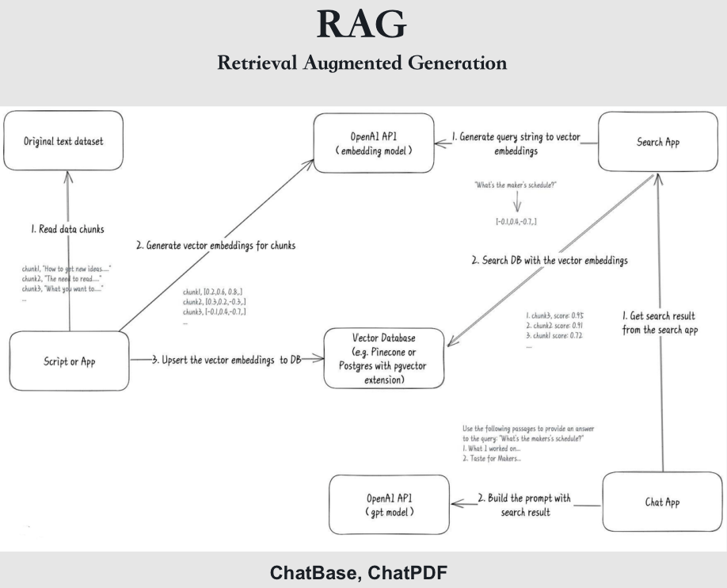
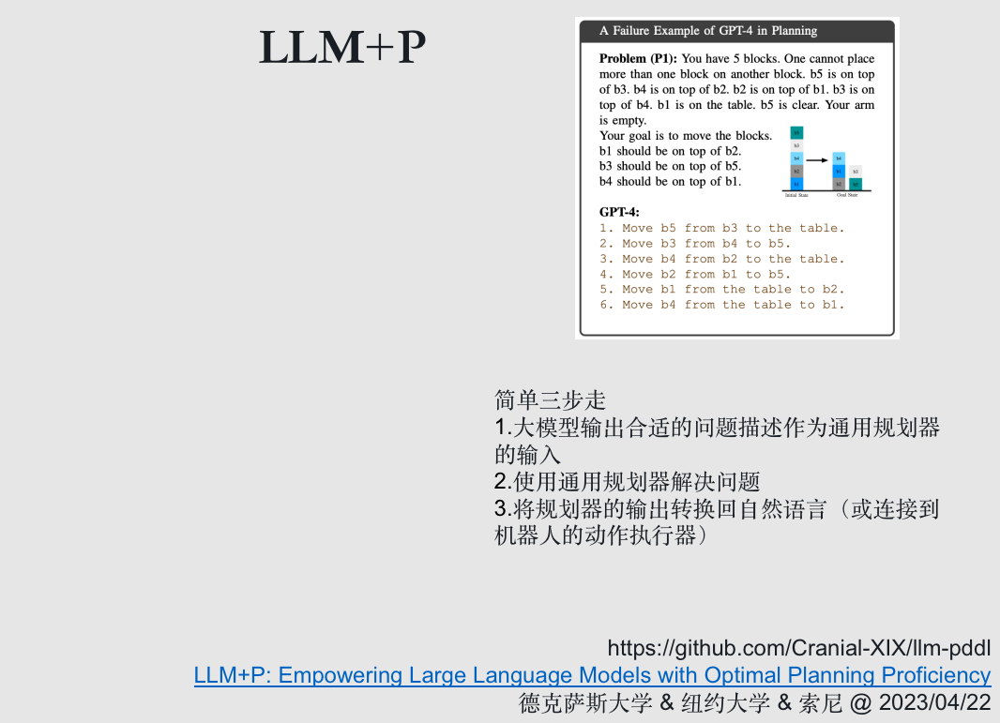
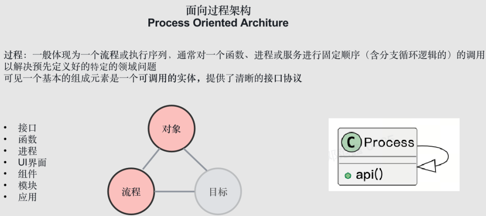
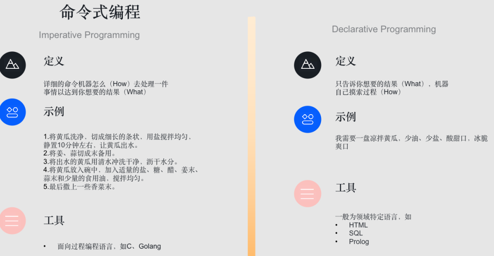

# A Comprehensive Guide to LLM-Powered Agents for Data Science Interviews

> This guide provides a deep dive into the rapidly evolving field of Large Language Model (LLM) powered agents. It traces the technological progression from basic prompt engineering to complex multi-agent systems. We will explore the fundamental principles of general intelligence, cognitive architectures like Global Workspace Theory, and the shift towards goal-oriented systems. The document is designed to be a complete resource for interview preparation, covering core concepts, seminal works, and practical implementations, culminating in a set of theoretical and coding questions to test your understanding.

## Knowledge Section

### 1. The Evolution of LLM Interaction: From Prompts to Autonomous Agents

The interaction paradigm with Large Language Models has matured rapidly. This evolution represents a clear trajectory towards increasing autonomy and capability, a path that is crucial to understand for anyone in the AI space.


#### 1.1. What is an Agent?

At its core, an **agent** is an entity that can perceive its environment, make autonomous decisions, and take actions to achieve specific goals. This definition, long-studied in AI, has gained new life in the era of LLMs.

The key characteristics of an agent include:
*   **Perception:** Sensing the environment (e.g., through text input, images, or API outputs).
*   **Autonomy:** Making decisions without direct human intervention.
*   **Action:** Executing actions (e.g., calling an API, writing code, generating text).
*   **Goal-Oriented:** Striving to achieve predefined objectives.
*   **Adaptability:** Learning from interactions and improving performance over time.


Before the LLM era, agent research was prominent in fields like robotics and reinforcement learning (e.g., DeepMind's AlphaGo, Agent57). However, these agents were often specialized. The breakthrough of LLMs is that they provide a powerful, general-purpose reasoning and knowledge engine, acting as the "brain" for a new class of versatile agents.


#### 1.2. Stage 1: Prompt Engineering

The most basic form of interaction is **Prompt Engineering**, where the LLM is treated as a programmable tool. A user crafts a detailed prompt that specifies a role, required skills, task context, and desired output format. This is a "tool-based" approach where the LLM executes a single, well-defined instruction.


A famous example is the "Mr. Ranedeer AI Tutor" prompt, which configures the LLM to act as a personalized learning assistant. This demonstrates the power of carefully structured prompts to elicit complex behavior.


#### 1.3. Stage 2: Prompt Augmentation (External Tools & Data)

Prompt engineering alone is insufficient due to the inherent limitations of LLMs (e.g., knowledge cutoffs, context window limits, poor reasoning on complex tasks). The next step was to augment prompts with external information and capabilities.

*   **Retrieval-Augmented Generation (RAG):** To provide up-to-date or private information, developers began using vector databases. Documents are chunked, embedded into vectors, and stored. When a user asks a question, the question is embedded, and the most similar document chunks are retrieved and added to the prompt's context.



*   **Tool Use and Function Calling:** To overcome the LLM's inability to interact with the real world, developers enabled them to use tools. Initially, this involved the LLM generating text that needed to be parsed to trigger an action. This has been formalized with features like **OpenAI's Function Calling**, where the model generates a structured JSON object specifying the function to call and its arguments. This is a more robust and reliable method.

*   **LLM as a Translator for Classical Planners:** For tasks requiring complex logical reasoning and planning, an LLM can be used to translate a natural language problem into a formal language like **PDDL (Planning Domain Definition Language)**. A dedicated, classical planner can then solve this formal problem, and the solution is translated back into actions.



This concept harks back to the early days of AI with the **General Problem Solver (GPS)** developed by Herbert Simon and Allen Newell. GPS operated by defining a goal state and searching through a space of possible operations to transform an initial state into that goal state.


#### 1.4. Stage 3: Decomposition, Combination, and Advanced Reasoning

For complex tasks that cannot be solved in a single step, the strategy of "divide and conquer" is essential. This led to a family of techniques designed to structure the LLM's thought process.


**Chain of Thought (CoT), Tree of Thoughts (ToT), and Graph of Thoughts (GoT)** are pivotal concepts here. They encourage the model to "think" before answering.


*   **Chain of Thought (CoT):** Instead of just asking for an answer, the prompt instructs the model to "show its work" or "think step-by-step." This can be done through few-shot examples or by simply adding the phrase "Let's think step-by-step" to the prompt. This simple trick significantly improves performance on arithmetic, commonsense, and symbolic reasoning tasks.


*   **Self-Consistency (CoT-SC):** To improve the reliability of CoT, Self-Consistency generates multiple reasoning chains (thoughts) and then takes a majority vote on the final answer. This reduces the chance of a single flawed reasoning path leading to an incorrect result.


*   **Tree of Thoughts (ToT):** ToT generalizes CoT by exploring multiple reasoning paths in a tree structure. It allows the model to consider different sub-problems at each step, evaluate their viability, and backtrack if a path seems unpromising. This is a form of deliberate search, much like how humans explore solutions to a complex problem like the "Game of 24."


*   **Graph of Thoughts (GoT):** GoT further generalizes ToT by modeling the reasoning process as a graph. This allows not only for branching (decomposition) but also for merging (synthesis) of thought paths. This is crucial for problems that require combining intermediate results, such as sorting algorithms where sub-arrays are sorted and then merged.


*   **Cumulative Reasoning:** An even more recent development (Proposed by Yao Qizhi's team at Tsinghua University, 2023) is a method where an initial idea is proposed and then iteratively validated and refined. Each new thought is added as a node to a growing graph, allowing for a flexible and robust reasoning process that has achieved state-of-the-art results on the Game of 24.

#### 1.5. Stage 4: Feedback Loops and Reflection

The previous methods structure thought but lack interaction with an external environment. Feedback mechanisms close this loop, allowing an agent to act, observe the consequences, and adjust its strategy.


*   **ReAct (Reasoning and Acting):** This is arguably the most foundational framework for modern LLM agents. ReAct interleaves **Reasoning** (the LLM generates a "Thought" about what to do next) and **Acting** (the LLM generates an "Action" to take, like calling a tool). The agent then receives an **Observation** from the environment (the result of the action) and uses this to inform the next Thought. This `Thought -> Action -> Observation` loop continues until the goal is achieved.


*   **Reflexion:** This technique enhances agents with a learning mechanism inspired by reinforcement learning. After a task, the agent enters a "reflection" phase. It analyzes its trajectory, identifies mistakes, and generates textual summaries of what it learned. These reflections are stored in a memory buffer and used in future tasks to avoid repeating the same errors.


OpenAI's native **Function Calling** capability is a direct enabler of these frameworks, providing a reliable way for the LLM to declare its intent to act.


#### 1.6. Stage 5: Autonomous Agents and Multi-Agent Systems

This stage represents the culmination of the previous concepts into fully-fledged autonomous systems capable of handling complex, multi-step tasks.


*   **AutoGPT:** One of the first projects to capture the public's imagination, AutoGPT implements a fully autonomous loop. It takes a high-level goal, breaks it down into tasks, prioritizes them in a queue, and executes them in a loop. It uses memory to maintain context and learn from its actions. A key feature is its ability to spawn other agents, creating a hierarchical task structure.


*   **Jarvis (HuggingGPT):** Developed by Microsoft, Jarvis acts as a central controller that manages a collection of expert models from Hugging Face. Given a user request, it first plans the necessary steps, then selects the most appropriate model for each step (e.g., a text-to-image model, an object detection model), executes the tasks, and synthesizes the results.


*   **Voyager:** This agent demonstrates learning in an open-ended environment (the game Minecraft). It features an **automatic curriculum** that proposes progressively harder tasks. As it completes tasks, it writes the corresponding code into a **skill library**. When faced with a new task, it can retrieve relevant skills from its library, significantly speeding up its learning process. This is a powerful demonstration of lifelong learning.


*   **XAgent:** Developed by Tsinghua and Facebear Technology, XAgent introduces a **dual-loop mechanism**. An outer loop handles high-level planning and task decomposition, while an inner loop focuses on the detailed execution of sub-tasks. This separation of concerns allows it to outperform earlier agents like AutoGPT on complex tasks.


*   **Multi-Agent Systems:** The next frontier is the collaboration of multiple specialized agents.
    *   **Stanford's Generative Agents (Smallville):** This landmark experiment created a virtual town populated by 25 agents, each with their own identity and memory. The agents planned their days, interacted with each other, and formed relationships. This demonstrated the emergence of complex social behaviors from simple agent rules.
    

    *   **MetaGPT:** This project applies the multi-agent concept to software development. It defines roles like Product Manager, Architect, Engineer, and QA. These agents collaborate following Standard Operating Procedures (SOPs) to take a one-line requirement and generate a complete software project with code, documentation, and diagrams.
    
    

### 2. Principles of General Intelligence and Cognitive Architectures

To build more advanced agents, it is essential to draw inspiration from human intelligence. The simple `perceive -> decide -> act` loop is a significant oversimplification.


#### 2.1. System 1 and System 2 Thinking

Popularized by Daniel Kahneman's book "Thinking, Fast and Slow," this model provides a powerful analogy for agent design.
*   **System 1:** Fast, intuitive, emotional, and largely unconscious. This is analogous to an LLM's raw, next-token-prediction output. It's quick but can be prone to biases and errors.
*   **System 2:** Slow, deliberate, logical, and conscious. This is analogous to the structured reasoning frameworks (ReAct, ToT) built around an LLM. It's the agent's explicit planning and problem-solving loop.

A robust agent architecture should leverage the speed of System 1 (the LLM) for generating ideas and understanding language, while using a System 2 framework to guide, verify, and correct those outputs.


#### 2.2. Global Workspace Theory (GWT)

GWT is a cognitive model of consciousness. It posits a central "global workspace" (analogous to working memory or the stage of a theater) where different specialized, unconscious processes compete for attention. The winning process gets to "broadcast" its information to the entire system, making it conscious.

This provides a compelling architectural blueprint for an agent:
*   **Specialized Processes:** These are the agent's tools (e.g., a calculator, a search engine, a code interpreter).
*   **Global Workspace:** This is the agent's central reasoning loop or "scratchpad" (the context window).
*   **Broadcast:** A tool's output is fed back into the workspace, becoming available for all subsequent reasoning steps.


#### 2.3. The Importance of World Models

An agent's ability to act correctly depends on its understanding of the world. A **world model** is an internal representation of how the world works, allowing the agent to predict the outcomes of its actions (mental simulation). While there is debate about whether LLMs truly possess world models, it's clear that for an agent to be effective, it must operate based on an accurate model of its environment and the tools it can use.


### 3. Goal-Oriented Architecture

Traditional software engineering largely follows a **Process-Oriented Architecture**. You define functions, interfaces, and procedures that execute a fixed process. The program executes the process but has no intrinsic understanding of the *goal*.



In contrast, **Goal-Oriented Architecture**, which is the natural paradigm for agents, focuses on the *outcome*. The user specifies a desired end state, and the agent is responsible for figuring out the sequence of steps to get there. This is the essence of **declarative programming**, exemplified by languages like SQL and HTML, where you state *what* you want, not *how* to get it.



The rise of LLM agents signifies a potential shift in software engineering from building rigid processes to building intelligent systems that can dynamically achieve goals.


### 4. Future Directions and Analysis

The field of LLM agents is still in its infancy. Future advancements will likely focus on improving several key components.


*   **Central Executive:** Improving the core reasoning loop. This involves making the internal "thought process" more transparent, controllable, and capable of higher-level strategic thinking and attention allocation.
*   **Memory:** Moving beyond simple RAG. Future systems need more sophisticated memory management, including mechanisms for consolidation (organizing knowledge), generalization (extracting principles from experience), and forgetting (discarding irrelevant or incorrect information).
*   **Sensory Input (Perception):** Expanding beyond text to true multimodality (vision, audio). A crucial challenge is creating a top-down perception mechanism, where the agent's current goal or context influences how it interprets sensory data (e.g., interpreting an ambiguous shape as '13' in a math problem context, not 'B').
*   **Motor Output (Action):** Developing more nuanced and efficient ways for agents to act. This includes direct neural control for robotics, better tool design (APIs built *for* agents), and even exploring agent-to-agent communication in a compressed, non-language format ("telepathy" in latent space).
*   **Learning:** Creating agents that truly learn and improve. This requires developing a sense of self-awareness (metacognition), knowing what they don't know, learning from authoritative sources to combat noisy web data, and balancing exploration with exploitation.
*   **World Models:** Building more robust and consistent internal world models. This involves the ability to identify and resolve contradictions in learned information and to perform "mental simulations" to predict the consequences of actions *before* taking them.

## Interview Questions

### Theoretical Questions

**1. Explain the ReAct framework. How does it fundamentally differ from simple prompt chaining or a Chain-of-Thought prompt?**

**Answer:**
The ReAct (Reasoning and Acting) framework creates a dynamic, interactive loop between an LLM and its environment (which includes tools). It operates on a `Thought -> Action -> Observation` cycle:
1.  **Thought:** The agent uses the LLM to reason about its current state and goal, generating a plan for what to do next. E.g., "I need to find the current weather in London. I should use the `search_weather` tool."
2.  **Action:** The agent extracts an executable action from the thought. E.g., `search_weather(city="London")`.
3.  **Observation:** The action is executed, and the result (e.g., an API response like "21°C, sunny") is returned to the agent as an observation.
This observation is then fed back into the context for the next `Thought` step, allowing the agent to assess the result and plan its next move.

**Key Differences:**
*   **vs. Prompt Chaining:** Simple prompt chaining is a static, predefined sequence of prompts. The output of prompt A is templated into prompt B, and so on. There is no dynamic decision-making or ability to change course based on intermediate results. ReAct is dynamic; the action taken at each step is decided in real-time based on the entire history of previous actions and observations.
*   **vs. Chain of Thought (CoT):** CoT is a technique to improve the reasoning quality of a *single* LLM call. It encourages the model to generate its reasoning steps *before* giving a final answer. However, it is non-interactive. It "thinks" about the world but cannot act upon it or receive new information midway through its reasoning. ReAct externalizes the "thinking" into an explicit step and adds an "acting" step that actually interacts with the world, making it a true agentic loop.

**2. Compare and contrast Tree of Thoughts (ToT) and Graph of Thoughts (GoT). For what kind of problem would GoT be fundamentally superior?**

**Answer:**
Both ToT and GoT are advanced reasoning strategies that improve upon the linear, single-path nature of Chain of Thought.

*   **Tree of Thoughts (ToT):** ToT structures the reasoning process as a tree. Starting from the initial problem, it generates several possible next steps or "thoughts" (branches). It then explores these branches, evaluating the state at each new node. This allows the agent to perform a search over the solution space, exploring different possibilities and backtracking from unpromising paths. It is excellent for problems that benefit from exploration and decomposition, like puzzles (Game of 24) or planning tasks where you need to try different routes.

*   **Graph of Thoughts (GoT):** GoT generalizes ToT by modeling the reasoning process as a graph instead of a tree. The key difference is that nodes in a graph can have multiple incoming edges. This allows for the **merging** or **synthesis** of different reasoning paths. While ToT can only decompose a problem, GoT can both decompose and recombine intermediate results.

**When GoT is Superior:**
GoT is fundamentally superior for problems that require **synthesis** of intermediate results. The classic example is **sorting**. You can decompose the problem by splitting an array into sub-arrays (like in MergeSort), but you must then *merge* the sorted sub-arrays back together. A tree structure cannot naturally represent this merging step, but a graph can, with multiple nodes (the sorted sub-arrays) feeding into a single new node (the merged array). Any problem involving aggregation, combination, or synthesis of partial solutions is a better fit for GoT.

**3. What is the role of memory in an LLM agent? Describe the mechanisms for short-term and long-term memory.**

**Answer:**
Memory is critical for an agent to maintain context, learn from experience, and perform complex, multi-step tasks. Without memory, each action would be independent and uninformed by previous events.

*   **Short-Term Memory (Working Memory):** This is the agent's ability to keep track of the immediate context of the current task.
    *   **Mechanism:** In practice, short-term memory is almost always implemented using the **LLM's context window**. The entire history of the current session (user queries, thoughts, actions, observations) is concatenated and fed into the LLM for each step.
    *   **Limitation:** It is constrained by the size of the context window. As the conversation or task gets longer, older information is pushed out, leading to forgetfulness. Managing this limited space is a key engineering challenge.

*   **Long-Term Memory:** This is the agent's ability to retain and recall information across different sessions and tasks, enabling true learning and personalization.
    *   **Mechanism:** The most common pattern is **Retrieval-Augmented Generation (RAG)** using a **vector database**.
        1.  **Storage:** Important pieces of information (like the conclusions of past tasks, user preferences, or successful "skill" implementations) are converted into numerical vectors (embeddings) and stored in a vector database.
        2.  **Retrieval:** When starting a new task, the current query or goal is also embedded. The agent performs a similarity search in the vector database to find the most relevant past memories.
        3.  **Augmentation:** These retrieved memories are then added to the short-term memory (the prompt's context) to provide the LLM with relevant past experience.
    *   **Examples:** The `Reflexion` framework uses this to store lessons from past failures. The `Voyager` agent uses it to build a "skill library" of reusable code.

**4. How does the concept of 'System 1' and 'System 2' thinking from cognitive science relate to LLM agent architectures?**

**Answer:**
The dual-process theory of System 1 and System 2 thinking provides a powerful mental model for designing and understanding LLM agents.

*   **System 1 (Fast, Intuitive):** This corresponds to the raw **Large Language Model** itself. When given a prompt, an LLM uses its vast, pre-trained neural network to generate a response almost instantly. This process is associative, parallel, and subconscious (we don't see the specific neuronal firings). It's incredibly powerful for understanding language, generating creative ideas, and making quick judgments, but it can be unreliable, biased, and prone to "hallucination."

*   **System 2 (Slow, Deliberate):** This corresponds to the **agent framework or orchestration logic** built around the LLM (e.g., ReAct, ToT, AutoGPT). This framework imposes a slow, deliberate, and logical structure onto the LLM's fast outputs. It involves:
    *   **Planning:** Breaking a problem down into steps (Thought).
    *   **Tool Use:** Deliberately choosing to execute a specific, reliable function (Action).
    *   **Verification:** Checking the results of an action (Observation).
    *   **Iteration and Search:** Methodically working through a problem, like the loops in ReAct or the search in ToT.

A well-designed agent effectively combines both: it uses the LLM (System 1) as a brilliant but sometimes erratic brainstorming and reasoning engine, while the agent framework (System 2) acts as the rational supervisor, directing the LLM's power and fact-checking its outputs against the real world via tools.

**5. What are the primary challenges in building reliable and production-ready LLM agents?**

**Answer:**
Building reliable agents is significantly harder than simple LLM prompting due to their autonomous and interactive nature. Key challenges include:

1.  **Hallucination and Reasoning Errors:** The core LLM can still generate factually incorrect information or make logical fallacies. In an agentic loop, one small error can derail the entire subsequent plan, leading to cascading failures.
2.  **Planning Fallacy:** Agents can be poor at estimating the complexity of a task. They might create brittle, linear plans that fail when an unexpected obstacle arises, or they can get stuck in loops, repeatedly trying the same failed action.
3.  **Tool Use Reliability:** The agent must reliably determine *when* to use a tool, *which* tool to use, and with what *parameters*. Incorrect tool use can lead to errors, wasted resources, or unintended consequences. Handling malformed API responses or tool execution errors gracefully is also critical.
4.  **Environment Feedback Interpretation:** The agent must correctly parse and understand the "Observation" from a tool. Sometimes these observations are complex, unstructured (like a web page's HTML), or ambiguous, and the agent might misinterpret them.
5.  **Cost and Latency:** Agentic systems often require many LLM calls for a single task. This can be very expensive and slow, making them unsuitable for real-time applications. Optimizing the number of calls and using smaller, specialized models is an active area of research.
6.  **Security and Safety:** Allowing an LLM to autonomously execute actions (especially writing to files, accessing APIs with write-permissions, or executing code) poses significant security risks. Robust sandboxing and permission controls are essential to prevent malicious or accidental damage.

### Practical & Coding Questions

**1. Implement a simple ReAct-style agent in Python. The agent should be able to use a "search" tool to answer a question.**

**Answer:**
This implementation uses the OpenAI API. It simulates a `search` tool and follows the `Thought -> Action -> Observation` loop.

```python
import openai
import os
import json
import re

# Set your OpenAI API key
# os.environ["OPENAI_API_KEY"] = "your-api-key"
# openai.api_key = os.getenv("OPENAI_API_KEY")

# --- 1. Define the Tool ---
# In a real scenario, this would be a real API call (e.g., Google Search, Wikipedia API)
def search(query: str) -> str:
    """
    A simple simulated search tool.
    Returns a fixed answer if the query matches a known pattern.
    """
    print(f"--- Calling Search Tool with query: '{query}' ---")
    query = query.lower()
    if "capital of france" in query:
        return "The capital of France is Paris."
    elif "deep learning pioneer" in query:
        return "Geoffrey Hinton, Yann LeCun, and Yoshua Bengio are considered pioneers of deep learning."
    else:
        return "Sorry, I couldn't find an answer for that."

# --- 2. Define the Agent ---
class ReActAgent:
    def __init__(self, model="gpt-4-turbo"):
        self.model = model
        self.system_prompt = """
You are an intelligent agent. Your goal is to answer the user's question.
You can use the `search` tool to find information.

To solve the task, you must follow this cycle:
1. **Thought:** First, think about what you need to do. Analyze the user's question and your history.
   Decide if you need to use a tool or if you have enough information to answer the question.
2. **Action:** If you decide to use a tool, output a JSON object in the format:
   ```json
   {
     "action": "search",
     "query": "your search query"
   }
   ```
   If you have the final answer, output the JSON in the format:
   ```json
   {
     "action": "finish",
     "answer": "your final answer"
   }
   ```
Your response MUST be only the JSON object.
"""
        self.history = [
            {"role": "system", "content": self.system_prompt}
        ]

    def run(self, user_question: str):
        print(f"User Question: {user_question}\n")
        self.history.append({"role": "user", "content": user_question})

        for i in range(5): # Limit to 5 steps to prevent infinite loops
            print(f"--- Iteration {i+1} ---")
            
            # --- Thought Step ---
            client = openai.OpenAI()
            response = client.chat.completions.create(
                model=self.model,
                messages=self.history,
                temperature=0.0,
            )
            
            thought_and_action = response.choices[0].message.content
            self.history.append({"role": "assistant", "content": thought_and_action})
            print(f"Agent's Thought & Action:\n{thought_and_action}\n")

            # --- Action Step ---
            try:
                action_json = json.loads(thought_and_action)
                action_type = action_json.get("action")
                
                if action_type == "search":
                    query = action_json.get("query")
                    
                    # --- Observation Step ---
                    observation = search(query)
                    print(f"Observation from search: '{observation}'\n")
                    self.history.append({
                        "role": "system", 
                        "content": f"Tool `search` returned: {observation}"
                    })

                elif action_type == "finish":
                    answer = action_json.get("answer")
                    print(f"--- Final Answer --- \n{answer}")
                    return answer
                else:
                    raise ValueError("Invalid action type")

            except (json.JSONDecodeError, ValueError) as e:
                print(f"Error parsing agent's action: {e}")
                # Provide feedback to the agent to correct its format
                self.history.append({
                    "role": "system", 
                    "content": "Invalid action format. Please provide a valid JSON with 'action' and 'query'/'answer' keys."
                })
        
        print("Agent failed to finish within 5 steps.")
        return None

# --- 3. Run the Agent ---
if __name__ == "__main__":
    # Ensure you have the OPENAI_API_KEY environment variable set
    if not os.getenv("OPENAI_API_KEY"):
         print("Error: OPENAI_API_KEY environment variable not set.")
    else:
        agent = ReActAgent()
        agent.run("Who is considered a pioneer of deep learning?")

```

**2. Implement a very basic Retrieval-Augmented Generation (RAG) system from scratch using NumPy and Scikit-learn.**

**Answer:**
This code demonstrates the core logic of RAG: embedding documents, storing them, and retrieving the most relevant one for a query using cosine similarity. We use `scikit-learn` for TF-IDF vectorization as a simple substitute for deep learning embeddings.

```python
import numpy as np
from sklearn.feature_extraction.text import TfidfVectorizer
from sklearn.metrics.pairwise import cosine_similarity

class SimpleRAG:
    def __init__(self):
        """
        A simple from-scratch RAG system using TF-IDF for vectorization.
        """
        self.documents = []
        self.doc_vectors = None
        self.vectorizer = TfidfVectorizer()

    def add_documents(self, docs: list[str]):
        """
        Adds and vectorizes a list of documents to the knowledge base.
        """
        self.documents.extend(docs)
        # Re-fit the vectorizer and transform all documents
        self.doc_vectors = self.vectorizer.fit_transform(self.documents)
        print(f"Added {len(docs)} new documents. Total documents: {len(self.documents)}")

    def retrieve(self, query: str, top_k: int = 1) -> list[str]:
        """
        Retrieves the top_k most relevant documents for a given query.
        """
        if not self.documents:
            return []

        # Transform the query using the same vectorizer
        query_vector = self.vectorizer.transform([query])

        # Calculate cosine similarity between the query and all documents
        similarities = cosine_similarity(query_vector, self.doc_vectors).flatten()
        
        # Get the indices of the top_k most similar documents
        # `argsort` returns indices that would sort the array. `[-top_k:]` gets the last k.
        # `[::-1]` reverses them to get descending order.
        top_k_indices = similarities.argsort()[-top_k:][::-1]

        # Return the corresponding documents
        return [self.documents[i] for i in top_k_indices]

    def query(self, query: str) -> str:
        """
        Performs a full RAG query: retrieve relevant documents and generate an answer.
        This part simulates the "Generation" from an LLM.
        """
        print(f"\nUser Query: '{query}'")
        
        # 1. Retrieval
        retrieved_docs = self.retrieve(query, top_k=1)
        if not retrieved_docs:
            return "I have no information about that."
        
        context = retrieved_docs[0]
        print(f"Retrieved Context: '{context}'")

        # 2. Augmentation and Generation (Simulated)
        # In a real system, you would pass the context and query to an LLM.
        # Here, we just create a formatted string.
        augmented_prompt = (
            f"Based on the following context: '{context}', "
            f"answer the question: '{query}'"
        )
        
        # Simulated LLM response
        simulated_answer = f"[Simulated LLM Answer] The answer, derived from the context, is likely related to: '{context}'"
        
        return simulated_answer

# --- Example Usage ---
if __name__ == "__main__":
    rag_system = SimpleRAG()

    # Create a knowledge base
    knowledge_base = [
        "The Eiffel Tower is a wrought-iron lattice tower on the Champ de Mars in Paris, France.",
        "Photosynthesis is a process used by plants to convert light energy into chemical energy.",
        "The first person to walk on the moon was Neil Armstrong in 1969.",
        "Python is a high-level, general-purpose programming language.",
        "Paris is known for its art, culture, and landmarks including the Louvre Museum."
    ]

    rag_system.add_documents(knowledge_base)

    # Ask questions
    print(rag_system.query("What is the Eiffel Tower?"))
    print(rag_system.query("Tell me about the history of space travel."))
    print(rag_system.query("What is Paris famous for?"))

```

**3. Visualize the search process of Tree of Thoughts (ToT) vs. Chain of Thought (CoT) for a simple maze problem.**

**Answer:**
This code uses `matplotlib` and `networkx` to create a visual representation of how CoT explores a single path versus how ToT explores multiple branches of a maze.

```python
import matplotlib.pyplot as plt
import networkx as nx

def visualize_maze_search():
    """
    Visualizes and compares the search paths of CoT and ToT in a simple maze.
    """
    # Define a simple maze as a graph
    # Nodes are positions (y, x)
    G = nx.Graph()
    edges = [
        ((0, 0), (0, 1)), ((0, 1), (0, 2)),
        ((0, 1), (1, 1)), ((1, 1), (2, 1)),
        ((1, 1), (1, 2)), ((1, 2), (2, 2)),
        ((2, 1), (2, 0)), ((2, 2), (2, 3))
    ]
    G.add_edges_from(edges)
    pos = {node: (node[1], -node[0]) for node in G.nodes()} # Position for plotting

    start_node = (0, 0)
    end_node = (2, 3)

    # --- Chain of Thought (CoT) Path ---
    # CoT follows a single, linear reasoning path. It might find a path, but it doesn't explore alternatives.
    cot_path = [(0, 0), (0, 1), (1, 1), (1, 2), (2, 2), (2, 3)] # A plausible direct path

    # --- Tree of Thoughts (ToT) Exploration ---
    # ToT explores multiple branches. It might go down a dead end and then backtrack.
    tot_paths = {
        'main_path': cot_path,
        'explored_dead_end': [(0, 0), (0, 1), (1, 1), (2, 1), (2, 0)]
    }

    fig, (ax1, ax2) = plt.subplots(1, 2, figsize=(14, 6))

    # --- Plot CoT ---
    ax1.set_title("Chain of Thought (CoT) - Linear Path")
    nx.draw(G, pos, ax=ax1, with_labels=False, node_color='lightgray', node_size=500)
    nx.draw_networkx_nodes(G, pos, nodelist=[start_node], node_color='green', node_size=700, ax=ax1, label="Start")
    nx.draw_networkx_nodes(G, pos, nodelist=[end_node], node_color='red', node_size=700, ax=ax1, label="End")
    
    path_edges = list(zip(cot_path, cot_path[1:]))
    nx.draw_networkx_edges(G, pos, edgelist=path_edges, edge_color='blue', width=3, ax=ax1)
    ax1.legend(scatterpoints=1)
    ax1.set_aspect('equal')

    # --- Plot ToT ---
    ax2.set_title("Tree of Thoughts (ToT) - Multi-Path Exploration")
    nx.draw(G, pos, ax=ax2, with_labels=False, node_color='lightgray', node_size=500)
    nx.draw_networkx_nodes(G, pos, nodelist=[start_node], node_color='green', node_size=700, ax=ax2, label="Start")
    nx.draw_networkx_nodes(G, pos, nodelist=[end_node], node_color='red', node_size=700, ax=ax2, label="End")

    # Draw main successful path
    main_path_edges = list(zip(tot_paths['main_path'], tot_paths['main_path'][1:]))
    nx.draw_networkx_edges(G, pos, edgelist=main_path_edges, edge_color='blue', width=3, ax=ax2, label="Successful Path")
    
    # Draw explored dead-end path
    dead_end_path_edges = list(zip(tot_paths['explored_dead_end'], tot_paths['explored_dead_end'][1:]))
    nx.draw_networkx_edges(G, pos, edgelist=dead_end_path_edges, edge_color='orange', width=2, style='dashed', ax=ax2, label="Explored Dead End")
    ax2.legend(scatterpoints=1)
    ax2.set_aspect('equal')
    
    plt.tight_layout()
    plt.show()

if __name__ == '__main__':
    visualize_maze_search()
```

## References

1.  **ReAct:** *ReAct: Synergizing Reasoning and Acting in Language Models*
2.  **Chain of Thought:** *Chain-of-Thought Prompting Elicits Reasoning in Large Language Models*
3.  **Self-Consistency:** *Self-Consistency Improves Chain of Thought Reasoning in Language Models*
4.  **Tree of Thoughts:** *Tree of Thoughts: Deliberate Problem Solving with Large Language Models*
5.  **Graph of Thoughts:** *Graph of Thoughts: Solving Elaborate Problems with Large Language Models*
6.  **Reflexion:** *Reflexion: Language Agents with Verbal Reinforcement Learning*
7.  **Voyager:** *Voyager: An Open-Ended Embodied Agent with Large Language Models*
8.  **Generative Agents (Stanford Smallville):** *Generative Agents: Interactive Simulacra of Human Behavior*
9.  **MetaGPT:** *MetaGPT: Meta Programming for Multi-Agent Collaborative Framework*
10. **HuggingGPT:** *HuggingGPT: Solving AI Tasks with ChatGPT and its Friends in Hugging Face*
11. **XAgent:** [XAgent GitHub Repository](https://github.com/OpenBMB/XAgent)
12. **AutoGPT:** [AutoGPT GitHub Repository](https://github.com/Significant-Gravitas/AutoGPT)
13. **General Agent Surveys:**
    *   Renmin University Survey: [https://arxiv.org/pdf/2308.11432.pdf](https://arxiv.org/pdf/2308.11432.pdf)
    *   Fudan University Survey: [https://arxiv.org/pdf/2309.07864.pdf](https://arxiv.org/pdf/2309.07864.pdf)
    *   Lilian Weng's Blog Post: [LLM-powered Autonomous Agents](https://lilianweng.github.io/posts/2023-06-23-agent/)
14. **Cognitive Architectures:**
    *   *A Review of 40 Years in Cognitive Architecture Research Core Cognitive Abilities and Practical Applications*
    *   *LIDA: A Computational Model of Global Workspace Theory and Developmental Learning*