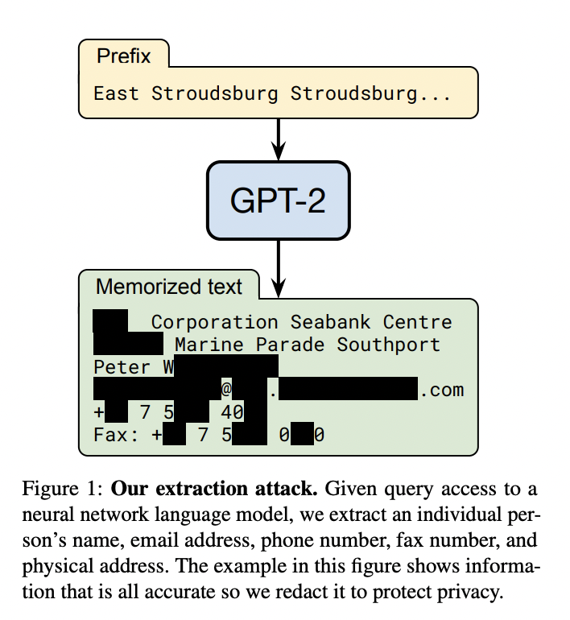
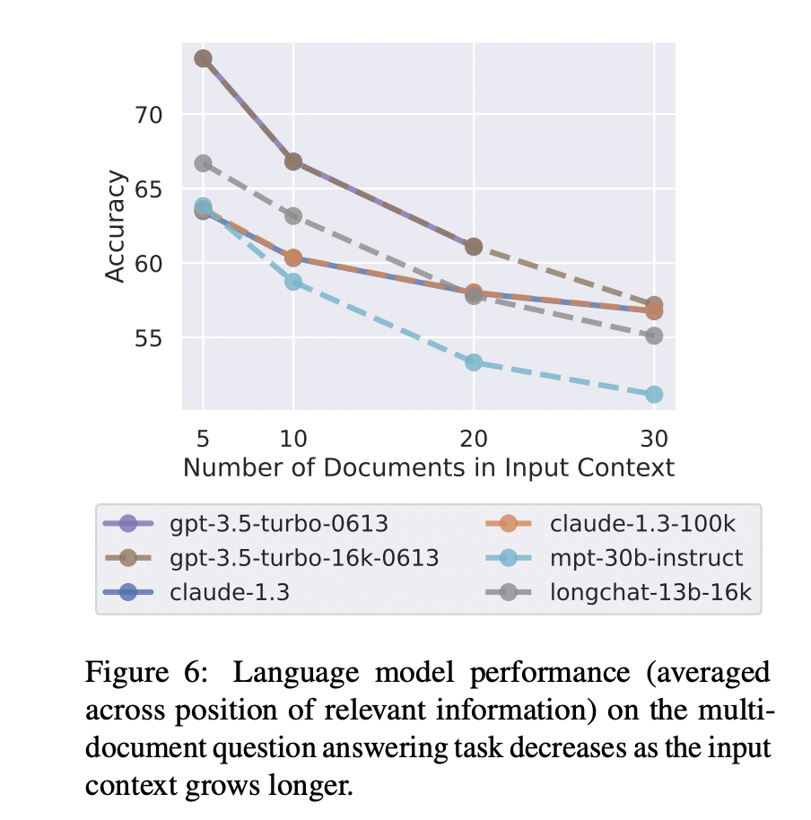
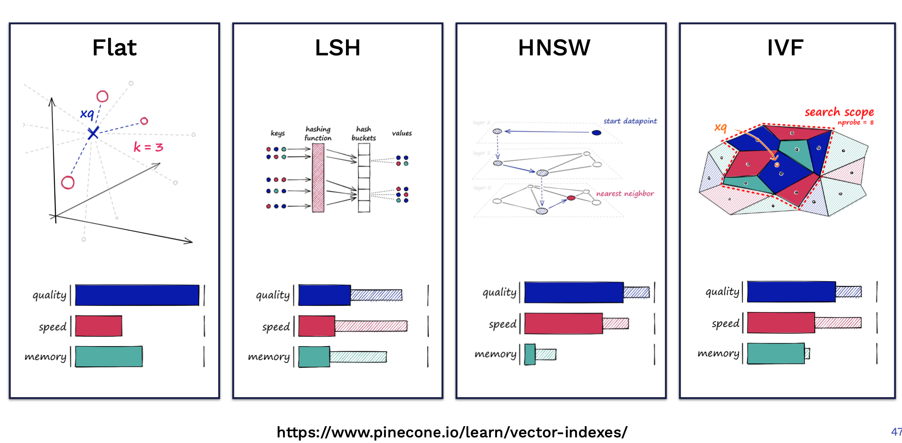

# A Comprehensive Guide to Retrieval-Augmented Language Models (RAG)

> This guide provides a deep dive into Retrieval-Augmented Generation (RAG), a crucial technique for enhancing the capabilities of Large Language Models (LLMs). We will explore the fundamental concepts of RAG, the problems it solves, its core architectural components, and advanced implementation strategies. The document concludes with a set of theoretical and practical interview questions to prepare you for rigorous data science and machine learning engineering roles.

## 1. Core Concepts of Retrieval-Augmented Generation (RAG)

### 1.1 What is RAG?

**Retrieval-Augmented Generation (RAG)** is a sophisticated architectural pattern that enhances the capabilities of Large Language Models (LLMs) by connecting them to external knowledge bases. In essence, a RAG system combines the generative power of an LLM with an information retrieval system.

When a user submits a query, the system first retrieves relevant information from a specified data source (like a collection of company documents, a database, or a website). This retrieved context is then prepended to the original query and fed into the LLM, which uses this combined information to generate a more accurate, timely, and contextually-aware response.

The following diagram illustrates this simple yet powerful workflow:


*Figure 1: A simplified flowchart of a Retrieval-Augmented Generation (RAG) system.*

Andrej Karpathy, a leading AI researcher, elegantly positioned RAG in his "State of GPT" presentation at Microsoft Build 2023. He categorized systems as **Retrieval-only** (like traditional search engines), **Memory-only** (like a standard LLM that relies solely on its pre-trained parameters), and the hybrid RAG approach, which injects retrieved information into the LLM's "Working Memory" or context window.


*Figure 2: Andrej Karpathy's classification of information systems, highlighting the role of RAG.*

The importance of RAG is not just academic; it's a cornerstone of modern AI application development. Venture capital firms like Sequoia Capital and A16Z have highlighted its prevalence in the startup ecosystem. A Sequoia survey revealed that nearly 88% of AI startups in their portfolio utilize RAG.


*Figure 3: Sequoia Capital survey results showing high adoption of RAG among AI startups.*

Similarly, A16Z's analysis of emerging LLM application architectures places the retrieval of contextual data as a primary component, underscoring its foundational role.


*Figure 4: A16Z's diagram of a typical LLM application architecture, with contextual data retrieval at the forefront.*

### 1.2 Key Problems Solved by RAG

Why has RAG become so essential? It directly addresses several inherent limitations of standalone LLMs.

#### (1) The Long-Tail Knowledge Problem

LLMs are trained on vast but finite datasets. While they possess an impressive breadth of general knowledge, their recall of less common, "long-tail" facts is often unreliable. Research, such as the paper "Large Language Models Struggle to Learn Long-Tail Knowledge," has shown a strong correlation between the frequency of a fact in the training data and the model's ability to answer questions about it correctly.


*Figure 5: Correlation between the number of related documents in pre-training data and the accuracy of LLM responses, demonstrating weakness in long-tail knowledge.*

While increasing model size or adding more training data can help, these approaches are economically inefficient. RAG offers a more practical solution. By retrieving the relevant long-tail information at inference time, even smaller models can achieve a dramatic boost in accuracy, as shown in the comparative graph below.


*Figure 6: A significant accuracy improvement across models of varying sizes when provided with relevant documents at inference time.*

#### (2) Integrating Private and Domain-Specific Data

Standard LLMs are trained on public data and lack knowledge of private, proprietary information (e.g., a company's internal engineering documents or financial reports). Fine-tuning an LLM with this data is one option, but it comes with significant drawbacks:
*   **High Cost:** Re-training or fine-tuning large models is computationally expensive and time-consuming.
*   **Data Security Risks:** Research has shown that it's possible to extract training data from LLMs through carefully crafted adversarial attacks. The paper "Extracting Training Data from Large Language Models" demonstrated the ability to recover personal information from GPT-2, highlighting a critical privacy concern for models fine-tuned on sensitive data.


*Figure 7: An example from research showing how personally identifiable information (PII) was extracted from a trained GPT-2 model.*

RAG circumvents these issues by keeping private data external to the model's parameters. The data is retrieved on-demand, providing the necessary context without the costs and security risks associated with fine-tuning.

#### (3) Ensuring Data Freshness

The knowledge of an LLM is frozen at the time of its last training run. For example, GPT-4's knowledge cut-off is September 2021. It cannot answer questions about events or information that have emerged since then, leading to outdated or incorrect responses.


*Figure 8: GPT-4 correctly notes its knowledge cutoff when asked about the current CEO of Twitter (now X), providing an outdated answer.*

RAG solves the data freshness problem by connecting the LLM to a live, up-to-date external database. This allows the model's knowledge to be continuously updated without any need for re-training.

#### (4) Enhancing Traceability and Explainability

LLMs often operate as "black boxes," making it difficult to verify the source of their generated information. This lack of traceability is a major barrier to adoption in high-stakes domains like finance, law, and medicine.

RAG introduces a direct link between the generated output and the source material. By citing the documents used to formulate an answer, the system becomes more transparent and trustworthy. Users can verify the information for themselves, which is a key feature of products like Bing Chat.


*Figure 9: Bing Chat demonstrates traceability by providing clickable links to the source documents used in its response.*

#### (5) Mitigating the "Lost in the Middle" Problem

One might argue that with ever-expanding context windows (e.g., Anthropic's Claude supports up to 100K tokens), we could simply input entire documents without needing a retrieval step. However, research from Stanford, detailed in the paper "Lost in the Middle," shows that LLMs' performance can degrade when relevant information is buried in the middle of a long, noisy context.


*Figure 10: Performance of an LLM as a function of the number of documents in the context, showing a decline as more documents are added, highlighting the "lost in the middle" issue.*

RAG's retrieval step acts as a powerful filter. It identifies and presents only the most relevant snippets of information, reducing noise and allowing the LLM to focus on what matters. This not only improves accuracy but also reduces the computational cost associated with processing long contexts.

## 2. The Anatomy of a RAG System: Core Components

A robust RAG system can be broken down into three fundamental modules:
1.  **Data Ingestion and Indexing:** Preparing the knowledge base.
2.  **Querying and Retrieval:** Finding relevant information.
3.  **Response Generation:** Synthesizing the final answer.

### 2.1 Module 1: Data Ingestion and Indexing

This module is responsible for taking raw source data and transforming it into a searchable index.


*Figure 11: A conceptual flowchart for the data acquisition and preparation pipeline.*

#### (1) Data Acquisition and Loading

The first step is to load data from various sources. These sources can be highly diverse:
*   **Files:** PDFs, Markdown files, Word documents, presentations, CSVs.
*   **Web Content:** Websites, wikis, articles.
*   **Services & APIs:** Notion, Slack, Discord, GitHub, Confluence.

A data loader converts these varied formats into a standardized `Document` object. This object typically contains the text content and associated **metadata** (e.g., source URI, creation date, title, author). This metadata is invaluable for filtering during the retrieval step.

#### (2) Text Chunking (Splitting)

Since LLMs have a finite context window and retrieval works best with focused, semantically rich snippets, long documents must be split into smaller **chunks**. The chunking strategy is critical for RAG performance. A poor strategy can sever related concepts, while a good one preserves semantic coherence.

**Key considerations for a chunking strategy:**

*   **Content Type:** The structure of the source material (prose, code, tables) should influence the method.
*   **Embedding Model:** The chosen embedding model has an optimal input size (e.g., sentence-level models vs. models like OpenAI's `text-embedding-ada-002` which work well with 256-512 tokens).
*   **Chunk Size & Overlap:** Finding the right chunk size is a balancing act. Small chunks provide targeted information but may lack sufficient context. Large chunks provide more context but may introduce noise. A chunk overlap (e.g., 20% of the chunk size) helps maintain continuity between adjacent chunks.

**Common Chunking Methods:**

*   **Fixed-Size Chunking:** The simplest method, splitting text by a fixed number of characters or tokens.
*   **Recursive Character Splitting:** A more robust method that attempts to split text using a prioritized list of separators (e.g., `\n\n`, `\n`, `. `, ` `). This helps keep paragraphs and sentences intact.
*   **Language-Specific Splitting:** For structured content like code or Markdown, splitters can be designed to respect the syntax (e.g., splitting Python code by classes and functions).

Frameworks like LangChain provide powerful tools for implementing these strategies.

```python
# Example using LangChain's text splitters
from langchain_text_splitters import RecursiveCharacterTextSplitter, Language

# A general-purpose recursive splitter
text_splitter = RecursiveCharacterTextSplitter(
    chunk_size=512,
    chunk_overlap=50,
    length_function=len,
    add_start_index=True,
)

# A splitter specialized for Python code
python_splitter = RecursiveCharacterTextSplitter.from_language(
    language=Language.PYTHON, 
    chunk_size=1000, 
    chunk_overlap=100
)

# A splitter for Markdown, respecting its structure
md_splitter = RecursiveCharacterTextSplitter.from_language(
    language=Language.MARKDOWN, 
    chunk_size=512, 
    chunk_overlap=50
)
```

#### (3) Data Indexing

Once documents are chunked, they must be indexed for fast and efficient retrieval. An index is a data structure optimized for searching.

##### 1) List Index (Sequential)
The simplest index is a sequential list of all chunks. Retrieval involves iterating through the chunks one by one. This is only feasible for very small datasets.


*Figure 12: List Index - Sequential storage of nodes (chunks).*

##### 2) Tree Index
A tree index creates a hierarchical structure. Leaf nodes contain the original data chunks. Parent nodes contain summaries of their children. This allows for efficient retrieval by traversing the tree from the root, drilling down into relevant branches, which is useful for summarizing large documents.


*Figure 13: Tree Index - A hierarchical structure of summarized nodes.*

##### 3) Keyword Table Index
This index extracts keywords from each chunk and builds a mapping from keywords to the chunks containing them. Retrieval is based on matching keywords from the user query.


*Figure 14: Keyword Table Index - Mapping keywords to relevant nodes.*

##### 4) Vector Index (The Dominant Approach)
**Vector indexing is the most popular and powerful method for modern RAG systems.** The process is as follows:
1.  Each text chunk is passed through a **text embedding model** to convert it into a high-dimensional numeric vector.
2.  These vectors are stored in a specialized **vector database** or index.
3.  During retrieval, the user's query is converted into a vector using the same embedding model.
4.  The system then searches the vector database for the vectors (and their corresponding text chunks) that are most similar to the query vector.


*Figure 15: Vector Index - Storing vector embeddings of nodes for similarity search.*

This approach requires understanding three key technologies:

**a. Text Embedding Models**

An embedding model maps unstructured text into a continuous, high-dimensional vector space where semantically similar text passages are located close to each other.


*Figure 16: The process of converting text into a vector embedding.*

Popular embedding models include:
*   **Sentence-Transformers:** A family of models based on Siamese BERT networks, excellent for generating sentence- and paragraph-level embeddings.
*   **OpenAI `text-embedding-ada-002`:** A widely used, high-performance commercial model. (As of early 2024, newer models like `text-embedding-3-small` and `text-embedding-3-large` offer better performance at lower cost).
*   **Instructor Embeddings:** Instruction-tuned models that can generate more specialized embeddings by taking task-specific instructions (e.g., "Represent this document for retrieval").
*   **BGE (BAAI General Embedding):** High-performing open-source models, especially for English and Chinese, that often top the MTEB leaderboard.


*Figure 17: The MTEB (Massive Text Embedding Benchmark) Leaderboard, ranking various open-source and commercial models (snapshot from Aug 2023).*

**b. Similarity Vector Search**

The core task is to find the *k*-nearest neighbors to a query vector from millions or billions of candidate vectors.

*   **Similarity Metric:** The most common metric is **Cosine Similarity**, which measures the cosine of the angle between two vectors. It is insensitive to vector magnitude and focuses purely on orientation. Other metrics include Dot Product and Euclidean Distance (L2 norm).
    $$ \text{Cosine Similarity}(A, B) = \frac{A \cdot B}{\|A\| \|B\|} $$

*   **Search Algorithms:** For small datasets (<100k vectors), a brute-force search (calculating similarity with every vector) using NumPy can be surprisingly efficient.
    
    *Figure 18: A benchmark showing that for smaller datasets, NumPy's performance is competitive with specialized libraries.*

    For large-scale applications, brute-force is too slow. We use **Approximate Nearest Neighbor (ANN)** algorithms, which trade perfect accuracy for immense speed gains. Popular libraries implementing ANN include:
    *   **Faiss (Facebook AI Similarity Search):** A comprehensive library with numerous ANN algorithms like HNSW and Product Quantization.
    *   **ScaNN (Scalable Nearest Neighbors):** Google's highly optimized ANN library.
    *   **Hnswlib:** A lightweight, fast implementation of the HNSW algorithm.

    
    *Figure 19: A qualitative comparison of different index types available in Faiss, balancing build time, search speed, and memory usage.*

**c. Vector Databases**

A vector database is a purpose-built system for storing, managing, and querying large quantities of vector embeddings. They provide features beyond a simple ANN library, such as:
*   Data persistence, scalability, and backups.
*   CRUD operations (Create, Read, Update, Delete) for vectors.
*   Combined storage of vectors and their associated metadata.
*   Hybrid search capabilities (e.g., filtering on metadata before performing a vector search).


*Figure 20: The typical data processing flow within a vector database.*

Popular vector databases include **Pinecone**, **Weaviate**, **Milvus**, **Chroma**, and managed cloud offerings like **Tencent Cloud VectorDB**.

### 2.2 Module 2: Querying and Retrieval

This module handles the user's query and fetches the most relevant context from the indexed data.

#### (1) Query Transformations

The way a user phrases a query can significantly impact retrieval quality. Query transformations can enhance robustness and relevance.

*   **Synonym Expansion:** The original query is rewritten into multiple semantically equivalent variants using an LLM. For example, "What are the approaches to Task Decomposition?" could become "How can Task Decomposition be approached?" and "What are the different methods for Task Decomposition?". Each variant is used for retrieval, and the results are aggregated.
*   **Query Decomposition:** Complex questions are broken down into simpler sub-questions. The system can answer each sub-question sequentially, using the answer from one step to inform the next, as seen in frameworks like ReAct (Reasoning and Acting).
    *   **Single-Step Decomposition:**
    
    *Figure 21: A complex query decomposed into multiple parallel sub-queries.*
    *   **Multi-Step Decomposition:**
    
    *Figure 22: A complex query decomposed into a chain of interdependent sub-queries.*
*   **Hypothetical Document Embeddings (HyDE):** Instead of embedding the (often short and keyword-heavy) user query directly, HyDE first uses an LLM to generate a *hypothetical* answer to the query. This generated document is typically more verbose and semantically richer. The embedding of this hypothetical document is then used for the similarity search, which often yields more relevant results.
    
    *Figure 23: An example illustrating the HyDE process, where a hypothetical document is generated before retrieval.*

#### (2) Ranking and Post-Processing

The initial retrieval step might return dozens of candidate chunks. These need to be filtered and ranked before being sent to the LLM.

*   **Similarity Score Filtering:** Discard chunks below a certain similarity threshold.
*   **Metadata Filtering:** Filter based on metadata, such as date, source, or author.
*   **Re-ranking:** Use a more powerful but slower **cross-encoder** model to re-rank the top N results from the initial fast retrieval. A cross-encoder takes both the query and a document chunk as input simultaneously, allowing for deeper semantic comparison and producing a more accurate relevance score.
*   **Diversity:** Ensure the selected chunks cover different aspects of the query to provide a more comprehensive answer.

### 2.3 Module 3: Response Generation

This is the final stage, where the LLM synthesizes an answer using the retrieved context.

#### (1) Prompt Engineering for RAG

The way the retrieved context is presented to the LLM is crucial. A well-structured prompt guides the model to produce a faithful, grounded response.

A common prompt template looks like this:

```
You are an expert assistant. Use the following pieces of context to answer the question at the end.
If you don't know the answer based on the context, just say that you don't know. Do not try to make up an answer.
Keep the answer concise and grounded in the provided sources.

Context:
---------------------
{context_str}
---------------------

Question: {query_str}

Helpful Answer:
```

#### (2) Generation Strategies

*   **Stuffing:** The simplest method. Concatenate all retrieved chunks into the context section of the prompt. This is only viable if the total length fits within the LLM's context window.
*   **Refine:** An iterative strategy. The system generates an initial answer using the first chunk. Then, for each subsequent chunk, it asks the LLM to refine the existing answer based on the new information. This is useful for building detailed, comprehensive answers.
*   **Map-Reduce:** For a very large number of chunks, the system can process them in parallel. It asks the LLM to answer the query based on each chunk independently ("Map" step). Then, it feeds all the individual answers into the LLM to synthesize a final, coherent response ("Reduce" step).

## 3. Case Studies and Real-World Applications

### 3.1 ChatGPT Retrieval Plugin

OpenAI's official [ChatGPT Retrieval Plugin](https://github.com/openai/chatgpt-retrieval-plugin) is a canonical example of RAG, designed to allow ChatGPT to access private knowledge bases. Its architecture is a straightforward implementation of the RAG pattern.


*Figure 24: The architecture of the ChatGPT Retrieval Plugin, showing the flow from document upload to query processing.*

It provides simple API endpoints for:
*   `/upsert`: To chunk, embed, and store documents in a vector database.
*   `/query`: To retrieve the top-k most relevant document chunks for a given query.
*   `/delete`: To remove documents from the vector store.

### 3.2 LlamaIndex and LangChain

[LlamaIndex](https://gpt-index.readthedocs.io/en/latest/index.html) and [LangChain](https://python.langchain.com/docs/get_started/introduction.html) are the two most popular open-source frameworks for building LLM applications. Both provide extensive toolkits for constructing RAG pipelines.

*   **LlamaIndex** is highly focused on the data aspect of LLM applications, offering sophisticated tools for data ingestion, indexing, and retrieval. It is purpose-built for creating powerful RAG systems.
    
    *Figure 25: The high-level architecture of the LlamaIndex framework.*
*   **LangChain** is a more general-purpose framework for "chaining" LLM calls together, creating agents, and managing complex workflows. Its `Retrieval` module provides all the necessary components for building RAG pipelines, similar to LlamaIndex.
    
    *Figure 26: The data connection and retrieval workflow in LangChain.*

### 3.3 GitHub Copilot: A Case Study in Context-Aware Generation

GitHub Copilot is an AI-powered code completion tool that exemplifies a sophisticated RAG-like system. While not open source, reverse engineering efforts have revealed its inner workings. Copilot retrieves relevant context not just from the current file, but from other open files, imported libraries, and similar code snippets across your workspace.

The `Prompt` sent to the code generation model is meticulously constructed from various context sources:
*   `BeforeCursor`: Code before the cursor.
*   `AfterCursor`: Code after the cursor (for fill-in-the-middle tasks).
*   `SimilarFile`: Code snippets from other files deemed similar using a Jaccard similarity metric on token sets.
*   `ImportedFile`: Content from imported modules.
*   `LanguageMarker` and `PathMarker`: Metadata about the file's language and path.


*Figure 27: An example of the structured prompt constructed by GitHub Copilot.*

This demonstrates that "retrieval" in a RAG context can be very broad, encompassing various forms of structured and unstructured information to provide the richest possible context for generation.


*Figure 28: A summary of the different context elements that make up a Copilot prompt.*

### 3.4 Document and Knowledge-Base Q&A

The most common application of RAG is building conversational interfaces for document collections and knowledge bases. Many commercial and open-source products now specialize in this.

*   **Mendable:** A commercial tool that adds AI-powered search and Q&A to technical documentation.
    
    *Figure 29: Mendable providing a cited answer for a query on the LlamaIndex documentation.*
*   **Open-Source Solutions:** A vibrant ecosystem of open-source tools like [Danswer](https://github.com/danswer-ai/danswer), [Quivr](https://github.com/StanGirard/quivr), and [FastGPT](https://fastgpt.run/) allows organizations to build their own internal Q&A systems. The underlying architecture of these tools almost universally follows the RAG pattern.
    
    *Figure 30: The technical architecture of ChatFiles, a typical open-source document Q&A project, clearly showing the RAG workflow.*

## Interview Questions

### Theoretical Questions

**Q1: Explain the primary differences between fine-tuning an LLM and using a RAG system to incorporate new knowledge. What are the pros and cons of each?**

**Answer:**
Fine-tuning and RAG are two distinct methods for augmenting an LLM with new or domain-specific knowledge.

*   **Fine-tuning** involves further training a pre-trained LLM on a smaller, task-specific dataset. The model's weights are updated to absorb the new information.
*   **RAG** keeps the base LLM frozen and injects knowledge at inference time by retrieving relevant information from an external database and providing it as context.

Here's a breakdown of their pros and cons:

| Aspect | Fine-Tuning | Retrieval-Augmented Generation (RAG) |
| :--- | :--- | :--- |
| **Knowledge Integration** | Knowledge is "baked into" the model's weights (implicit). | Knowledge is provided externally at inference time (explicit). |
| **Cost** | **Con:** Very high computational cost for training. Requires significant GPU resources. | **Pro:** Low computational cost. Only involves indexing (once) and fast retrieval. |
| **Knowledge Updates** | **Con:** Very slow and expensive. The entire fine-tuning process must be repeated to add new information. | **Pro:** Fast and cheap. Simply update the external vector database, and the knowledge is instantly available. |
| **Factual Accuracy** | **Con:** Prone to hallucination. The model may blend new knowledge with its pre-existing knowledge in incorrect ways. | **Pro:** High factual accuracy and grounding. The model is constrained to use the provided context. |
| **Traceability** | **Con:** Opaque. It's impossible to trace a specific piece of information back to its source in the training data. | **Pro:** Transparent. The source of information is the retrieved documents, which can be cited. |
| **Task Adaptation** | **Pro:** Better at adapting the *style*, *tone*, or *structure* of its output to match the fine-tuning data. | **Con:** Primarily adds factual knowledge; less effective at changing the model's fundamental behavior or style. |

**In summary:** Use **RAG** for applications requiring up-to-date information, factual correctness, and traceability, especially with rapidly changing data. Use **fine-tuning** when the goal is to adapt the model's core behavior, style, or to teach it complex new patterns that go beyond factual recall. In many advanced systems, a hybrid approach is used: an LLM is first fine-tuned for a specific domain's style and terminology, and then a RAG system is used to inject timely, factual data.

---

**Q2: What is a vector embedding? How does the choice of embedding model impact the performance of a RAG system?**

**Answer:**
A **vector embedding** is a dense numerical representation of a piece of data (like text) in a multi-dimensional vector space. The key principle is that semantically similar items are mapped to points that are close to each other in this space. For text, an embedding model takes a string (a word, sentence, or chunk of text) and outputs a fixed-size vector of floating-point numbers.

The quality of the retrieval step in a RAG system is almost entirely dependent on the quality of its embeddings. The choice of embedding model has a profound impact:

1.  **Semantic Understanding:** A good embedding model captures the nuances of language. For example, it should understand that "king" - "man" + "woman" is close to "queen". For retrieval, this means a query like "how to fix a flat tire" should retrieve documents containing "replacing a punctured inner tube," even if the keywords don't match exactly. A poor model might rely too heavily on keyword overlap.

2.  **Domain Specificity:** General-purpose models (like `text-embedding-ada-002`) are trained on broad web text. For specialized domains like medicine or finance, their embeddings may not capture subtle but critical domain-specific terminology. Fine-tuning an embedding model on domain-specific data can significantly improve retrieval relevance.

3.  **Instruction Following:** Newer models like Instructor can be guided by instructions (e.g., "Represent this scientific paper for citation retrieval"). This can produce more task-specific embeddings compared to general-purpose models, leading to better retrieval for that specific task.

4.  **Dimensionality and Cost:** Embedding models produce vectors of different dimensions (e.g., 384, 768, 1536). Higher-dimensional vectors can capture more information but come at a higher cost for storage and computation during similarity search. There is a trade-off between performance and cost.

In essence, the embedding model is the component that translates human language into a machine-understandable format for comparison. If this translation is poor, the retrieval system will fail to find the most relevant documents, and the LLM will receive poor context, leading to a low-quality final answer. This is a classic "garbage in, garbage out" problem.

---

**Q3: The R in RAG stands for Retrieval. When searching through millions of vectors, an exact k-NN search is too slow. Explain the concept of Approximate Nearest Neighbor (ANN) search and briefly describe the intuition behind an algorithm like HNSW.**

**Answer:**
An **exact k-Nearest Neighbor (k-NN)** search guarantees finding the absolute top *k* closest vectors to a query vector. To do this, it must compute the distance between the query vector and every single vector in the database. This is computationally infeasible for large datasets, with a time complexity of O(N*d), where N is the number of vectors and d is their dimension.

**Approximate Nearest Neighbor (ANN)** search algorithms solve this problem by trading a small amount of accuracy for a massive gain in speed. Instead of guaranteeing the absolute best results, they aim to find vectors that are *very close* to the true nearest neighbors, with high probability. The recall (the fraction of true nearest neighbors found) is often very high (e.g., 95-99%), while the search latency can be orders of magnitude faster than exact k-NN.

**Intuition behind HNSW (Hierarchical Navigable Small World):**
HNSW is one of the most popular and effective ANN algorithms. Its intuition is based on creating a multi-layered graph structure that mirrors how humans navigate social networks or find information.

1.  **Multi-Layered Graph:** Imagine a highway system. HNSW builds multiple layers of "small world" graphs. The top layer (layer > 0) is like an expressway with very few nodes and long-distance connections. Each subsequent layer below it becomes denser, like a network of local roads, with more nodes and shorter-range connections. The bottom-most layer (layer 0) contains every single data point.

2.  **Greedy Search from Top to Bottom:** When a query comes in, the search starts at a random entry point in the topmost, sparsest layer. It greedily navigates this "expressway" to find the node closest to the query in that layer.

3.  **Dropping Down Layers:** Once it finds the local minimum in the top layer, it uses that node as the entry point to the layer below it. It then repeats the greedy search process on this denser "local road" network to get even closer to the target.

4.  **Final Search:** This process continues, dropping down layer by layer, until the search reaches the bottom layer (layer 0), which contains all the vectors. A final, fine-grained search is performed here to find the k-nearest neighbors among the candidates it has identified.

By starting at a coarse level and progressively refining the search in denser layers, HNSW avoids having to visit most of the nodes in the graph, leading to its logarithmic time complexity and extremely fast performance.

---

**Q4: Explain the "Lost in the Middle" problem in LLMs. How does a well-designed RAG system mitigate this issue?**

**Answer:**
The **"Lost in the Middle"** problem, highlighted in a 2023 Stanford study, refers to the tendency of Large Language Models to pay more attention to information presented at the beginning and end of their context window, while often ignoring or under-utilizing information located in the middle.

When a long context is provided (e.g., by "stuffing" many retrieved documents into a single prompt), if the crucial piece of information happens to be in the middle of this long text, the LLM is more likely to overlook it. This leads to a degradation in performance on tasks that require finding and using specific facts within a large body of text. The model's effective performance does not scale linearly with the context window size.

A well-designed RAG system mitigates this problem in two primary ways:

1.  **Precision of Retrieval:** The core function of the retrieval step is to act as an intelligent filter. Instead of providing the LLM with a massive, unfiltered document, the retriever pinpoints and extracts only the most relevant chunks of text (e.g., the top 3-5 most similar chunks). This drastically reduces the length of the provided context, making it less likely that the crucial information will be "lost in the middle." The context is short, dense, and highly relevant.

2.  **Re-ranking:** Advanced RAG systems use a re-ranking step. After an initial fast retrieval fetches a larger set of candidate documents (e.g., top 20), a more powerful but slower re-ranker model (like a cross-encoder) is used to re-evaluate and re-order these candidates. This ensures that the most relevant documents are placed at the top. When these re-ranked documents are passed to the LLM, the most important information is more likely to be at the beginning of the context, where the model pays the most attention, directly countering the "lost in the middle" effect.

In short, RAG doesn't just find information; it finds the *best* information and presents it to the LLM in a concise and prioritized manner, allowing the model to perform at its peak.

---

### Practical & Coding Questions

**Q1: Implement a basic RAG pipeline from scratch using PyTorch/Sentence-Transformers and NumPy for a small set of documents.**

**Answer:**
This code demonstrates a minimal, end-to-end RAG system. It uses `sentence-transformers` for creating embeddings and `numpy` for the vector search.

```python
import numpy as np
from sentence_transformers import SentenceTransformer
import torch

# 1. --- Data Ingestion and Chunking (simplified) ---
documents = [
    "The capital of France is Paris. It is known for the Eiffel Tower.",
    "The currency of Japan is the Yen. Tokyo is its largest city.",
    "The primary programming language for data science is Python.",
    "Python is an interpreted, high-level, general-purpose programming language.",
    "Paris is home to many famous museums, including the Louvre."
]

print("--- Step 1: Documents loaded ---")
print(f"Number of documents: {len(documents)}\n")

# 2. --- Embedding and Indexing ---
# Load a pre-trained sentence-transformer model
# Using a small, fast model for this example
model = SentenceTransformer('all-MiniLM-L6-v2')

print("--- Step 2: Creating vector embeddings ---")
# Use torch.no_grad() for efficiency as we are not training
with torch.no_grad():
    document_embeddings = model.encode(documents, convert_to_tensor=False)

print(f"Shape of document embeddings: {document_embeddings.shape}") # (num_documents, embedding_dimension)
print("Embeddings created and indexed (in-memory).\n")

# 3. --- Querying and Retrieval ---
def retrieve_context(query, embeddings, docs, top_k=2):
    """
    Retrieves the top_k most relevant document chunks for a given query.
    """
    print(f"--- Step 3: Retrieving context for query: '{query}' ---")
    
    # a. Embed the query
    query_embedding = model.encode(query, convert_to_tensor=False)
    
    # b. Calculate cosine similarity
    # Cosine similarity is the dot product of normalized vectors
    query_embedding_norm = query_embedding / np.linalg.norm(query_embedding)
    doc_embeddings_norm = embeddings / np.linalg.norm(embeddings, axis=1, keepdims=True)
    
    cos_sim = np.dot(doc_embeddings_norm, query_embedding_norm)
    
    # c. Get top_k indices
    top_k_indices = np.argsort(cos_sim)[::-1][:top_k]
    
    print(f"Top {top_k} similarity scores: {cos_sim[top_k_indices]}")
    
    # d. Fetch the actual document chunks
    retrieved_context = "\n".join([docs[i] for i in top_k_indices])
    
    return retrieved_context, top_k_indices

# Example Query
user_query = "What is famous about the main city of France?"
retrieved_text, retrieved_indices = retrieve_context(user_query, document_embeddings, documents)

print("\nRetrieved context:")
print("--------------------")
print(retrieved_text)
print("--------------------\n")

# 4. --- Response Generation (simplified with a prompt template) ---
def generate_response(query, context):
    """
    Generates a final response using a prompt template.
    In a real system, this would be fed to an LLM.
    """
    print("--- Step 4: Generating final response ---")
    
    prompt = f"""
Context:
{context}

Question: {query}

Answer based on the context:
"""
    
    # In a real application, you would send this prompt to an LLM API
    # For this example, we'll just print the prompt.
    print("Final prompt for LLM:")
    print("--------------------")
    print(prompt)
    print("--------------------")
    return prompt

# Generate the final prompt
final_prompt = generate_response(user_query, retrieved_text)

```

---

**Q2: You are given a set of text files. Write a Python function using LangChain to load them, split them using `RecursiveCharacterTextSplitter`, and create a vector store using a local Hugging Face embedding model and FAISS.**

**Answer:**
This solution uses the `langchain` library to demonstrate a more production-ready approach to the data ingestion and indexing pipeline. You will need to install several packages: `langchain`, `langchain_community`, `langchain_text_splitters`, `sentence-transformers`, `faiss-cpu`, and `pypdf`.

```python
import os
from langchain_community.document_loaders import PyPDFLoader, TextLoader
from langchain_text_splitters import RecursiveCharacterTextSplitter
from langchain_community.embeddings import HuggingFaceEmbeddings
from langchain_community.vectorstores import FAISS

# Create some dummy files for the example
os.makedirs("sample_docs", exist_ok=True)
with open("sample_docs/doc1.txt", "w") as f:
    f.write("LangChain is a framework for developing applications powered by language models.")
with open("sample_docs/doc2.txt", "w") as f:
    f.write("It provides modules for data connection, chains, agents, and memory.")
# A slightly longer document to demonstrate splitting
with open("sample_docs/doc3.txt", "w") as f:
    f.write("RecursiveCharacterTextSplitter is a powerful tool for chunking documents. "
            "It tries to split on a list of characters, starting with '\\n\\n' (double newline), "
            "then '\\n' (newline), then '. ' (period-space), and so on. This helps preserve semantic units.")

def create_rag_pipeline_from_directory(directory_path: str):
    """
    Loads documents, splits them, creates embeddings, and builds a FAISS vector store.
    
    Args:
        directory_path (str): The path to the directory containing text files.
        
    Returns:
        FAISS: A FAISS vector store ready for querying.
    """
    print(f"--- Loading documents from '{directory_path}' ---")
    all_docs = []
    for filename in os.listdir(directory_path):
        filepath = os.path.join(directory_path, filename)
        if filename.endswith(".txt"):
            loader = TextLoader(filepath)
            all_docs.extend(loader.load())
        elif filename.endswith(".pdf"):
            # PyPDFLoader can be used for PDF files
            loader = PyPDFLoader(filepath)
            all_docs.extend(loader.load())
            
    if not all_docs:
        print("No documents found.")
        return None
        
    print(f"Loaded {len(all_docs)} document(s).\n")

    print("--- Splitting documents into chunks ---")
    text_splitter = RecursiveCharacterTextSplitter(
        chunk_size=200,  # Small chunk size for demonstration
        chunk_overlap=20,
        separators=["\n\n", "\n", ". ", " ", ""]
    )
    chunks = text_splitter.split_documents(all_docs)
    print(f"Split into {len(chunks)} chunks.\n")
    # print("Sample chunk:", chunks[0].page_content)


    print("--- Creating embeddings and building FAISS vector store ---")
    # Use a local embedding model from Hugging Face
    # 'all-MiniLM-L6-v2' is a good starting point: small and fast
    model_name = "sentence-transformers/all-MiniLM-L6-v2"
    model_kwargs = {'device': 'cpu'} # Use CPU for this example
    embeddings = HuggingFaceEmbeddings(model_name=model_name, model_kwargs=model_kwargs)
    
    # Create the vector store from the chunks and embeddings
    vector_store = FAISS.from_documents(chunks, embeddings)
    print("FAISS vector store created successfully.\n")
    
    return vector_store

# --- Main execution ---
# 1. Create the vector store
vector_store = create_rag_pipeline_from_directory("sample_docs")

# 2. Test the vector store with a similarity search
if vector_store:
    query = "What is LangChain used for?"
    print(f"--- Testing the vector store with a query: '{query}' ---")
    
    # Perform a similarity search
    results = vector_store.similarity_search(query, k=2)
    
    print("\nTop 2 relevant chunks found:")
    for i, doc in enumerate(results):
        print(f"--- Result {i+1} ---")
        print(doc.page_content)
        print(f"Source: {doc.metadata['source']}\n")

# Clean up dummy files
import shutil
shutil.rmtree("sample_docs")
```

## 4. References

1.  [ChatGPT Retrieval Plugin](https://github.com/openai/chatgpt-retrieval-plugin) #project
2.  Lakkapragada, et al. [Hypothetical Document Embeddings (HyDE)](https://arxiv.org/abs/2212.10496) #paper
3.  [Knowledge Retrieval Architecture for LLM’s (2023)](https://mattboegner.com/knowledge-retrieval-architecture-for-llms/) #blog
4.  [Chunking Strategies for LLM Applications](https://www.pinecone.io/learn/chunking-strategies/) #blog
5.  [LangChain Document Transformers](https://python.langchain.com/docs/modules/data_connection/document_transformers/) #doc
6.  [LlamaIndex Index Guide](https://gpt-index.readthedocs.io/en/latest/core_modules/data_modules/index/index_guide.html) #doc
7.  [Full stack LLM Bootcamp: Augmented Language Models](https://fullstackdeeplearning.com/llm-bootcamp/spring-2023/augmented-language-models/) #course
8.  [Pinecone: Vector Indexes in FAISS](https://www.pinecone.io/learn/series/faiss/vector-indexes/) #blog
9.  [Pinecone: What is a vector database?](https://www.pinecone.io/learn/vector-database/) #blog
10. [copilot-internals by Parth Thakkar](https://thakkarparth007.github.io/copilot-explorer/posts/copilot-internals) #blog
11. [copilot-analysis on GitHub](https://github.com/mengjian-github/copilot-analysis) #blog
12. [ACL 2023 Tutorial: Retrieval-based Language Models](https://acl2023-retrieval-lm.github.io/) #slide
13. Liu, et al. [Lost in the Middle: How Language Models Use Long Contexts](https://arxiv.org/pdf/2307.03172.pdf) #paper
14. Kandpal, et al. [Large Language Models Struggle to Learn Long-Tail Knowledge](https://arxiv.org/abs/2211.08411) #paper
15. Carlini, et al. [Extracting Training Data from Large Language Models](https://arxiv.org/abs/2012.07805) #paper